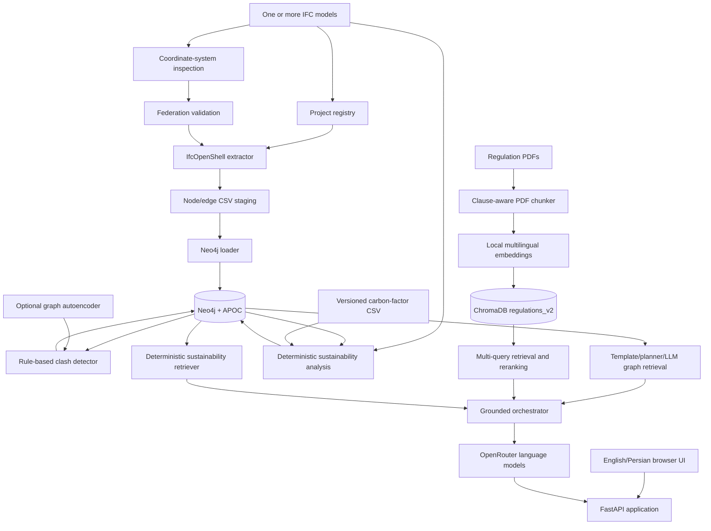

# BIM-Intellect v2 — System Documentation

**Document version:** 2.4

**Updated:** 2026-09-05

**Applies to:** the current integrated BIM-Intellect v2 tree

## Contents

1. [Purpose and capabilities](#1-purpose-and-capabilities)
2. [Architecture](#2-architecture)
3. [User interface](#3-user-interface)
4. [IFC project workflow](#4-ifc-project-workflow)
5. [Neo4j graph model](#5-neo4j-graph-model)
6. [Clash and clearance detection](#6-clash-and-clearance-detection)
7. [Graph anomaly detection](#7-graph-anomaly-detection)
8. [Regulation RAG, graph QA, and sustainability reasoning](#8-regulation-rag-graph-qa-and-sustainability-reasoning)
9. [API reference](#9-api-reference)
10. [Module reference](#10-module-reference)
11. [Configuration](#11-configuration)
12. [Installation and deployment](#12-installation-and-deployment)
13. [Testing and verification](#13-testing-and-verification)
14. [Operations, security, and limitations](#14-operations-security-and-limitations)
15. [Troubleshooting](#15-troubleshooting)
16. [Related documents](#16-related-documents)

## 1. Purpose and capabilities

BIM-Intellect is a bilingual BIM analysis and grounded question-answering system. It joins regulation evidence from PDF documents with structured facts from IFC building models.

The current system can:

- upload and independently inspect multiple IFC files;
- group IFC models into a project and preserve source-file/discipline provenance;
- verify compatible units and coordinate references before federation;
- extract selected storeys and IFC element types in world coordinates;
- load a project-aware graph into Neo4j;
- detect AABB clashes and clearance violations within or across selected files;
- optionally enrich elements and clash relationships with graph-anomaly scores;
- deterministically extract IFC materials/quantities and calculate project/file-scoped embodied-carbon estimates from operator-supplied factors;
- classify LEED/sustainability standards and combine cited requirements with deterministic project sustainability evidence;
- review project/file-scoped sustainability KPIs, carbon breakdowns, contributors, and data-quality exclusions in a bilingual dashboard;
- download auditable JSON, CSV, or printable HTML sustainability reports;
- upload and index multiple regulation PDFs in a multilingual ChromaDB collection;
- maintain bounded conversation context;
- route questions to regulation retrieval, graph retrieval, deterministic sustainability retrieval, combinations of those sources, or conversation handling;
- generate schema-aware Cypher for common BIM question shapes;
- require supported clause/page or document/section/page citations for documentary claims;
- present all workflows through a responsive English/Persian interface.

Typical questions include:

| Question | Retrieval path | Expected evidence |
|---|---|---|
| What is the minimum landing depth for stairs? | Regulation | Retrieved clause and page |
| How many `IfcStair` elements are loaded? | Graph | Exact property-based count |
| List clashes between `IfcWall` and `IfcFlowSegment`. | Graph | Issue, metric, names, and IDs |
| Does this model satisfy the retrieved stair requirement? | Regulation + graph | Cited requirement plus graph facts |
| What is the estimated embodied carbon for this project? | Sustainability | Stored deterministic run and factor provenance |
| Which materials contribute most, and what LEED guidance applies? | Sustainability + LEED | Stored carbon results plus cited document evidence |
| What did I ask previously about Level 5? | Conversation | Bounded session memory |

The application supports engineering review; it is not a certified code-checking or exact-geometry coordination product.

## 2. Architecture



The completed sustainability path can also be read as the following evidence-flow diagram:

                             BIM-Intellect
                                  |
            +---------------------+----------------------+
            |                     |                      |
           IFC              Regulations / LEED      Carbon Factors
            |                     |                      |
            v                     v                      v
         Neo4j                 ChromaDB          Sustainability Engine
            |                     |                      |
            +-- Clash             |                      +-- Material
            +-- Anomaly           |                      +-- Quantity
            +-- BIM facts         |                      +-- Carbon
            |                     |                      |
            +-------------+-------+--------------+-------+
                          v                      v
                     Orchestrator          Assessment Layer
                          |                      |
                          +----------+-----------+
                                     v
                               Grounded LLM
                                     |
                       +-------------+--------------+
                       v             v              v
                      Chat      Sustainability    Reports
                                  Dashboard

### Main runtime services

| Service | Technology | Role |
|---|---|---|
| Application | Python 3.12, FastAPI, Uvicorn | HTTP API and static UI |
| IFC engine | IfcOpenShell 0.8.5 | IFC parsing and geometry |
| Graph database | Neo4j 5.20 with APOC | BIM graph, provenance, issues, anomaly fields |
| Vector database | ChromaDB | Persistent regulation chunks and embeddings |
| Embeddings | Sentence Transformers | Local multilingual semantic embedding |
| Reranking | Hybrid TF-IDF/dense or optional BGE cross-encoder | Candidate ranking |
| Language models | OpenRouter through the OpenAI-compatible SDK | Query understanding, novel Cypher, final answer |
| Sustainability | Deterministic Python modules plus additive Neo4j records | Material/quantity extraction, factor matching, carbon calculation, aggregation |
| Reporting | Python JSON/CSV/HTML renderers | Exact-scope sustainability exports without recalculation |
| Optional ML | PyTorch sparse GCN autoencoder | Unsupervised graph anomaly scoring |

`main.py` mounts every backend route under `/api`, serves `/static`, and returns `templates/index.html` at `/`. Static paths are resolved from the source location, so launching Uvicorn from a different working directory does not break the frontend.

## 3. User interface

The integrated UI is implemented in `templates/index.html`, `static/style.css`, `static/i18n.js`, `static/app.js`, and `static/sustainability.js`.

### 3.1 Workspace structure

The application has five views:

- **Chat:** hybrid graph/regulation questions, example questions, stronger-model mode, source tags, and retrieval diagnostics. A labelled **3D Visualization** header action (cube icon) and per-answer buttons open the viewer drawer for the elements an answer identified.
- **Pipeline:** project ID, multi-IFC upload, registered-model selection, storey/type filtering, graph reset option, ingestion, analysis, and activity logging.
- **Results:** All Issues, Clashes, and Clearances with graph-derived filters and project context. A result count, issue badges, row hover, and a pinned first column aid scanning; a synchronized scrollbar above the table mirrors the table's horizontal scroll, and **Export CSV** downloads the currently displayed rows (with filters and scope applied) as UTF-8 CSV.
- **Sustainability:** exact project/IFC scope, embodied-carbon KPIs, breakdowns, top contributors, data-quality exclusions, grounded session LEED findings, and report downloads.
- **Documents:** multi-PDF upload, optional single-document ID, document domain/standard/version classification, and a stored-document inventory with Select All + Delete Selected bulk removal. The list refreshes automatically after upload, deletion, and language changes; there are no manual Refresh or Clear All controls.

Navigation is an overlay drawer. Chat analysis context and the 3D Visualization are separate drawers. A shared scrim, close controls, responsive breakpoints, and `Escape` handling keep all drawers usable on desktop and mobile.

### 3.2 English/Persian support

`static/i18n.js` contains the English and Persian interface catalog. It:

- saves the chosen language in local storage;
- updates the document `lang` and `dir` values;
- updates text, placeholders, labels, tooltips, and dynamic status strings;
- mirrors layout using CSS logical properties;
- keeps citations, metrics, IDs, and logs LTR;
- lets questions, answers, project IDs, and IFC names choose their direction from content.

This allows an English model answer in the Persian UI—or a Persian answer in the English UI—to remain readable.

### 3.3 Upload compatibility

Both IFC and PDF inputs allow multiple selection. The browser sends:

- one file using the backward-compatible `file` multipart field;
- multiple files using repeated `files` fields.

The backend accepts both shapes. PDF upload reads repeated form parts directly to avoid version-dependent single-item/list validation behavior in FastAPI/Pydantic. Validation errors omit raw request objects and return stable JSON fields (`type`, `loc`, and `msg`), which the UI formats for users.

### 3.4 Filter semantics

An empty multiselect and an explicitly selected complete option set both mean “all.” Only a real subset is sent to ingestion. Results filters are populated from the graph after ingestion, so they reflect elements that were actually loaded rather than every class in the original IFC.

## 4. IFC project workflow

### 4.1 Upload and registration

`POST /api/ifc/upload` accepts one or more `.ifc` files with a project ID and discipline. Every file is processed independently.

For each file, the API:

1. sanitizes the project ID and client filename;
2. streams bytes to a temporary file under `dataset/ifc/projects/<project-id>/`;
3. calculates SHA-256;
4. stores the model with a digest-prefixed filename;
5. scans IFC schema, storeys, and type counts;
6. inspects unit scale, world coordinate systems, true north, site placement/georeference, map conversion, and project/site GUIDs;
7. writes a record to the thread-safe JSON project registry.

The content-based file ID is:

```text
<sanitized-original-stem>-<first-12-characters-of-sha256>
```

Registry state distinguishes upload, extraction, graph import, analysis, failure, and files no longer present in the graph.

### 4.2 Federation validation

Cross-file ingestion is allowed only when the selected records have the same length-unit scale and a verifiable coordinate basis.

Accepted bases are:

- identical IFC map conversion metadata; or
- identical world context plus a shared project GUID, site GUID, or site georeference.

A single model is accepted without a cross-file comparison. Missing coordinate metadata, different unit scales, or unverified alignment returns HTTP 409. No automatic transform is estimated; models must be federated/aligned in the authoring workflow first.

### 4.3 IFC extraction

`extract_graph.py` produces staging CSVs for graph loading.

Spatial hierarchy nodes always include:

- `IfcProject`;
- `IfcSite`;
- `IfcBuilding`;
- `IfcBuildingStorey`.

Semantic extraction uses a supported IFC-type whitelist. Type values outside that whitelist are ignored even if a UI scan discovered them. Optional storey/type filters are applied before expensive geometry extraction.

IfcOpenShell geometry settings include:

- `USE_WORLD_COORDS = True`;
- opening subtraction disabled for bounding-envelope performance;
- default material application disabled;
- a multi-process iterator restricted to filtered candidates.

Each representable element gets `min_x/min_y/min_z/max_x/max_y/max_z`. Elements without representable geometry remain graph nodes with missing bounds, but cannot enter clash detection.

### 4.4 Extracted graph relationships

| Relationship | Meaning |
|---|---|
| `AGGREGATES` | IFC spatial/decomposition hierarchy |
| `CONTAINS` | Storey contains semantic element |
| `BOUNDS` | Space boundary references an element |
| `PORT_OF` | Distribution port belongs to an MEP element |

Edges are written only when the retained node set can resolve both endpoints, except that port nodes depend on extractor support. The loader reports staging edges that failed to resolve.

### 4.5 Multi-file identity and provenance

Legacy single-file extraction can use the IFC GUID as `Element.id`. Project extraction uses:

```text
project_id::source_file_id::ifc_guid
```

The original GUID stays in `ifcGuid`. Elements also carry `projectId`, `sourceFileId`, `sourceIfcFile`, `discipline`, and `coordinateSystemId`.

### 4.6 Graph loading

`bim_graph/load_to_neo4j.py` loads CSV records through batched Bolt `UNWIND` queries. The default batch size is 1,000.

The loader:

- creates a uniqueness constraint on `Element.id`;
- merges every node as `:Element`;
- adds the runtime IFC type as an APOC dynamic label;
- merges typed IFC relationships;
- creates project/model provenance nodes;
- can clear the entire graph or replace one project.

The project model is:

```text
(:BIMProject)-[:HAS_MODEL]->(:IFCModel)-[:HAS_ELEMENT]->(:Element)
```

Project extraction, CSV staging, graph loading, and optional clash detection run inside a process-local reentrant lock to avoid concurrent use of shared staging files.

### 4.7 Sustainability analysis lifecycle

Sustainability analysis is a separate, explicitly triggered operation after project ingestion. It resolves the requested project and file IDs through the registry, requires those files to be in `ingested` state, repeats federation validation, and reads the retained semantic element set from Neo4j. It then reopens each registered source IFC to extract material and quantity evidence only for those retained graph elements.

The service does not modify `extract_graph.py` CSV columns or place carbon totals directly on `Element`. A completed run and its evidence are written to the additive sustainability subgraph. Re-running the same scope creates a new run and marks the prior current run for that exact scope as historical. The operation is synchronous and shares the process-local pipeline lock with graph ingestion.

## 5. Neo4j graph model

### 5.1 Element nodes

```cypher
(:Element:IfcWall {
  id: "project::file::ifc-guid",
  ifcGuid: "ifc-guid",
  ifcType: "IfcWall",
  name: "Wall name",
  storeyId: "storey-guid",
  storeyName: "Level 5",
  minX: 0.0, minY: 0.0, minZ: 0.0,
  maxX: 1.0, maxY: 0.3, maxZ: 3.0,
  sourceIfcFile: "architecture.ifc",
  sourceFileId: "architecture-abcdef123456",
  discipline: "architecture",
  projectId: "project-a",
  coordinateSystemId: "coordinate-fingerprint"
})
```

When anomaly inference has run, an element may also contain:

```text
anomalyScore
anomalyFeatureError
anomalyStructuralError
isAnomaly
```

### 5.2 Project nodes

`BIMProject` stores project identity/update time. `IFCModel` stores filename, file ID, discipline, project ID, coordinate fingerprint, and ingest time.

### 5.3 Relationships

```cypher
(:Element)-[:AGGREGATES]->(:Element)
(:Element)-[:CONTAINS]->(:Element)
(:Element)-[:BOUNDS]->(:Element)
(:Element)-[:PORT_OF]->(:Element)
(:Element)-[:CLASHES_WITH]->(:Element)
(:BIMProject)-[:HAS_MODEL]->(:IFCModel)
(:IFCModel)-[:HAS_ELEMENT]->(:Element)
```

`CLASHES_WITH` is a directed storage representation; its direction is not engineering causality.

### 5.4 Additive sustainability subgraph

The sustainability implementation adds versioned `SustainabilityRun`, `SustainabilityResult`, `MaterialUse`, `Material`, `QuantityEvidence`, and `CarbonFactor` nodes. They link to existing project/model/element nodes without changing `Element` properties or clash/anomaly relationships. Results preserve the exact quantity evidence, allocation share, factor provenance, project/file identity, calculation status, and methodology version. See [Sustainability carbon analysis](docs/SUSTAINABILITY_CARBON_ANALYSIS.md) for the full schema and limitations.

### 5.5 Material, quantity, and carbon rules

Material extraction follows `IfcRelAssociatesMaterial` on an occurrence and falls back to its IFC type only when no usable occurrence assignment exists. Supported material selections include direct materials, layer/layer-set usage, profile/profile-set usage, constituent/constituent-set, and legacy material lists. The authored name is preserved; normalization and category assignment create separate deterministic lookup fields.

Explicit `IfcElementQuantity` values are read from occurrence or type definitions, including volume, area, length, and weight quantities. Values normalize to compatible SI bases (`m3`, `m2`, `m`, or `kg`). When explicitly enabled, missing dimensions may be estimated from stored AABB bounds for a limited IFC-type allowlist. Such values retain `geometry_derived`, a derivation method, and low-quality status. The engine never relabels them as IFC-authored values.

Carbon factors are exact normalized-name/approved-alias matches from the configured CSV. Matching may be `matched`, `ambiguous`, or `unmatched`. A result is calculated only when a unique enabled factor and an unambiguous compatible quantity are available. For one material the full selected quantity is used; supported layer-thickness or constituent-fraction allocations are marked as estimates. Other multi-material allocations fail closed. The deterministic formula is:

```text
carbon_kgco2e = normalized_quantity × factor_value
```

Supported factor denominators are kg, m3, and m2. Missing materials, factors, quantities, ambiguous evidence, implausible explicit values, and incompatible units are excluded from totals rather than treated as zero. The checked-in CSV contains only its schema header, so deployments must supply reviewed factors before expecting calculated carbon values.

## 6. Clash and clearance detection

`bim_graph/clash_pipeline.py` is the authoritative deterministic issue engine. It reads elements from Neo4j after graph import and writes results back to Neo4j.

### 6.1 Eligible scope

The fetch requires an element bounding box and optionally filters by project and selected source file IDs. Project-scoped analysis verifies that selected models are ingested and coordinate-compatible before invoking the engine.

Storey is returned as metadata, but the detector does not group candidates by storey. All selected world-coordinate AABBs enter the same sweep. This permits valid cross-storey and cross-file comparisons when envelopes actually meet.

### 6.2 AABB classification

For each axis:

```text
gap_axis = max(a.min_axis, b.min_axis) - min(a.max_axis, b.max_axis)
```

- `gap < 0`: overlap on that axis;
- `gap = 0`: touching envelopes;
- `gap > 0`: separation.

A pair is a `CLASH` only when all three gaps are strictly negative. Its metric is intersection-envelope volume:

```text
overlap_volume = (-gap_x) * (-gap_y) * (-gap_z)
```

All other pairs use envelope distance:

```text
distance = sqrt(max(gap_x, 0)^2 + max(gap_y, 0)^2 + max(gap_z, 0)^2)
```

The fixed implementation threshold is:

```text
CLEARANCE_THRESHOLD = 0.25
```

If `distance < 0.25`, the pair becomes `CLEARANCE_VIOLATION`. Exactly `0.25` is accepted. Touching envelopes have distance zero, so they are clearance violations rather than volumetric clashes. Metrics are rounded to four decimals.

### 6.3 Sweep-and-prune candidate generation

The broad phase:

1. sorts elements by `min_x`;
2. maintains an active list;
3. drops element `a` when `a.max_x + 0.25 < b.min_x`;
4. evaluates the complete three-axis formula for active candidates.

Sorting costs `O(n log n)`. Candidate comparisons depend on spatial density and can still become `O(n²)` in the worst case. The implementation uses AABBs, not meshes, exact solids, a BVH, or a spatial database index.

### 6.4 Duplicate and ignore rules

The detector skips the same non-empty IFC GUID when it appears in different source files. This avoids treating duplicate discipline exports of one object as a clash.

The following unordered type pairs are ignored:

| Pair |
|---|
| `IfcWallStandardCase` + `IfcWallStandardCase` |
| `IfcSpace` + `IfcSpace` |
| `IfcRailing` + `IfcWallStandardCase` |
| `IfcRailing` + `IfcStair` |
| `IfcRailing` + `IfcSlab` |
| `IfcRailing` + `IfcRailing` |
| `IfcDoor` + `IfcWallStandardCase` |
| `IfcDoor` + `IfcSlab` |
| `IfcDoor` + `IfcDoor` |
| `IfcCovering` + `IfcWallStandardCase` |
| `IfcCovering` + `IfcCovering` |
| `IfcSlab` + `IfcWallStandardCase` |
| `IfcStair` + `IfcWallStandardCase` |
| `IfcSlab` + `IfcStair` |

These exact type-name rules suppress expected host/contact conditions. They do not automatically apply to other subclasses or domain-specific cases.

### 6.5 Persistence and provenance

Each detected issue is stored as:

```cypher
(a:Element)-[r:CLASHES_WITH]->(b:Element)
```

Relationship properties are:

| Property | Meaning |
|---|---|
| `issue` | `CLASH` or `CLEARANCE_VIOLATION` |
| `metric` | Overlap volume or envelope distance |
| `projectId` | Project analysis scope |
| `sourceIfcFileA/B` | Source filename for each endpoint |
| `ifcGuidA/B` | Original IFC GUIDs |
| `crossFile` | True when both source file IDs exist and differ |

For a scoped rerun, prior selected-file issue relationships in the project are deleted before writing new results. This prevents stale results even when the new analysis finds zero issues.

The API summary contains element count, new issue count, graph counts by type, project, selected file IDs, and cross-file issue count.

### 6.6 Results API semantics

- `/api/clashes` returns only `CLASH`.
- `/api/violations` returns only `CLEARANCE_VIOLATION`.
- `/api/issues` returns both.

Optional `storey`, comma-separated `types`, and `project_id` filters match when either endpoint satisfies the storey/type condition. Responses include IDs, original GUIDs, names, IFC types, disciplines, source files, issue, metric, project/cross-file fields, and optional anomaly scores.

### 6.7 Important limitations

- An AABB overlap can be a false positive for rotated, hollow, curved, or irregular solids.
- Clearance is a physical 0.25 m threshold. Extracted AABBs and GLB scenes share IfcOpenShell's canonical metre output contract; source-unit mismatch remains a federation error.
- The engine does not return clash points, intersection solids, penetration direction, or viewer markup.
- Ignore rules and clearance are global constants rather than system/discipline/tolerance profiles.
- The synchronous analysis request can be expensive on dense models.
- Unscoped legacy analysis does not have the same stale-result replacement guarantees as project-scoped analysis.

## 7. Graph anomaly detection

The optional anomaly subsystem is separate from deterministic clash rules. It is an unsupervised graph autoencoder used for review prioritization.

### 7.1 Input features

The encoder uses only the IFC graph before clash relationships are included:

- bounding-box availability, center, extent, and log volume;
- total/in/out degree, mean neighbor degree, and isolation;
- storey presence;
- in/out counts for each source relationship type;
- one-hot IFC type and storey with unknown buckets.

`CLASHES_WITH` is explicitly excluded from dataset and inference edges, preventing rule-output leakage into the model.

### 7.2 Model and training

The model has two sparse GCN encoder layers, an MLP feature decoder, and a dot-product link decoder. Default training uses:

- hidden dimension 64;
- latent dimension 16;
- dropout 0.1;
- 100 epochs;
- seed 42;
- `alpha=0.7` feature reconstruction;
- `beta=0.3` structural reconstruction;
- one sampled negative per positive edge;
- 99th-percentile training score as a triage threshold.

The repository contains no reviewed anomaly labels, so the threshold is not accuracy and no precision/recall/F1 claim is supported.

### 7.3 Clash enrichment

When `/api/analyze` enables anomaly mode, node scores are written to elements and endpoint scores are added to each issue relationship. `combinedAnomalyScore` is the maximum by default or the mean when requested.

Anomaly inference never changes `issue` or `metric`. Missing checkpoints and scoring failures produce warnings and allow deterministic clash analysis to continue.

## 8. Regulation RAG, graph QA, and sustainability reasoning

### 8.1 Versioned multilingual index

The current Chroma collection defaults to `regulations_v2`. Embeddings default to the local `sentence-transformers/paraphrase-multilingual-MiniLM-L12-v2` model on CPU. OpenRouter is used for language generation, not default embedding generation.

Build or inspect the versioned corpus with:

```powershell
python -m rag.indexer --source-dir dataset/sources --rebuild
python -m rag.indexer --status
```

Changing the embedding model/provider, collection name, or index schema requires rebuilding the collection.

### 8.2 PDF chunking and metadata

The chunker extracts page text, normalizes Persian/Arabic characters and digits, detects clause roots and hierarchical clause IDs, separates logical blocks, identifies likely table-of-contents entries, and creates linked section chunks.

Stored metadata includes document/source identity, clause, page, section, chunk order, neighboring chunk IDs, content hash, heading, and index version. PDF upload deletes stale chunks for the effective document ID before upserting the new set.

Batch uploads receive content-derived document IDs. A caller-provided `doc_id` is used only for a single uploaded file.

### 8.3 Retrieval pipeline

The regulation retrieval flow is:

1. understand the current question using bounded conversation context;
2. create a standalone query and up to four retrieval variants;
3. retrieve up to 32 dense candidates per query;
4. rerank to 10 using hybrid scoring or an optional cross-encoder;
5. perform one bounded lexical fallback when dense relevance is weak;
6. expand neighboring chunks, or complete sections for completeness requests;
7. deduplicate and assemble up to the configured context-character limit.

Default hybrid weights are 0.65 dense, 0.25 lexical, and 0.10 multi-query contribution. The default context limit is 28,000 characters.

### 8.4 Conversation memory

The `/api/ask` request accepts `conversation_id`. Memory stores recent turns, summaries, topics, used chunk IDs, and routing state. Defaults are 10 recent messages, 4,000 summary characters, 1,000 conversations, and a six-hour TTL.

Memory is bounded and in-process. It is not durable across restarts and is not shared across multiple application workers.

### 8.5 Graph question planning

`GraphRetriever` resolves graph questions in this order:

1. deterministic templates for high-frequency identifier questions;
2. schema-aware query plans;
3. LLM-generated Cypher for novel shapes.

The deterministic planner covers:

- counts grouped by `CLASHES_WITH.issue`;
- storey-scoped issue counts where either endpoint matches;
- `anomalyScore`/`isAnomaly` presence counts;
- detailed issue listings between two explicit IFC types;
- exact counts for one or more explicit IFC type names.

Plans use parameters and declare required result columns. Neo4j `EXPLAIN` validates queries before execution. If a non-empty planned result omits required columns, one corrective generation/execution is allowed. A still-incomplete result fails closed. Final graph context displays at most 25 rows.

### 8.6 Routing and grounded answers

The orchestrator decides independently whether a request needs document retrieval, ordinary graph retrieval, deterministic sustainability retrieval, a grounded combination, or neither. Explicit IFC types, Neo4j schema terms, issue constants, and anomaly property names force graph routing unless documentary evidence is also explicitly requested.

Documentary statements must cite an actually retrieved clause/page pair or named document/section/page triplet. Citation parsing normalizes Persian digits. Unsupported, malformed, or invented citations trigger repair or a fail-closed insufficient-evidence response. Graph sources contain element identity/provenance when available.

The standard model profile defaults to `openai/gpt-4o-mini` for understanding and final generation. The optional stronger profile defaults to `google/gemini-2.5-flash` for routing/understanding and `anthropic/claude-sonnet-4.5` for the final grounded answer.

### 8.7 Sustainability and LEED hybrid reasoning

Document chunks may carry `document_domain` (`regulation`, `sustainability`, `leed`, or `standard`), `standard_name`, and `standard_version`. Omitted and legacy metadata defaults to `regulation`. Sustainability document searches filter dense retrieval, lexical fallback, reranking, and expanded context to the classified domains.

The orchestrator treats stored sustainability runs as a third evidence source, separate from ordinary graph facts and documentary RAG. `project_id` and selected `file_ids` resolve the exact deterministic carbon run. Hybrid answers receive separate document, graph, sustainability, and conservative assessment blocks. Project carbon totals, estimates, contributions, and calculated values absent from deterministic sustainability evidence are rejected after generation; a documentary numeric requirement is accepted only when it occurs in retrieved text and its answer line has a validated citation.

Named sections without a numeric clause use `[Document <document_id>, Section <section_id>, Page <page>]`; the existing `[Clause <clause>, Page <page>]` form remains valid. Both are checked against current retrieval metadata. LEED-oriented statuses are `satisfied_from_available_evidence`, `not_satisfied_from_available_evidence`, `insufficient_evidence`, and `not_automatically_evaluable`; no certification level is inferred.

### 8.8 Sustainability dashboard, findings, and reports

The fifth workspace view reuses the active project and multi-IFC selection. Operators may analyze the selected files or all ingested files in that project. Before rendering, the browser validates the returned project and exact selected-file set and discards stale responses using a monotonically increasing request token.

Summary cards, CSS-native breakdown bars, contributor rows, and data-quality tables are populated only from persisted sustainability APIs. Unknown carbon is shown as unknown rather than zero. Explicit IFC quantities and derived/allocation estimates carry different badges.

Hybrid LEED assessment answers that pass citation and numeric validation are copied into a bounded conversation-scoped finding ledger. The dashboard and reports read only findings whose conversation, project, and file set match. Findings remain session-only explanatory evidence and are never used as carbon inputs or stored as certification decisions.

The `sustainability-report-v1` assembler emits JSON, flat CSV, and printable HTML without recalculating carbon. JSON is the complete machine-readable representation and includes item-level data-quality exceptions. CSV contains report/run fields, selected models, summary and breakdown rows, top contributors, used factors, quality counts, LEED-oriented findings, citations, and limitations. HTML presents the project/run, summary, breakdowns, top contributors, quality counts, LEED-oriented findings, and limitations. All formats retain exact scope and factor-dataset identity; only JSON currently carries the full quality-item list.

## 9. API reference

All entries below are relative to `/api`.

### 9.1 IFC and project pipeline

| Method | Path | Description |
|---|---|---|
| POST | `/extract` | Legacy server-path IFC extraction; repeatable storey/type query filters |
| POST | `/load` | Load staging CSVs; optional full reset |
| POST | `/ingest` | Legacy extract + load operation |
| POST | `/ifc/upload` | Upload/inspect one or multiple IFC files |
| GET | `/ifc/projects` | List project registry and legacy unregistered disk models |
| POST | `/ifc/projects/{project_id}/ingest` | Validate federation, extract, load, and optionally analyse selected file IDs |
| POST | `/analyze` | Run project/file-scoped clash detection and optional anomaly scoring |

`ProjectIngestRequest` contains:

```json
{
  "file_ids": ["architecture-abcdef123456"],
  "storeys": null,
  "types": null,
  "reset_all": false,
  "run_clash_detection": true
}
```

### 9.2 Filters and results

| Method | Path | Description |
|---|---|---|
| GET | `/filters/dataset` | Generate/read IFC storey/type scan metadata |
| GET | `/filters/storeys` | Storeys actually loaded in Neo4j |
| GET | `/filters/types` | IFC types actually loaded in Neo4j |
| GET | `/clashes` | Hard AABB overlaps |
| GET | `/violations` | Clearance violations |
| GET | `/issues` | Both issue types |

Issue endpoints accept `storey`, comma-separated `types`, and `project_id`.

Sustainability endpoints are project/file scoped:

| Method | Path | Description |
|---|---|---|
| POST | `/sustainability/analyze` | Extract evidence and run deterministic carbon analysis |
| GET | `/sustainability/summary` | Retrieve an exact-scope current or historical run summary |
| GET | `/sustainability/materials` | Retrieve material/result aggregates |
| GET | `/sustainability/elements` | Retrieve paginated element/material-use results |
| GET | `/sustainability/factors` | Inspect factor dataset status and provenance |
| GET | `/sustainability/assessment-findings` | Exact-scope grounded findings from one conversation session |
| GET | `/sustainability/report` | Download the persisted run as JSON, CSV, or printable HTML |

Analysis request example:

```json
{
  "project_id": "project-a",
  "file_ids": ["architecture-abcdef123456"],
  "factor_dataset_version": null,
  "region": null,
  "allow_geometry_derived": false
}
```

Read endpoints take repeated `file_id` query parameters, not the body field name `file_ids`. Omitting them means all currently ingested files in that project. `run_id` may select a historical exact-scope run. `/elements` additionally supports calculation `status`, exact `ifc_type`, `limit` (maximum 1,000), and `offset`. `/report` accepts `format=json|csv|html` and optional `conversation_id`; findings are present only when that conversation contains a grounded finding for the exact project/file set.

### 9.3 Regulation corpus

| Method | Path | Description |
|---|---|---|
| POST | `/rag/upload` | Multipart one/multi-PDF indexing (`file` or repeated `files`) |
| POST | `/rag/ingest` | Legacy trusted server-path PDF ingestion |
| GET | `/rag/status` | Collection metadata, chunk count, samples, and indexed documents |
| DELETE | `/rag/clear` | Delete the complete configured collection |

`/rag/upload` and `/rag/ingest` accept optional `document_domain`, `standard_name`, and `standard_version` query parameters. Existing callers default to `regulation`. `document_domain=leed` requires a version and defaults the standard name to `LEED`; `document_domain=standard` requires both a name and version.

### 9.4 Question answering

| Method | Path | Description |
|---|---|---|
| POST | `/ask` | Conversation-aware grounded document/graph/sustainability orchestration |
| POST | `/ask-vector` | Legacy vector-only path |
| POST | `/ask-graph` | Graph retrieval/debug path |
| DELETE | `/rag/conversations/{conversation_id}` | Remove one in-memory conversation |

`QuestionRequest` is:

```json
{
  "question": "How many clashes are on Level 5?",
  "conversation_id": "optional-id",
  "use_strong_models": false,
  "selected_element_id": null,
  "project_id": "optional-project",
  "file_ids": ["optional-source-file-id"]
}
```

`selected_element_id` is part of the request contract but the current `/ask` handler does not forward it to orchestration.

### 9.5 Health

`GET /api/health` checks Neo4j and Chroma. It returns HTTP 200 only when both checks pass; otherwise it returns HTTP 503 with per-service status. `/api/health/` is an alias.

## 10. Module reference

### Application and API

| File | Responsibility |
|---|---|
| `main.py` | Application creation, CORS, validation handler, router/static/UI mounts |
| `api/routes.py` | HTTP contracts and pipeline orchestration |
| `api/sustainability_routes.py` | Sustainability HTTP contracts |

### IFC and graph

| File | Responsibility |
|---|---|
| `extract_graph.py` | Filtered world-coordinate IFC graph extraction |
| `extract_sotreys_type.py` | Storey/type discovery for UI filters |
| `bim_graph/project_registry.py` | Project/file manifest and provenance states |
| `bim_graph/coordinate_system.py` | IFC coordinate inspection and federation checks |
| `bim_graph/load_to_neo4j.py` | Batched Neo4j loading and project graph replacement |
| `bim_graph/pipeline_lock.py` | Shared process-local lock for graph and sustainability pipeline mutations |
| `bim_graph/neo4j_client.py` | Neo4j driver wrapper, batching, `EXPLAIN`, counts |
| `bim_graph/clash_pipeline.py` | Deterministic issue detection and optional anomaly integration |
| `bim_graph/query_planner.py` | Complete parameterized plans for high-risk graph shapes |
| `bim_graph/cypher_templates.py` | Narrow deterministic question templates |
| `bim_graph/cypher_generator.py` | Read-only free-form and corrective Cypher generation |
| `bim_graph/graph_retriever.py` | Query selection, validation, execution, completeness, formatting |

### Sustainability

| File | Responsibility |
|---|---|
| `sustainability/config.py` | Methodology/extractor versions, factor path, batch size, and derived-quantity policy |
| `sustainability/models.py` | Typed material, quantity, factor, element-evidence, and result records |
| `sustainability/ifc_extractor.py` | IFC material and explicit/derived/unavailable quantity evidence |
| `sustainability/normalization.py` | Raw-preserving deterministic material normalization |
| `sustainability/units.py` | SI normalization and dimensional compatibility |
| `sustainability/factors.py` | Validated CSV factors, dataset hash, and exact alias lookup |
| `sustainability/calculator.py` | Deterministic calculation, allocation, and aggregation |
| `sustainability/repository.py` | Additive Neo4j persistence, reads, and re-ingestion cleanup |
| `sustainability/service.py` | Project/file scope resolution and analysis orchestration |
| `sustainability/retriever.py` | Bounded deterministic sustainability evidence for chat |
| `sustainability/assessment.py` | Conservative LEED-oriented evidence states |
| `sustainability/reporting.py` | Canonical report assembly and JSON/CSV/HTML rendering |

### RAG

| File | Responsibility |
|---|---|
| `rag/config.py` | Environment-backed model, index, retrieval, and memory settings |
| `rag/chunker.py` | Multilingual clause/page-aware PDF chunking |
| `rag/document_metadata.py` | Document-domain and standard metadata validation |
| `rag/embedder.py` | Local embeddings and Chroma collection operations |
| `rag/indexer.py` | Versioned corpus rebuild/status CLI |
| `rag/retrieval.py` | Multi-query retrieval, fallback, expansion, context assembly |
| `rag/reranker.py` | Hybrid or cross-encoder ranking |
| `rag/memory.py` | Bounded in-process conversation state |
| `rag/orchestrator.py` | Understanding, routing, retrieval, generation, citation validation |
| `rag/prompts.py` | Understanding, routing, Cypher, repair, and combine prompts |
| `rag/openrouter_client.py` | Lazy OpenRouter client and bounded retry handling |
| `rag/retriever.py` | Legacy vector-only API compatibility |

### Anomaly model

| File | Responsibility |
|---|---|
| `bim_graph/anomaly/dataset.py` | IFC/CSV graph dataset build and caching |
| `bim_graph/anomaly/features.py` | Geometry/topology/categorical encoding |
| `bim_graph/anomaly/model.py` | Sparse GCN autoencoder and losses |
| `bim_graph/anomaly/train.py` | Reproducible training/checkpoint CLI |
| `bim_graph/anomaly/inference.py` | Scoring, CSV output, clash enrichment |

### Frontend and deployment

| File | Responsibility |
|---|---|
| `templates/index.html` | Accessible workspace structure |
| `static/style.css` | Responsive monochrome LTR/RTL presentation |
| `static/i18n.js` | English/Persian interface localization |
| `static/app.js` | Browser state, API calls, uploads, filters, rendering, drawers |
| `static/sustainability.js` | Project-safe sustainability state, dashboard rendering, and downloads |
| `Dockerfile` | Python 3.12 application image |
| `docker-compose.yml` | Neo4j-only development service |
| `docker-compose.client.yml` | Full Neo4j + application deployment |
| `.dockerignore` | Excludes secrets, caches, local data, and artifacts from build context |

## 11. Configuration

Copy `.env.example` to `.env` and provide the required OpenRouter key. `.env` is ignored by Git and excluded from Docker build context.

### 11.1 Neo4j and storage

| Variable | Default | Meaning |
|---|---|---|
| `NEO4J_URI` | `bolt://localhost:7687` | Bolt endpoint |
| `NEO4J_USER` | `neo4j` | Database user |
| `NEO4J_PASSWORD` | `bimintellect` | Development password |
| `IFC_PATH` | `dataset/210_King_Merged.ifc` | Legacy default IFC path |
| `NODES_CSV` | `nodes.csv` | Staging node CSV |
| `EDGES_CSV` | `edges.csv` | Staging edge CSV |
| `BIM_PROJECT_STORAGE_DIR` | `dataset/ifc/projects` | Registered model storage |
| `BIM_PROJECT_REGISTRY` | `dataset/ifc/project_registry.json` | Registry manifest |
| `SUSTAINABILITY_CARBON_FACTORS` | `dataset/sustainability/carbon_factors.csv` | Reviewed carbon-factor CSV; checked-in file is a header-only template |
| `SUSTAINABILITY_BATCH_SIZE` | `500` | Neo4j sustainability persistence batch size |

### 11.2 Models and index

| Variable | Default |
|---|---|
| `OPENROUTER_API_KEY` | required for LLM operations |
| `OPENROUTER_CHAT_MODEL` | `openai/gpt-4o-mini` legacy fallback for standard router/final settings |
| `OPENROUTER_SITE_URL` | empty optional attribution URL |
| `OPENROUTER_SITE_NAME` | `BIM-Intellect` |
| `OPENROUTER_MAX_RETRIES` | `2` total attempts in the shared retry wrapper |
| `OPENROUTER_BASE_BACKOFF` | `1.5` seconds before exponential backoff/jitter |
| `RAG_ROUTER_MODEL` | `openai/gpt-4o-mini` |
| `RAG_FINAL_MODEL` | `openai/gpt-4o-mini` |
| `RAG_STRONG_ROUTER_MODEL` | `google/gemini-2.5-flash` |
| `RAG_STRONG_FINAL_MODEL` | `anthropic/claude-sonnet-4.5` |
| `RAG_EMBEDDING_PROVIDER` | `local` |
| `RAG_EMBEDDING_MODEL` | `sentence-transformers/paraphrase-multilingual-MiniLM-L12-v2` |
| `RAG_EMBEDDING_DEVICE` | `cpu` |
| `RAG_EMBEDDING_BATCH_SIZE` | `64` |
| `RAG_COLLECTION_NAME` | `regulations_v2` |
| `RAG_INDEX_VERSION` | `2` |
| `CHROMA_PERSIST_DIR` | `./chroma_db` |

### 11.3 Retrieval and memory defaults

| Variable | Default |
|---|---|
| `RAG_CANDIDATE_COUNT` | `32` |
| `RAG_RERANK_COUNT` | `10` |
| `RAG_MAX_QUERY_VARIANTS` | `4` |
| `RAG_MAX_SECTION_CHUNKS` | `12` |
| `RAG_NEIGHBOR_WINDOW` | `2` |
| `RAG_MAX_CONTEXT_CHARS` | `28000` |
| `RAG_WEAK_RELEVANCE_THRESHOLD` | `0.18` |
| `RAG_LEXICAL_POOL_LIMIT` | `5000` |
| `RAG_RERANKER_PROVIDER` | `hybrid` |
| `RAG_RERANKER_MODEL` | `BAAI/bge-reranker-v2-m3` |
| `RAG_DENSE_WEIGHT` | `0.65` |
| `RAG_LEXICAL_WEIGHT` | `0.25` |
| `RAG_MULTI_QUERY_WEIGHT` | `0.10` |
| `RAG_MEMORY_RECENT_MESSAGES` | `10` |
| `RAG_MEMORY_SUMMARY_CHARS` | `4000` |
| `RAG_MEMORY_MAX_CONVERSATIONS` | `1000` |
| `RAG_MEMORY_TTL_SECONDS` | `21600` |

## 12. Installation and deployment

### 12.1 Local development

```powershell
git clone https://github.com/bim-project-team/bim-intellect-v2.git
Set-Location bim-intellect-v2

Copy-Item .env.example .env
# Add OPENROUTER_API_KEY and confirm database settings.

docker compose -f docker-compose.yml up -d
python -m pip install -r requirements.txt
python -m rag.indexer --source-dir dataset/sources --rebuild
python -m uvicorn main:app --reload
```

Open `http://localhost:8000`. Neo4j Browser is available at `http://localhost:7474` in the development composition.

`dataset/sustainability/carbon_factors.csv` is intentionally header-only. Replace or populate it with reviewed records following its README/schema before using carbon totals. Neo4j Browser uses HTTP on 7474; the application connects to Neo4j through Bolt on 7687.

### 12.2 Full Docker deployment

```powershell
docker compose -f docker-compose.client.yml build
docker compose -f docker-compose.client.yml up -d
docker compose -f docker-compose.client.yml ps
docker compose -f docker-compose.client.yml logs -f app
```

The full composition:

- builds the application from `python:3.12.6-slim`;
- installs IFC/scientific system libraries and Python dependencies;
- starts Neo4j 5.20 with APOC;
- waits for Neo4j health before starting the application;
- exposes app/Neo4j ports 8000, 7474, and 7687;
- persists Neo4j in a named volume;
- mounts host `chroma_db`, `dataset`, and `artifacts` directories.

Inside Compose the application uses `bolt://neo4j:7687`, not localhost.

### 12.3 Typical UI workflow

1. Open **Documents**, upload regulation PDFs, and confirm indexed documents.
2. Open **Pipeline**, enter a stable project/building ID, and upload IFC models.
3. Select parsed models and optional storey/type subsets.
4. Run ingestion and clash analysis.
5. Open **Results** to filter and review detected issues.
6. Open **Sustainability**, choose selected or all project models, run/load the analysis, inspect coverage and exclusions, and download a report.
7. Open **Chat** to ask regulation, graph, sustainability, LEED, or combined questions. Grounded LEED assessment findings then appear in the Sustainability view for that conversation and exact scope.

## 13. Testing and verification

The integrated tree was verified on 2026-09-05 with:

```powershell
$env:PYTEST_DISABLE_PLUGIN_AUTOLOAD = "1"
python -m pytest -q
node --check static/app.js
node --check static/i18n.js
node --check static/sustainability.js
python -m compileall -q api bim_graph rag sustainability main.py extract_graph.py extract_sotreys_type.py
docker compose -f docker-compose.client.yml config
```

Result: **122 tests passed, 1 skipped** in **50.60 seconds**. The combined focused sustainability suite passed **36 tests**, including **6 Phase 3 dashboard/reporting tests**. The skip is environment/optional-integration dependent. A global incompatible Hydra/OmegaConf pytest plugin on the verification workstation required disabling third-party plugin auto-loading; it was not a project test failure.

Test coverage includes:

- clause parsing, indexing, retrieval, routing, conversation, and citation validation;
- graph query planning, exact types, grouped issue counts, completeness repair, and safety;
- AABB rules, anomaly feature/model behavior, and clash enrichment;
- project registry, coordinate federation, multi-file extraction/provenance;
- scalar and repeated multipart upload compatibility;
- IFC material/quantity extraction, unit safety, factors, carbon arithmetic, provenance, aggregation, project isolation, re-ingestion, and sustainability API contracts;
- classified sustainability document filtering, named-section citations, hybrid evidence, assessment states, missing evidence, numeric grounding, and model-profile parity;
- frontend project/scope isolation, bilingual dashboard contracts, report formats, session assessment findings, and API OpenAPI schemas.

Frontend serving returned HTTP 200 and generated OpenAPI successfully. Docker Compose configuration validated. JavaScript syntax, Python compilation, and the carbon-factor JSON schema passed validation.

A live local Neo4j instance was exercised through Bolt on port 7687 using the registered `210_King_Merged.ifc` model. Run `59a28482-e312-44c1-b251-34df65832614` persisted 10,773 evidence/result rows linked to 9,533 distinct elements with exact project/file provenance; summary, paginated elements, and JSON report APIs returned HTTP 200. The checked-in factor repository is intentionally header-only, so 0 elements were carbon-calculable and the UI/report treat the total as unavailable rather than as a verified zero. The local Chroma corpus had no classified LEED document, so live LEED retrieval was not fabricated; document filtering and hybrid behavior were verified with deterministic test fixtures.

## 14. Operations, security, and limitations

### 14.1 Current security posture

The current repository is suitable for trusted development/private evaluation, not direct public exposure.

- No endpoint authentication or authorization is implemented.
- CORS allows all origins and credentials.
- API callers can trigger graph reset, collection deletion, file writes, and paid LLM requests.
- Compose uses a known development Neo4j password and unrestricted APOC procedures.
- Legacy server-path IFC/PDF endpoints assume a trusted caller.
- Upload limits, quotas, malware scanning, rate limits, and audit logs are absent.

Production deployment should add identity, role checks, explicit origins, secret rotation, restricted APOC/read-only graph users for generated queries, upload/rate controls, and tenant/project authorization.

### 14.2 Scalability and state

- IFC extraction, graph import, clash detection, and PDF embedding run synchronously in HTTP handlers.
- Sustainability extraction/calculation and report assembly also run synchronously; large IFC scopes and item-rich JSON reports can hold a request open.
- A process-local lock serializes project ingestion but does not coordinate multiple workers/hosts.
- Conversation memory, the session LEED-finding ledger, project registry, CSV staging, Chroma, and artifacts are local state.
- Neo4j clients create a driver per operation rather than sharing one application-level pool.
- Dense AABB candidate sets remain worst-case quadratic.
- Result endpoints cap rows and graph LLM context shows no more than 25 rows.

Long-running work should move to durable background jobs with progress, cancellation, retry, and shared persistence before scaling horizontally.

### 14.3 Correct interpretation

- `CLASH` means strictly overlapping AABBs, not confirmed solid intersection.
- `CLEARANCE_VIOLATION` means AABB separation below the fixed threshold.
- An anomaly is an unsupervised reconstruction score, not a clash or code violation.
- A regulatory answer is grounded only in retrieved corpus material; missing evidence should produce an insufficient-evidence answer.
- A sustainability total covers only result rows with matched factors and compatible quantities. Unknown/unmatched rows are exclusions, not zero-carbon elements.
- The bundled carbon-factor CSV is a non-authoritative empty template; meaningful carbon estimates require an operator-supplied, reviewed dataset.
- LEED output is a session-scoped, evidence-oriented assessment. It is not credit scoring, certification, or proof of compliance.
- A 200 response with an empty issue/filter list can currently hide a Neo4j exception in handlers that catch infrastructure errors, so health/status must also be checked.

## 15. Troubleshooting

### UI loads without styles or scripts

Run the server from the repository and request `/static/style.css`, `/static/i18n.js`, and `/static/app.js`. `main.py` resolves these paths relative to itself. Browser cache-busting query values are already included in the HTML.

### Multipart upload returns 400 or 422

Send one or more actual file parts using `file` or `files`. Do not send a text field with those names. Do not manually set a multipart boundary in browser code; `FormData` must set it.

### Multi-file IFC ingestion returns 409

Inspect the `alignment` object. Re-upload files missing coordinate metadata. Unit mismatch or unverified world alignment must be corrected in the authoring/federation tool; the API intentionally does not guess a transform.

### No elements are checked for clashes

Confirm the selected models have `status=ingested` and that extracted nodes contain all six bounding fields. Review storey/type filters and extraction logs. Elements without IfcOpenShell-representable geometry are not clash candidates.

### Unexpected clash volume or clearance

Remember that metrics come from AABBs and the clearance threshold is a fixed 0.25 m. Check IFC units, world coordinates, ignored type pairs, and duplicate GUID behavior. Use exact geometry software to confirm critical findings.

### Graph questions fail or return no rows

Check `/api/health`, Neo4j connectivity, project ingestion, and graph filter values. Planned graph diagnostics expose intent, parameters, returned columns, completeness, and query count. Novel wording can still use LLM-generated Cypher.

### Regulation retrieval is empty or outdated

Run:

```powershell
python -m rag.indexer --status
python -m rag.indexer --source-dir dataset/sources --rebuild
```

Confirm `RAG_COLLECTION_NAME`, index version, embedding model, and Chroma directory. Changing embedding/index settings without rebuilding produces an incompatible corpus.

### Strong-model chat fails while standard mode works

Confirm the configured OpenRouter account can access both strong-profile model IDs. The stronger option changes two models and can have different availability/cost.

### Sustainability analysis is empty or has no carbon total

Confirm the selected project files are registered with `status=ingested` and that an analysis exists for that exact file set. Inspect `/api/sustainability/factors`: the checked-in CSV is intentionally empty, and unmatched materials or incompatible/missing quantities are excluded from totals. Enable geometry-derived quantities only when low-quality AABB estimates are acceptable for the review.

### LEED findings do not appear on the dashboard or report

Upload the source document with the correct `document_domain`, standard name, and required version, then ask a hybrid sustainability/LEED question with the same project/file scope used by the dashboard. Findings are created only after grounded answer validation and are keyed to the current conversation, project, and exact file set. They disappear on process restart or conversation clearing.

### Pytest fails before collection in a shared Python environment

Third-party auto-loaded plugins can conflict with the environment. Isolate dependencies in a virtual environment or run:

```powershell
$env:PYTEST_DISABLE_PLUGIN_AUTOLOAD = "1"
python -m pytest -q
```

## 16. Related documents

- [`REPORT.md`](REPORT.md) — integrated audit/report and recommended next work
- [`docs/RAG_ARCHITECTURE.md`](docs/RAG_ARCHITECTURE.md) — detailed RAG v2 design
- [`docs/MULTI_FILE_WORKFLOWS.md`](docs/MULTI_FILE_WORKFLOWS.md) — batch ingestion and federation contracts
- [`docs/CLASH_DETECTION_AND_GRAPH_ANOMALY.md`](docs/CLASH_DETECTION_AND_GRAPH_ANOMALY.md) — clash/anomaly training and inference
- [`docs/GRAPH_RAG_QUERY_IMPROVEMENTS.md`](docs/GRAPH_RAG_QUERY_IMPROVEMENTS.md) — graph planning and completeness
- [`docs/SUSTAINABILITY_CARBON_ANALYSIS.md`](docs/SUSTAINABILITY_CARBON_ANALYSIS.md) — implemented Phase 1 formulas, provenance, APIs, and limits
- [`docs/SUSTAINABILITY_IMPLEMENTATION_PLAN.md`](docs/SUSTAINABILITY_IMPLEMENTATION_PLAN.md) — phased Sustainability + LEED architecture
- [`docs/SUSTAINABILITY_LEED_RAG.md`](docs/SUSTAINABILITY_LEED_RAG.md) — classified documents, citations, routing, and hybrid reasoning
- [`docs/SUSTAINABILITY_REPORTING_UI.md`](docs/SUSTAINABILITY_REPORTING_UI.md) — dashboard state, session findings, and report formats
- [`README.md`](README.md) — concise setup entry point

This file is the current system documentation. The referenced subsystem documents provide deeper implementation rationale and specialized commands.
