# BIM-Intellect

[](https://www.python.org/)
[](https://fastapi.tiangolo.com/)
[](https://neo4j.com/)
[](#rag-architecture)

BIM-Intellect is a web application for asking evidence-backed questions about building regulations and BIM models. It combines a multilingual document RAG pipeline with an IFC-derived Neo4j graph, allowing one question to retrieve clause-level PDF evidence, inspect project elements and clashes, and return a grounded answer with traceable citations. The same project workspace also supports multi-file IFC ingestion, scoped clash analysis, answer-linked 3D visualization, and deterministic embodied-carbon reporting.

## RAG architecture

The RAG system is the core of the application. It treats regulatory documents as structured evidence rather than undifferentiated text, then routes each question to the document index, building graph, sustainability results, or an appropriate combination.

```mermaid
flowchart LR
    subgraph Indexing[Document indexing]
        PDF[Regulation / standard PDFs] --> Parse[Page, clause, and table extraction]
        Parse --> Chunk[Section-aware chunks + citation metadata]
        Chunk --> Embed[Multilingual embeddings]
        Embed --> Chroma[(Persistent ChromaDB)]
    end

    Question[User question + bounded conversation context] --> Router[Query understanding and source routing]
    Router -->|document evidence| Retrieve[Dense + lexical candidate retrieval]
    Chroma --> Retrieve
    Retrieve --> Rerank[Hybrid or cross-encoder reranking]
    Rerank --> Expand[Section / hierarchy / neighbor expansion]

    Router -->|building evidence| Graph[Template or planned read-only Cypher]
    Graph --> Neo4j[(Neo4j IFC graph)]

    Router -->|carbon evidence| Carbon[Deterministic sustainability results]

    Expand --> Context[Bounded evidence context]
    Neo4j --> Context
    Carbon --> Context
    Context --> Generate[Grounded generation via OpenRouter]
    Generate --> Validate[Citation, completeness, and numeric validation]
    Validate --> Answer[Answer + sources + visualization payload]
```



### Indexing and storage

- Extracts PDFs page by page and segments text on detected clause boundaries before applying bounded chunk sizes.
- Normalizes Persian/Arabic digits, RTL-extracted clause numbers, dash variants, and common spacing artifacts.
- Preserves document, clause, section, physical page, printed page, heading, table, and neighboring-chunk metadata.
- Serializes extracted tables without discarding header/value relationships.
- Uses normalized multilingual embeddings from `sentence-transformers/paraphrase-multilingual-MiniLM-L12-v2` by default; OpenRouter embeddings are also supported.
- Persists vectors and metadata in a versioned ChromaDB collection. A changed index version, provider, or embedding model requires an explicit rebuild.
- Produces an index manifest with source hashes, page/chunk counts, duplicates, extraction diagnostics, and collection metadata.

### Retrieval

- Rewrites follow-up questions into standalone queries and generates a bounded set of retrieval variants.
- Merges semantic Chroma results with lexical candidates so exact clause names, engineering terms, and document identifiers can recover from weak dense matches.
- Reranks with configurable dense, character n-gram, heading, document, and multi-query agreement signals. An optional cross-encoder can replace the built-in hybrid scorer.
- Expands strong hits to their complete section tree for completeness-sensitive questions, or follows linked neighboring chunks for focused questions.
- Groups evidence by document and section, removes duplicate content, and enforces a configurable context budget.
- Routes graph questions through deterministic templates and query plans before falling back to LLM-generated Cypher. Generated Cypher is restricted to a single read-only statement and validated by Neo4j before execution.

### Grounded generation

- Combines only the evidence selected for the current request: document passages, graph results, deterministic sustainability output, and bounded conversation context.
- Requires exact clause/page or document/section/page citations for documentary claims.
- Canonicalizes and validates generated citations against retrieved metadata; unsupported citations trigger one repair attempt, then a fail-closed response.
- Checks completeness when a user asks for all items and repairs omissions against a deterministic checklist.
- Rejects sustainability numbers that do not occur in deterministic calculation output and prevents LEED-oriented evidence checks from being presented as certification decisions.
- Falls back to extractive source text if the final model is unavailable, avoiding an ungrounded answer.

These choices make the pipeline auditable: the API response reports routing decisions, retrieval diagnostics, executed Cypher, selected sources, model profile, and the element identities used by the 3D viewer.

## Supporting capabilities

- **IFC graph pipeline:** parses one or more IFC files with IfcOpenShell, retains project/file provenance, validates federation coordinates, and loads spatial and element relationships into Neo4j.
- **Clash analysis:** detects AABB hard clashes and clearance violations in a selected project/file scope and writes `CLASHES_WITH` relationships back to the graph.
- **Graph anomaly scoring:** optionally enriches clash results with per-element scores from a PyTorch graph autoencoder checkpoint; rule-based analysis still runs when the model is disabled or unavailable.
- **3D review:** exports per-storey glTF scenes, resolves graph results to IFC GUIDs, and highlights answer-related elements in a bundled three.js viewer.
- **Sustainability:** extracts IFC materials and quantities, matches reviewed carbon factors, calculates scoped embodied-carbon results deterministically, tracks data quality, and exports JSON, CSV, or HTML reports.
- **Browser workspace:** provides document management, project ingestion, results filtering/export, chat, sustainability reporting, English/Persian localization, and RTL-aware rendering without a frontend build step.

> The checked-in `dataset/sustainability/carbon_factors.csv` is intentionally header-only. Add a reviewed, sourced factor dataset before interpreting embodied-carbon totals.

## Tech stack

| Layer | Technologies |
| --- | --- |
| API and application | Python 3.12, FastAPI, Uvicorn, Pydantic |
| RAG | ChromaDB, Sentence Transformers, scikit-learn TF-IDF, pypdf, PyMuPDF, OpenRouter via the OpenAI SDK |
| BIM and graph | IfcOpenShell, Neo4j 5.20, APOC, pandas |
| ML and analysis | PyTorch, NumPy |
| Frontend and 3D | HTML, CSS, vanilla JavaScript, three.js |
| Delivery and testing | Docker Compose, pytest |

## Setup

### Prerequisites

- Python 3.12
- Docker with Compose
- An [OpenRouter](https://openrouter.ai/) API key for query understanding and answer generation
- Your own PDF and IFC inputs; `*.pdf` and `*.ifc` are intentionally ignored by Git

### Local application with Dockerized Neo4j

```bash
git clone https://github.com/bim-project-team/bim-intellect-v2.git
cd bim-intellect-v2

python -m venv .venv
source .venv/bin/activate  # PowerShell: .\.venv\Scripts\Activate.ps1
python -m pip install --upgrade pip
python -m pip install -r requirements.txt

cp .env.example .env      # PowerShell: Copy-Item .env.example .env
# Set OPENROUTER_API_KEY in .env.

docker compose up -d
python -m uvicorn main:app --reload
```

Open <http://localhost:8000>. FastAPI's interactive API documentation is available at <http://localhost:8000/docs>.

The default embedding model is downloaded on first use. Neo4j connection defaults match `docker-compose.yml`; override `NEO4J_URI`, `NEO4J_USER`, and `NEO4J_PASSWORD` in `.env` for another instance. The bundled database credentials are development defaults and should be changed outside a private local environment.

### Full Docker deployment

```bash
cp .env.example .env
# Set OPENROUTER_API_KEY in .env.

docker compose -f docker-compose.client.yml build
docker compose -f docker-compose.client.yml up -d
```

This composition starts the app and Neo4j together and persists `chroma_db`, `dataset`, and `artifacts` on the host.

## Usage

The browser UI supports the complete workflow: upload documents, create/select a project, upload IFC models, ingest the selected scope, run analysis, and ask questions. The same operations are available through the API.

### 1. Build or upload a document index

Place local PDFs under `dataset/sources/`, then build a reproducible index:

```bash
python -m rag.indexer --source-dir dataset/sources --rebuild
python -m rag.indexer --status
```

Alternatively, upload a document while the API is running:

```bash
curl -X POST "http://localhost:8000/api/rag/upload?document_domain=regulation" \
  -F "files=@/path/to/regulation.pdf"
```

The upload path replaces stale chunks only for the same stable document ID; it does not rebuild unrelated documents.

### 2. Ask a grounded question

```bash
curl -X POST http://localhost:8000/api/ask \
  -H "Content-Type: application/json" \
  -d '{
    "question": "What is the minimum landing depth for stairs?",
    "use_strong_models": false
  }'
```

The response includes the answer, validated sources, selected model profile, rewritten query, retrieval diagnostics, conversation ID, and an optional visualization payload. Pass the returned `conversation_id` on later requests to keep follow-up context. Use `/api/ask-vector` and `/api/ask-graph` to inspect either retrieval path independently.

### 3. Ingest BIM data

For project-safe multi-file ingestion, use the **Pipeline** tab or these endpoints in order:

1. `POST /api/ifc/upload` — parse and register one or more IFC files.
2. `POST /api/ifc/projects/{project_id}/ingest` — extract/load the selected files, optionally create glTF scenes, and run clash detection.
3. `GET /api/issues` — query scoped clashes and clearance violations.
4. `POST /api/sustainability/analyze` — calculate sustainability results for the exact project/file scope.

Use `GET /api/health` to check Neo4j and ChromaDB connectivity.

## Project structure

```text
api/                     FastAPI routes for RAG, IFC, model, and sustainability workflows
rag/                     Chunking, embeddings, indexing, retrieval, routing, validation, and memory
bim_graph/               Neo4j access, graph queries, clash analysis, scenes, and anomaly detection
sustainability/          IFC material evidence, carbon factors, calculations, and reporting
static/                   Browser application, localization, chat rendering, and three.js viewer
templates/                Application HTML shell
tests/                    RAG, graph, IFC, 3D, UI, and sustainability regression tests
dataset/                  Runtime inputs, registry data, generated scenes, and factor schema/template
artifacts/                Graph-anomaly training outputs and checkpoints
docs/                     Architecture, evaluation, and subsystem design notes
scripts/                  RAG evaluation tooling
main.py                   FastAPI entry point
extract_graph.py          IFC-to-graph and geometry extraction pipeline
```

Generated or sensitive runtime data—including `.env`, PDFs, IFC files, ChromaDB data, graph CSVs, and generated scenes—is excluded by `.gitignore`.

## Verification

Run the regression suite from the repository root:

```bash
python -m pytest -q
```

Useful lightweight checks:

```bash
python -m compileall -q api bim_graph rag sustainability main.py extract_graph.py extract_sotreys_type.py
node --check static/app.js
node --check static/chat-markdown.js
node --check static/i18n.js
node --check static/sustainability.js
node --check static/viewer.js
docker compose -f docker-compose.client.yml config
```
