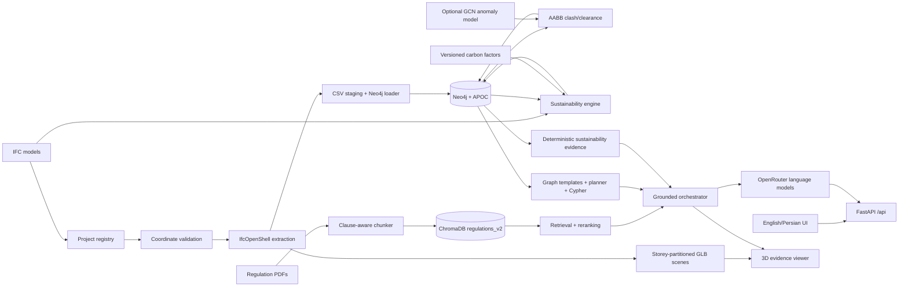

# BIM-Intellect v2

> Bilingual BIM intelligence for IFC federation, graph analysis, clash detection, deterministic embodied-carbon estimation, and citation-grounded regulatory/LEED question answering.

BIM-Intellect combines IFC geometry, a Neo4j building graph, a multilingual regulation index, and grounded language models in one English/Persian web application. Teams can upload multiple discipline models, verify that their coordinate systems are safe to federate, detect intra-file and cross-file issues, and ask questions that use building data, regulation evidence, or both.

## Highlights

- Multi-file IFC projects with file, discipline, project, and original-GUID provenance
- Conservative federation checks for units, map conversions, world contexts, projects, sites, and georeferences
- Filtered parallel IfcOpenShell extraction in world coordinates
- Neo4j BIM graph with IFC hierarchy, containment, boundaries, MEP ports, projects, and source models
- Deterministic AABB clash and clearance detection with cross-file issue tracking
- Optional sparse-GCN graph anomaly scoring kept separate from authoritative clash rules
- Versioned multilingual regulation RAG using local Sentence Transformer embeddings and ChromaDB
- Project/file-scoped IFC material, quantity, and deterministic embodied-carbon analysis with explicit factor provenance
- Classified LEED/sustainability document retrieval and grounded hybrid reasoning over deterministic carbon evidence
- Project-safe Sustainability dashboard with bilingual KPIs, breakdowns, contributors, exclusions, and session-grounded LEED findings
- Downloadable `sustainability-report-v1` JSON, audit CSV, and printable HTML reports
- Multi-query retrieval, hybrid/cross-encoder reranking, section expansion, and lexical fallback
- Schema-aware graph query planning with parameterized Cypher and result-completeness checks
- Storey-partitioned glTF export and a 3D map that highlights the elements an answer identified
- Clause/page citation validation that fails closed on unsupported regulatory claims
- Bounded conversation memory and standard/strong model profiles
- Responsive bilingual UI with mirrored RTL layout and content-aware text direction
- Single-file and batch-compatible IFC/PDF multipart APIs
- Local-development and complete Docker Compose deployment paths

## Current verification

The current integrated tree was verified with:

| Check | Result |
|---|---|
| Project tests | **240 passed** |
| Python compilation | Passed |
| Frontend JavaScript syntax | Passed |
| Frontend smoke request | `GET /` returned 200 |
| OpenAPI generation | Passed |
| Full Compose configuration | Validated |
| IFC-to-glTF export | Passed against `dataset/ifc/210_King_Merged.ifc` |
| Headless WebGL viewer smoke test | Passed with a real exported GLB |

The full suite completed in 112.67 seconds on the integration workstation. See [Testing](#testing) for the exact commands.

## Architecture



## Interface

The web workspace has five views:

- **Chat** routes questions to regulations, the building graph, both sources, or conversation handling. It displays citations, graph elements, model mode, and retrieval diagnostics. When an answer identifies specific BIM elements, a 3D map opens beside it with those elements highlighted in their storey.
- **Pipeline** uploads and registers multiple IFC files, selects a project/model set and optional storey/type filters, imports the graph, and runs clash analysis.
- **Results** separates all issues, volumetric clashes, and clearance violations, with graph-derived storey/type filters.
- **Sustainability** analyzes selected or all ingested project models, shows deterministic carbon coverage/breakdowns/contributors/data quality, displays exact-scope grounded LEED findings, and downloads JSON/CSV/HTML reports.
- **Documents** uploads classified regulation, sustainability, LEED, or standard PDFs, lists what is actually indexed, and manages the configured collection.

English and Persian translations live in `static/i18n.js`. The layout uses CSS logical properties for RTL mirroring, while answers, questions, IFC names, IDs, metrics, and citations preserve the direction appropriate to their content.

## 3D visualization

Every answer carries a `visualization` block whose `reason` states what can be shown and why. The block also preserves the project and selected IFC file IDs used for that answer, so reopening an older answer does not silently switch to a newer model selection:

| `reason` | Meaning |
|---|---|
| `graph_elements` | The graph identified specific elements; the map opens with them highlighted |
| `related_types` | No element evidence, but the subject maps to IFC types the user may opt into viewing — labelled as orientation, not evidence |
| `no_evidence` | Nothing to show and nothing to offer |
| `graph_unavailable` | The graph was consulted and failed, which is distinct from finding nothing |

Aggregate answers such as `count(r)` name no element, so `bim_graph/query_planner.py` pairs each plan with a hand-written parameterized identity query that reuses the same filters and parameters. Nothing asks a language model which elements matter.

Project ingestion writes one glTF binary per storey under `dataset/ifc/scenes/`, reusing the tessellation the bounding-box pass already performs — measured at 55s combined versus 73s for bounding boxes alone across 10,887 elements. Each glTF node is named by the element's IFC GlobalId, which is the same identifier the graph stores as `ifcGuid`, so a highlight is a direct name lookup. Geometry stays in project file units to match every stored bounding box and clash metric. Set `build_scenes: false` on the ingest request to import graph data only; projects without exported scenes fall back to the bounding boxes the clash engine measured.

three.js is vendored under `static/vendor/three/` and resolved through an import map, so the viewer needs no bundler and no CDN at runtime.

## Quick start

### Requirements

- Python 3.12
- Docker with Docker Compose
- An OpenRouter API key for query understanding and answer generation
- Enough local disk/RAM for IfcOpenShell, ChromaDB, Sentence Transformers, and optional PyTorch workflows

### Local application with Dockerized Neo4j

```powershell
git clone https://github.com/bim-project-team/bim-intellect-v2.git
Set-Location bim-intellect-v2

Copy-Item .env.example .env
# Set OPENROUTER_API_KEY in .env.

docker compose -f docker-compose.yml up -d
python -m pip install -r requirements.txt
python -m rag.indexer --source-dir dataset/sources --rebuild
python -m uvicorn main:app --reload
```

The checked-in `dataset/sustainability/carbon_factors.csv` is intentionally empty apart from its header. Add a reviewed, sourced factor dataset before interpreting embodied-carbon totals. The application can still expose missing-material, unmatched-factor, and quantity-quality results without factor rows.

Open:

- Application: `http://localhost:8000`
- OpenAPI: `http://localhost:8000/docs`
- Neo4j Browser: `http://localhost:7474`

### Full client deployment

The client composition builds and starts the application and Neo4j together:

```powershell
Copy-Item .env.example .env
# Set OPENROUTER_API_KEY in .env.

docker compose -f docker-compose.client.yml build
docker compose -f docker-compose.client.yml up -d
docker compose -f docker-compose.client.yml ps
docker compose -f docker-compose.client.yml logs -f app
```

Host `chroma_db`, `dataset`, and `artifacts` directories are mounted for persistence. Inside Compose, the application uses the Neo4j service hostname (`bolt://neo4j:7687`).

> The supplied Neo4j password and unrestricted APOC configuration are development defaults. Change and restrict them before any non-private deployment.

## Typical workflow

1. Copy `.env.example` to `.env` and configure OpenRouter/Neo4j settings.
2. Start Neo4j or the complete client composition.
3. Open **Documents** and upload regulation PDFs, classifying LEED/sustainability/standard documents with their standard name and required version, or build the default regulation index with `rag.indexer`.
4. Open **Pipeline**, enter a stable project/building ID, and upload one or more IFC files.
5. Review each file's parsed schema, storeys, types, coordinate metadata, and status.
6. Select the models and any desired storey/type subset.
7. Run graph ingestion and clash analysis.
8. Open **Sustainability**, run the exact-scope analysis, inspect data quality, and download a report.
9. Review **Results** and ask grounded graph, regulation, sustainability, or LEED questions in **Chat**.

Multi-model analysis stops with HTTP 409 when compatible coordinate frames cannot be verified. BIM-Intellect does not guess or estimate a transform between unaligned IFC files.

## Clash detection: what is implemented

The rule engine in `bim_graph/clash_pipeline.py` is the authoritative detector. It reads eligible element AABBs from Neo4j and compares the selected project/model scope in shared world coordinates.

For every axis:

```text
gap_axis = max(a.min_axis, b.min_axis) - min(a.max_axis, b.max_axis)
```

- All three gaps strictly negative → `CLASH`
- Otherwise, envelope distance below `0.25` → `CLEARANCE_VIOLATION`
- Exactly `0.25` → no issue
- Touching envelopes → zero-distance clearance violation, not volumetric clash

Clash metric:

```text
(-gap_x) * (-gap_y) * (-gap_z)
```

Clearance metric:

```text
sqrt(max(gap_x,0)^2 + max(gap_y,0)^2 + max(gap_z,0)^2)
```

Candidates use a sweep-and-prune window on X, followed by exact three-axis AABB classification. Duplicate non-empty IFC GUIDs exported by different source files are skipped. Expected host/contact type pairs—such as door/wall, slab/wall, railing/stair, and several others—are excluded by an explicit unordered ignore list.

Results are persisted as provenance-aware `CLASHES_WITH` relationships:

```text
(a:Element)-[:CLASHES_WITH {
  issue,
  metric,
  projectId,
  sourceIfcFileA,
  sourceIfcFileB,
  ifcGuidA,
  ifcGuidB,
  crossFile
}]->(b:Element)
```

Important interpretation limits:

- AABB overlap is conservative and is not exact solid/mesh intersection.
- The fixed `0.25` threshold is not converted using IFC unit metadata; treat it as model units.
- The engine does not produce clash points, intersection solids, or viewer markup.
- Optional anomaly scores are review signals and never change deterministic `issue` or `metric` values.

For the full formulas, ignore list, persistence behavior, complexity, and anomaly integration, see [Clash and graph anomaly documentation](docs/CLASH_DETECTION_AND_GRAPH_ANOMALY.md) and the [integrated project report](REPORT.md).

## Regulation RAG v2

The default regulation index uses:

- collection `regulations_v2`;
- local `sentence-transformers/paraphrase-multilingual-MiniLM-L12-v2` embeddings;
- multilingual clause/page-aware chunks;
- up to four retrieval-query variants;
- dense candidate retrieval and hybrid or cross-encoder reranking;
- one bounded lexical fallback for weak semantic recall;
- neighboring-chunk or complete-section expansion;
- deduplicated, size-bounded final context;
- backward-compatible document domains (`regulation`, `sustainability`, `leed`, `standard`) and standard name/version metadata;
- domain-isolated LEED/sustainability retrieval and validated named-section citations.

Build or inspect the index:

```powershell
python -m rag.indexer --source-dir dataset/sources --rebuild
python -m rag.indexer --status
```

Documentary claims in final answers must cite a retrieved clause/page pair or an exact document/section/page triplet. Persian digits are normalized during validation. Unsupported citations trigger repair or a fail-closed insufficient-evidence answer.

Chat accepts optional `project_id` and `file_ids`. Sustainability questions retrieve the stored deterministic run separately from document RAG; hybrid answers cannot ask the language model to calculate or invent carbon values.

Conversation memory is bounded and in-process. It is not durable across restarts or shared among multiple Uvicorn workers.

## Graph question answering

Graph retrieval chooses among:

1. deterministic templates for supported identifier questions;
2. parameterized schema-aware plans for common high-risk result shapes;
3. LLM-generated read queries for novel questions.

The planner currently covers grouped clash/clearance counts, storey-scoped counts, anomaly-property counts, exact IFC-type counts, and detailed relationships between explicit IFC types. Queries are validated with Neo4j `EXPLAIN`, and planned results are checked for required output columns. One bounded corrective query is allowed when a non-empty result is incomplete.

## Graph model

Every IFC object is stored as `:Element` and receives a dynamic IFC-type label through APOC. Project ingestion adds composite identity and provenance:

```text
Element.id = project_id::source_file_id::ifc_guid
```

Core graph relationships are:

```text
(:Element)-[:AGGREGATES]->(:Element)
(:Element)-[:CONTAINS]->(:Element)
(:Element)-[:BOUNDS]->(:Element)
(:Element)-[:PORT_OF]->(:Element)
(:Element)-[:CLASHES_WITH]->(:Element)
(:BIMProject)-[:HAS_MODEL]->(:IFCModel)
(:IFCModel)-[:HAS_ELEMENT]->(:Element)
```

The original IFC GUID remains in `ifcGuid`; file, project, discipline, and coordinate-system provenance are stored separately.

Sustainability uses additive `SustainabilityRun`, `SustainabilityResult`, `MaterialUse`, `Material`, `QuantityEvidence`, and `CarbonFactor` nodes linked to the existing project/model/element graph. It does not place calculated totals on `Element` or alter clash/anomaly relationships.

## API overview

All backend routes are mounted below `/api`.

| Area | Endpoints |
|---|---|
| Projects | `POST /ifc/upload`, `GET /ifc/projects`, `POST /ifc/projects/{project_id}/ingest` |
| Legacy IFC pipeline | `POST /extract`, `POST /load`, `POST /ingest` |
| Analysis | `POST /analyze`, `GET /clashes`, `GET /violations`, `GET /issues` |
| Filters | `GET /filters/dataset`, `GET /filters/storeys`, `GET /filters/types` |
| 3D model | `GET /model/manifest`, `GET /model/scene/{project_id}/{file_id}/{scene_key}`, `GET /model/elements` |
| Documents | `POST /rag/upload`, `POST /rag/ingest`, `GET /rag/status`, `DELETE /rag/clear` |
| Sustainability | `POST /sustainability/analyze`, `GET /sustainability/summary`, `GET /sustainability/materials`, `GET /sustainability/elements`, `GET /sustainability/factors`, `GET /sustainability/assessment-findings`, `GET /sustainability/report` |
| Questions | `POST /ask`, `POST /ask-vector`, `POST /ask-graph` |
| Conversation | `DELETE /rag/conversations/{conversation_id}` |
| Health | `GET /health` |

The OpenAPI schema is available at `/docs`. Upload contracts support both the batch `files` field and legacy scalar `file` field.

## Technology stack

| Area | Technology |
|---|---|
| API | FastAPI, Uvicorn, Pydantic |
| IFC | IfcOpenShell |
| Graph | Neo4j Python driver, Neo4j 5.20, APOC |
| Vector search | ChromaDB, Sentence Transformers |
| Ranking | scikit-learn hybrid scoring, optional BGE cross-encoder |
| LLM | OpenRouter via OpenAI-compatible client |
| Data/ML | pandas, NumPy, PyTorch |
| Frontend | HTML, CSS, vanilla JavaScript |
| Deployment | Docker, Docker Compose |

## Repository layout

```text
api/                         FastAPI routes
bim_graph/                   Neo4j, federation, clash, graph QA
bim_graph/anomaly/           GCN dataset, training, and inference
rag/                         Chunking, indexing, retrieval, memory, grounding
sustainability/              IFC evidence, units, factors, calculation, Neo4j persistence, reports
dataset/sustainability/      Carbon-factor CSV template, schema, and operator guidance
static/                      UI styles, localization, and browser logic
static/vendor/three/         Vendored three.js for the offline-capable 3D viewer
templates/                   Application HTML shell
tests/                       Automated regression tests
docs/                        Detailed subsystem documentation
artifacts/anomaly/           Model/dataset/result artifacts
dataset/ifc/scenes/          Generated per-storey glTF (rebuilt by ingestion)
main.py                      Application entry point
extract_graph.py             IFC graph and AABB extraction
Dockerfile                   Application image
docker-compose.yml           Development Neo4j service
docker-compose.client.yml    Full application deployment
```

## Configuration

Start from [.env.example](.env.example). Important groups include:

- `OPENROUTER_API_KEY` and model profile variables
- `NEO4J_URI`, `NEO4J_USER`, and `NEO4J_PASSWORD`
- `RAG_EMBEDDING_*`, `RAG_COLLECTION_NAME`, and `CHROMA_PERSIST_DIR`
- retrieval/reranking counts, limits, models, and weights
- conversation-memory limits and TTL
- project storage and registry paths
- `SUSTAINABILITY_CARBON_FACTORS` and `SUSTAINABILITY_BATCH_SIZE`
- `BIM_SCENE_STORAGE_DIR` for generated 3D geometry

`.env` is ignored by Git and excluded by `.dockerignore`. Do not commit API keys or production credentials.

## Testing

Use a clean virtual environment. To prevent unrelated globally installed pytest plugins from interfering with collection:

```powershell
$env:PYTEST_DISABLE_PLUGIN_AUTOLOAD = "1"
python -m pytest -q
```

Additional checks used for the integrated tree:

```powershell
node --check static/app.js
node --check static/i18n.js
node --check static/sustainability.js
node --check static/viewer.js
python -m compileall -q api bim_graph rag sustainability main.py extract_graph.py extract_sotreys_type.py
docker compose -f docker-compose.client.yml config
python -c "import json, pathlib; json.loads(pathlib.Path('dataset/sustainability/carbon_factors.schema.json').read_text(encoding='utf-8'))"
```

`tests/test_scene_export.py` includes one end-to-end IFC-to-glTF export. It skips automatically when no reference IFC file is present.

## Documentation

- [Complete system documentation](BIM-Intellect-Documentation.md)
- [Sustainability carbon analysis](docs/SUSTAINABILITY_CARBON_ANALYSIS.md)
- [Sustainability + LEED RAG](docs/SUSTAINABILITY_LEED_RAG.md)
- [Sustainability dashboard and reports](docs/SUSTAINABILITY_REPORTING_UI.md)
- [Sustainability implementation plan](docs/SUSTAINABILITY_IMPLEMENTATION_PLAN.md)
- [Integrated project report](REPORT.md)
- [RAG architecture](docs/RAG_ARCHITECTURE.md)
- [Multi-file workflows and federation](docs/MULTI_FILE_WORKFLOWS.md)
- [Clash detection and graph anomaly](docs/CLASH_DETECTION_AND_GRAPH_ANOMALY.md)
- [Graph RAG query improvements](docs/GRAPH_RAG_QUERY_IMPROVEMENTS.md)
- [3D visualization](docs/3D_VISUALIZATION.md)

## Security and production readiness

The current project targets trusted development/private evaluation. Before public or multi-tenant deployment, address the following:

- add authentication, authorization, project tenancy, and audit logging;
- replace wildcard CORS with explicit trusted origins;
- rotate default database credentials and restrict APOC procedures;
- isolate or remove trusted server-path ingestion endpoints;
- add upload limits, validation/scanning, quotas, and rate limiting;
- move extraction, embedding, loading, and clash analysis to durable background jobs;
- move sustainability analysis and large report assembly to durable jobs;
- use shared durable storage for registry, conversations, vectors, and staging;
- supply and govern an authoritative regional carbon-factor dataset; the bundled CSV is only a template;
- treat AABB-derived quantities as low-quality estimates and LEED findings as non-certifying, session-scoped evidence;
- normalize the clash threshold to physical units and confirm AABB candidates with exact geometry where required.

See [REPORT.md](REPORT.md) for the verified operational limitations and recommended next work.
