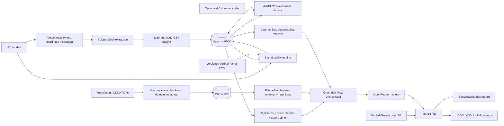

# BIM-Intellect v2 — Integrated Project Report

**Report date:** 2026-09-05

**Audit scope:** current integrated working tree, including the implemented Sustainability phases

**Verification:** 122 tests passed, 1 skipped; focused sustainability tests, Python and JavaScript syntax checks, frontend/OpenAPI smoke checks, carbon-factor schema loading, Docker Compose validation, and a live local Neo4j sustainability run completed.

## 1. Executive summary

BIM-Intellect v2 is a bilingual BIM analysis and grounded question-answering application. It combines five evidence/analysis systems:

1. IFC parsing and filtered, multi-model federation with IfcOpenShell;
2. a provenance-aware Neo4j building graph;
3. deterministic AABB clash and clearance analysis, optionally enriched by an unsupervised graph anomaly model;
4. deterministic IFC material/quantity extraction and embodied-carbon estimation from governed carbon factors;
5. regulation and sustainability/LEED RAG over a multilingual ChromaDB corpus, combined with graph and deterministic sustainability retrieval.

The delivered interface is a responsive English/Persian workspace with overlay navigation and context drawers plus Chat, Pipeline, Results, Sustainability, and Documents views. Existing graph query planning, grounded citation handling, multi-file uploads, text-direction support, project-scoped ingestion, clash logic, and anomaly behavior remain connected.

The deterministic clash engine is the authoritative issue detector. The graph anomaly model is a separate triage signal; it does not create, remove, or reclassify clashes.

Embodied-carbon arithmetic is deterministic Python code. The LLM may explain stored results but cannot supply factors, quantities, or calculated kgCO2e. LEED output is a conservative, document-grounded assessment of available evidence; no certification level or general credit score is implemented.

### Changes in the current implementation

- Added project/file-scoped sustainability analysis over graph-retained IFC elements and registered source models.
- Added raw-preserving material extraction, explicit and optional derived quantity evidence, SI normalization, deterministic alias matching, dimension-safe carbon calculation, and additive Neo4j persistence.
- Added classified `regulation`, `sustainability`, `leed`, and `standard` document metadata to the existing RAG collection without breaking legacy regulation chunks.
- Added sustainability-only and sustainability + LEED hybrid orchestration, citation validation, numeric grounding, and conservative assessment states.
- Added the fifth Sustainability workspace view, exact-scope state protection, data-quality presentation, and session-scoped LEED-oriented findings.
- Added `sustainability-report-v1` JSON, CSV, and printable HTML exports.
- Expanded regression coverage and live Neo4j verification while preserving existing clash, anomaly, graph-QA, RAG, multi-file, and frontend behavior.

## 2. System architecture



The implementation keeps evidence classes separate until orchestration: LEED/standards remain document chunks in ChromaDB; BIM facts and calculated sustainability results remain structured Neo4j data. Carbon values are calculated before the LLM is involved.

### Runtime components

| Component | Implementation | Responsibility |
|---|---|---|
| Web/API | FastAPI 0.111, Uvicorn | Serves the UI and `/api` routes |
| IFC | IfcOpenShell 0.8.5 | IFC parsing, hierarchy, world-coordinate geometry |
| Graph | Neo4j 5.20 + APOC | Elements, IFC relationships, project provenance, detected issues |
| Vector store | ChromaDB | Persistent multilingual regulation chunks |
| Embeddings/ranking | Sentence Transformers, scikit-learn | Dense embeddings, lexical/hybrid reranking |
| LLM access | OpenAI-compatible client through OpenRouter | Query understanding, novel Cypher, grounded answer generation |
| Sustainability | Deterministic Python modules | IFC evidence, SI units, factor lookup, carbon calculation, aggregation |
| Reports | Python JSON/CSV/HTML renderers | Reproducible exact-scope sustainability exports |
| Data/ML | pandas, NumPy, PyTorch | CSV handling, clash data, graph anomaly training/inference |
| Frontend | HTML, CSS, vanilla JavaScript | Responsive bilingual single-page workspace |

## 3. Repository map

| Path | Purpose |
|---|---|
| `main.py` | FastAPI application, CORS, static/template serving, safe validation-error response |
| `api/routes.py` | IFC, graph, clash, RAG, chat, filter, health, and sustainability-router mounting |
| `api/sustainability_routes.py` | Project/file-scoped sustainability analysis, read, finding, and report APIs |
| `extract_graph.py` | IFC hierarchy/semantic extraction and AABB generation |
| `extract_sotreys_type.py` | Fast IFC storey/type scanning for UI filters (filename retains the historical typo) |
| `bim_graph/` | Neo4j loader/client, project registry, coordinate validation, clash pipeline, graph retrieval |
| `bim_graph/pipeline_lock.py` | Shared process-local serialization for graph/sustainability mutations |
| `bim_graph/anomaly/` | Graph dataset, features, sparse GCN autoencoder, training and inference |
| `rag/` | PDF chunking, indexing, Chroma access, retrieval, reranking, memory, prompts, orchestration |
| `sustainability/` | Material/quantity extraction, normalization, factors, calculation, persistence, retrieval, assessment, reports |
| `dataset/sustainability/` | Header-only factor template, JSON schema, and operator guidance |
| `templates/index.html` | Integrated application shell and accessible controls |
| `static/style.css` | Responsive logical-property styling for LTR/RTL layouts |
| `static/i18n.js` | English/Persian translation and document direction controller |
| `static/app.js` | UI state, uploads, ingestion, chat, results, filters and drawers |
| `static/sustainability.js` | Exact-scope sustainability dashboard state, rendering, and report downloads |
| `tests/` | RAG, graph planning, federation, clash/anomaly, and workflow regression tests |
| `docs/` | Detailed subsystem documents |
| `Dockerfile`, `docker-compose.client.yml` | Full application + Neo4j client deployment |
| `docker-compose.yml` | Neo4j-only development deployment |
| `artifacts/anomaly/` | Checked-in anomaly dataset/checkpoint/results artifacts |

## 4. Integrated UI/UX

The current workspace shell extends the existing backend contracts without replacing the established workflows.

### Navigation and layout

- Overlay sidebar navigation for Chat, Pipeline, Results, Sustainability, and Documents.
- Secondary context drawer for chat retrieval details.
- Scrim, close buttons, `Escape` behavior, and responsive hidden sidebars.
- Logical CSS properties allow the complete layout to mirror under RTL.
- Desktop and mobile layouts use the same functional controls.

### Internationalization

- `static/i18n.js` supplies English and Persian strings.
- The chosen language is stored in browser local storage.
- `<html lang>` and `<html dir>` are updated together.
- Model answers, questions, IFC names, and project IDs get content-aware direction.
- Metrics, citations, code-like IDs, and logs stay LTR where mirroring would be misleading.

### Functional views

- **Chat:** hybrid vector/graph questions, example prompts, stronger-model option, cited sources, retrieval diagnostics, and conversation ID continuity.
- **Pipeline:** multi-IFC drag/drop, project ID, registered-model selection, storey/type multiselects, reset option, import/analyse action, and activity log.
- **Results:** All Issues, Clashes, and Clearances; storey/type filters; project-aware output; cross-file and anomaly fields.
- **Sustainability:** selected/all-project-model analysis, carbon coverage and breakdowns, contributors, data quality, exact-scope LEED findings, and JSON/CSV/HTML downloads.
- **Documents:** multi-PDF ingestion, optional document ID for a single file, document-domain/standard/version fields, indexed-document status, and collection clearing.

### Compatibility preserved during integration

- Empty multiselect and “all selected” both serialize as no filter.
- One file uses the legacy scalar multipart field; batches use repeated `files` fields.
- API validation errors are converted to a stable JSON-safe shape.
- Structured FastAPI/Pydantic errors are rendered into readable UI text.
- Current graph source/citation rendering and Persian/English chat direction were retained.
- Sustainability responses are cleared and scope-checked when project/file selection changes; stale asynchronous responses cannot overwrite the active scope.

## 5. IFC project and graph ingestion

### Upload and registry

`POST /api/ifc/upload` accepts one or multiple `.ifc` files. Each file is processed independently, so one invalid sibling does not roll back valid files.

For every accepted file the system:

1. sanitizes the client filename and project ID;
2. streams to a temporary file under `dataset/ifc/projects/<project-id>/`;
3. computes SHA-256 and uses a digest-prefixed stored filename;
4. scans schema, storeys, and IFC type counts;
5. inspects units, world context, sites, georeference, map conversion, and project/site GUIDs;
6. writes a thread-safe JSON registry record with provenance and processing state.

The `file_id` is `<safe-stem>-<first-12-sha256>`. This makes duplicate content stable while preserving the original filename in metadata.

### Federation safety

Before multi-file ingestion or project-scoped analysis, `validate_federation` requires:

- equal length-unit scale;
- and either matching map conversion, or matching world context plus a shared project GUID, site GUID, or georeference.

A single file is automatically compatible. Missing metadata, unit mismatch, or unverified alignment returns HTTP 409. The system intentionally refuses cross-file analysis rather than mixing unverified coordinate frames.

### Extraction

`extract_graph.py` always includes spatial hierarchy nodes (`IfcProject`, `IfcSite`, `IfcBuilding`, `IfcBuildingStorey`) and `AGGREGATES` edges. Semantic elements are limited to a supported whitelist and can be filtered by storey and IFC type.

For selected elements, IfcOpenShell geometry uses `USE_WORLD_COORDS`. A multi-process iterator calculates axis-aligned min/max values. Opening subtraction and material resolution are disabled because only outer bounding envelopes are required. Elements without representable geometry remain graph nodes but are excluded from clash analysis because their bounding-box fields are null.

Additional relationships are:

- `CONTAINS`: storey to element;
- `BOUNDS`: space to boundary element when both were retained;
- `PORT_OF`: distribution port to related MEP element;
- `AGGREGATES`: spatial hierarchy.

Federated element identity is composite: `project_id::source_file_id::ifc_guid`. The original IFC GUID is retained separately as `ifcGuid`.

### Neo4j loading

The loader sends batches of 1,000 rows through the Bolt driver. Every IFC object is an `:Element` with an additional dynamic IFC-class label such as `:IfcWall`. APOC creates dynamic labels and typed relationships. A uniqueness constraint protects `Element.id`.

Project mode also creates:

```text
(:BIMProject)-[:HAS_MODEL]->(:IFCModel)-[:HAS_ELEMENT]->(:Element)
```

`reset_all=true` clears the complete graph. Otherwise, project ingestion replaces that project's elements and model nodes. The project pipeline is serialized by a process-local reentrant lock to avoid concurrent CSV/import corruption.

## 6. Clash detection — exact implemented behavior

This section describes the code in `bim_graph/clash_pipeline.py`, not an intended future design.

### 6.1 Input and scope

The engine reads `:Element` nodes back from Neo4j. It does not analyse the CSV directly. An element is eligible only when `minX` is present; extraction writes all six bounds together, so this represents elements with usable AABBs.

Optional scope is applied by:

- `projectId = $project_id` when a project is supplied;
- `sourceFileId IN $file_ids` when files are supplied.

Project analysis normally supplies only files that reached `ingested` state. Before detection, the API repeats federation validation. Storey name is fetched for reporting, but the current detector does **not** partition candidates by storey. All eligible selected elements share one world-coordinate sweep, allowing cross-storey issues when their actual AABBs overlap or approach each other.

### 6.2 Bounding-box mathematics

For each axis `x`, `y`, and `z`:

```text
gap_axis = max(a.min_axis, b.min_axis) - min(a.max_axis, b.max_axis)
```

- A negative gap is overlap depth on that axis.
- Zero means the envelopes touch on that axis.
- A positive gap is separation on that axis.

A pair is a `CLASH` only when all three gaps are strictly negative. Its metric is AABB intersection volume:

```text
metric = (-gap_x) * (-gap_y) * (-gap_z)
```

Otherwise the engine clamps negative gaps to zero and calculates Euclidean envelope separation:

```text
distance = sqrt(max(gap_x,0)^2 + max(gap_y,0)^2 + max(gap_z,0)^2)
```

If `distance < 0.25`, the result is `CLEARANCE_VIOLATION` and the metric is that distance. Exactly `0.25` is not reported. Face/edge/corner touching has distance zero: it is not a volumetric clash, but is reported as a clearance violation. Metrics are rounded to four decimal places before persistence.

### 6.3 Candidate generation and performance

The detector implements a one-axis sweep-and-prune broad phase:

1. sort all eligible records by `min_x`;
2. maintain an active list;
3. remove prior element `a` when `a.max_x + 0.25 < b.min_x`;
4. run the exact three-axis classification for every remaining active pair.

This avoids testing pairs that are clearly too far apart on X. Sorting is `O(n log n)`; the candidate pass depends on X-axis density and remains `O(n²)` in the worst case. The active list is a Python list and no spatial tree or exact solid/mesh intersection is used.

### 6.4 Duplicate and ignored pairs

The same IFC `GlobalId` exported in different source files is skipped when both records have that GUID and different source file IDs. This prevents duplicate discipline exports of one physical object from manufacturing a clash.

The following unordered IFC-type pairs are intentionally ignored:

| Type A | Type B |
|---|---|
| IfcWallStandardCase | IfcWallStandardCase |
| IfcSpace | IfcSpace |
| IfcRailing | IfcWallStandardCase |
| IfcRailing | IfcStair |
| IfcRailing | IfcSlab |
| IfcRailing | IfcRailing |
| IfcDoor | IfcWallStandardCase |
| IfcDoor | IfcSlab |
| IfcDoor | IfcDoor |
| IfcCovering | IfcWallStandardCase |
| IfcCovering | IfcCovering |
| IfcSlab | IfcWallStandardCase |
| IfcStair | IfcWallStandardCase |
| IfcSlab | IfcStair |

These exclusions encode expected host/contact relationships and reduce envelope false positives. They are exact runtime IFC type-name matches; similar subclasses are not automatically covered.

### 6.5 Multi-file provenance

Every result records:

- composite endpoint IDs and original IFC GUIDs;
- source IFC filename for each endpoint;
- endpoint disciplines in the in-memory result;
- project ID;
- `cross_file=true` only when both source file IDs are non-empty and different.

Because all models must pass coordinate verification and their geometry is extracted in world coordinates, intra-file and cross-file candidates use the same calculation.

### 6.6 Persistence

Detected issues are stored as a directed relationship:

```text
(a:Element)-[:CLASHES_WITH {
  issue,
  metric,
  projectId,
  sourceIfcFileA,
  sourceIfcFileB,
  ifcGuidA,
  ifcGuidB,
  crossFile
}]->(b:Element)
```

The direction is an implementation detail arising from sweep order, not engineering causality. `MERGE` prevents duplicate relationships for the same ordered endpoints.

For a project-scoped rerun, prior `CLASHES_WITH` relationships in that project are deleted within the selected file scope before new results are written. This also removes stale issues when the new run finds zero. The summary returns elements checked, issues detected, counts by issue type, selected files, and cross-file issue count.

Read APIs expose:

- `GET /api/clashes` → `issue=CLASH`;
- `GET /api/violations` → `issue=CLEARANCE_VIOLATION`;
- `GET /api/issues` → both;
- optional `storey`, comma-separated `types`, and `project_id` filters.

A storey/type result matches when either endpoint satisfies the filter. Rows include both endpoint IDs, GUIDs, names, types, source files, issue, metric, project, cross-file flag, and nullable anomaly scores.

### 6.7 Optional anomaly enrichment

When enabled, the engine first completes the deterministic rule pass, then scores the graph using `GraphAnomalyDetector`. Only `AGGREGATES`, `CONTAINS`, `BOUNDS`, and `PORT_OF` edges are model inputs; `CLASHES_WITH` is explicitly excluded to prevent target leakage.

Node properties written are:

- `anomalyScore`;
- `anomalyFeatureError`;
- `anomalyStructuralError`;
- `isAnomaly`.

Issue relationships receive `anomalyScoreA`, `anomalyScoreB`, and `combinedAnomalyScore`. Combination is `max` by default or `mean` when requested. The rule `issue` and `metric` are never altered. A missing/broken anomaly checkpoint emits a warning and the authoritative clash run continues.

### 6.8 Engineering limitations that must be understood

- AABB overlap is conservative; rotated, curved, hollow, and irregular shapes can have overlapping envelopes without solid intersection.
- The physical clearance constant is `0.25` metres. IfcOpenShell tessellation is pinned to `CONVERT_BACK_UNITS=False`, and AABBs, scenes, and clearance distances share that canonical metre contract. Declared unit mismatch still stops federation before extraction.
- The ignore list is global, hard-coded, and does not consider system, material, discipline, tolerance class, or element-specific rules.
- There is no severity ranking beyond issue type, metric, cross-file flag, and optional anomaly score.
- The detector does not compute clash point, intersection solid, penetration direction, or visualization geometry.
- Project/file scope cleanup is precise only when analysis is invoked with project provenance; legacy unscoped use should be treated as development compatibility.
- The algorithm is synchronous inside the API request and can be CPU-intensive for dense models.

## 7. Graph anomaly detection

The optional ML subsystem is an unsupervised two-layer sparse GCN autoencoder. It reconstructs both node features and graph links.

Features include bounding-box presence, centers, extents, log volume, degrees, neighbor-degree mean, isolation, storey presence, relationship-specific in/out degrees, one-hot IFC type, and one-hot storey. Unknown categories have explicit buckets. Missing geometry becomes zero numerical geometry plus `has_bbox=0`.

Training loss is:

```text
loss = alpha * feature reconstruction MSE
     + beta  * positive/negative link BCE
```

Defaults are 100 epochs, hidden dimension 64, latent dimension 16, dropout 0.1, `alpha=0.7`, `beta=0.3`, seed 42, and a 99th-percentile training-score triage threshold. This threshold is not supervised accuracy. The checked-in documentation records a two-building, 12,311-node training artifact; no precision/recall claim is valid because the repository contains no anomaly ground-truth labels.

## 8. Regulation RAG, graph QA, and sustainability reasoning

### Document ingestion

PDFs are normalized and parsed page by page. The chunker detects Persian/English clause structure, canonicalizes Persian/Arabic digits, excludes table-of-contents fragments where possible, stores section links, and retains source, document, clause, page, section, content hash, and neighbor metadata. Indexing uses Chroma upsert semantics so rebuilding known IDs is idempotent.

New chunks also retain `document_domain`, `standard_name`, and `standard_version`. Domains are validated as `regulation`, `sustainability`, `leed`, or `standard`; LEED and generic standard documents require versions, and generic standards also require a name. Legacy chunks without domain metadata continue to behave as ordinary regulations.

### Retrieval

The current retrieval path provides:

1. contextual standalone-query rewriting and bounded conversation memory;
2. up to four query variants;
3. dense multilingual candidate retrieval;
4. hybrid/cross-encoder reranking;
5. one bounded lexical fallback when semantic relevance is weak;
6. neighboring-chunk expansion, or complete-section expansion for completeness requests;
7. deduplicated, size-bounded context assembly.

When the planner requests sustainability/LEED documents, the domain filter is applied to dense candidates, lexical fallback, reranking, and expanded neighbors/sections. The current design deliberately reuses the existing `regulations_v2` collection; it does not create a second sustainability vector store.

Conversation memory is in process, bounded by count and TTL, and is not a durable multi-worker session database.

### Graph retrieval

Graph questions are resolved in this order:

1. deterministic templates for known identifiers;
2. schema-aware plans for grouped issue counts, storey-scoped counts, anomaly-property counts, typed issue listings, and exact IFC-type counts;
3. LLM-generated Cypher for novel shapes.

Queries are safety-checked and validated with Neo4j `EXPLAIN`. Planned queries carry required output columns. If a non-empty result omits them, one bounded corrective query is allowed; a still-incomplete response fails closed. UI context is capped to 25 graph rows.

### Grounding and citations

The orchestrator routes independently to document, graph, and deterministic sustainability evidence, allowing single-source and grounded combined paths. Routing uses the existing semantic planner with bilingual safety signals rather than a keyword-only switch. Explicit graph schema signals still override accidental vector-only routing.

Final documentary claims must cite a retrieved clause/page pair or a validated document/section/page reference. Persian digits are normalized during citation validation. Unsupported or malformed citations cause repair or a fail-closed insufficient-evidence response. Numeric project-sustainability claims must occur in deterministic sustainability context; invented carbon totals are rejected and replaced with evidence-only output. Returned `sources` include only evidence actually used by the answer.

Standard and stronger model profiles are configured independently. The strong option changes query-understanding and final-answer models; it does not weaken grounding requirements.

Conservative LEED-oriented statuses are `satisfied_from_available_evidence`, `not_satisfied_from_available_evidence`, `insufficient_evidence`, and `not_automatically_evaluable`. Positive or negative outcomes require a named deterministic evaluator. No general evaluator registry is populated in the current release, so having both evidence sources normally produces `not_automatically_evaluable`, not a compliance or certification claim.

## 9. Sustainability and embodied-carbon implementation

### Material extraction

`sustainability/ifc_extractor.py` reopens each registered source IFC after resolving the retained semantic elements from Neo4j. It follows `IfcRelAssociatesMaterial` at occurrence level and falls back to the IFC type only when occurrence associations yield no usable material. It flattens direct materials, material layers/layer sets/layer-set usage, profiles/profile sets/profile-set usage, constituents/constituent sets, and legacy material lists.

Every use preserves the IFC-authored name. A separate normalized key and broad deterministic category support lookup; the original value is never overwritten. Occurrence assignments take precedence over inherited type assignments.

### Quantity evidence and units

Explicit occurrence/type `IfcElementQuantity` definitions support `IfcQuantityVolume`, `IfcQuantityArea`, `IfcQuantityLength`, and `IfcQuantityWeight`, including nested complex quantities. Raw value, raw unit, normalized value/unit, quantity/set name, association level, and errors are retained.

Known quantities normalize to SI bases: kg, m3, m2, and m. A generous AABB plausibility guard can exclude gross project/local unit inconsistencies without rewriting the authored quantity. When `allow_geometry_derived=true`, a limited IFC-type allowlist may receive envelope volume, maximum-face area, or maximum-extent length only when that dimension has no explicit value. These records are `geometry_derived`, retain their method, and have low quality. The safe API/UI default is false.

### Factors, matching, and calculation

The factor repository is a validated CSV configured through `SUSTAINABILITY_CARBON_FACTORS`. Required provenance includes factor/material IDs, aliases, category, value/unit, region, source/version, year, dataset version, notes, and enabled state. Supported units are `kgCO2e/kg`, `kgCO2e/m3`, and `kgCO2e/m2`. Matching uses normalized names and explicitly reviewed pipe-separated aliases and returns `matched`, `ambiguous`, or `unmatched`; no LLM matching participates in calculation.

For a uniquely matched factor, the engine selects the best compatible explicit quantity before any derived evidence. Tied top-ranked quantities with different values become ambiguous. Single materials receive the whole quantity. Multi-layer volume may use a layer-thickness ratio, and constituents may use authored fractions; both allocations are estimates. Unsupported multi-material allocation fails closed.

```text
estimated embodied carbon (kgCO2e)
    = allocated normalized quantity × compatible factor value
```

The multiplication uses decimal representations and is refused for incompatible dimensions. Results preserve the element ID/GUID/type/name, project/model/file/discipline, raw and normalized material/quantity evidence, quantity source, allocation, factor record and dataset hash, kgCO2e, calculation status, and methodology version. Unknown/unmatched/excluded rows are not treated as zero.

The checked-in `dataset/sustainability/carbon_factors.csv` is intentionally header-only. Therefore the software and quality reporting are usable out of the box, but meaningful carbon totals require an operator-supplied reviewed dataset. The repository makes no environmental-accuracy claim beyond that dataset.

### Persistence and aggregation

The implementation adds `SustainabilityRun`, `SustainabilityResult`, `MaterialUse`, `Material`, `QuantityEvidence`, and `CarbonFactor` nodes and links them to existing project, model, and element nodes. Existing `Element` properties and clash/anomaly relationships are not rewritten. Runs are exact project/file scopes; a rerun makes the prior current run for that scope historical and retains reproducible factor/methodology identity.

Summaries aggregate by project, source IFC file, discipline, IFC type, normalized material, and element. Coverage and status counts include calculated elements, non-calculated elements, explicit/estimated quantities, missing materials/quantities, unmatched or ambiguous materials, ambiguous quantities, and unit incompatibility.

### Dashboard, findings, and reports

The Sustainability view renders backend results only; JavaScript does no carbon arithmetic. It supports selected-file or all-ingested-file scope, six summary indicators, four breakdown dimensions, top contributors, and quality details. It handles loading, success, partial, empty, and backend-error states and rejects stale/mismatched project responses.

Grounded hybrid assessment answers may be copied into a bounded in-process finding ledger. Findings are keyed by conversation, project, and sorted file set and retain citations and missing-project-data categories. They are explanatory session data, not durable assessment or certification records.

`sustainability-report-v1` is assembled from persisted results without recalculation. JSON contains the full canonical structure, including item-level quality rows. CSV contains metadata, selected models, summary/breakdowns, top contributors, used factors, quality counts, LEED-oriented findings/citations, and limitations. Printable HTML contains summary/breakdowns, top contributors, quality counts, findings, and limitations. CSV and HTML do not currently contain the complete quality-item list.

## 10. API inventory

All application endpoints are mounted under `/api`; `/` serves the UI.

| Method | Endpoint | Purpose |
|---|---|---|
| POST | `/extract` | Legacy path-based IFC extraction to CSV |
| POST | `/load` | Load staged CSV into Neo4j |
| POST | `/ingest` | Legacy combined extract/load |
| POST | `/analyze` | Run rule clash analysis and optional anomaly scoring |
| POST | `/ifc/upload` | Upload and independently inspect one/many IFC files |
| GET | `/ifc/projects` | List registered projects/files and legacy disk files |
| POST | `/ifc/projects/{project_id}/ingest` | Federate, extract, load, and optionally analyse selected models |
| GET | `/filters/dataset` | Generate/read IFC storey/type filter metadata |
| GET | `/filters/storeys` | List storeys actually present in Neo4j |
| GET | `/filters/types` | List IFC types actually present in Neo4j |
| GET | `/clashes` | List volumetric AABB clashes |
| GET | `/violations` | List clearance violations |
| GET | `/issues` | List both issue types |
| POST | `/rag/upload` | Upload and index one/many PDFs |
| POST | `/rag/ingest` | Legacy server-path PDF ingestion |
| GET | `/rag/status` | Collection count and indexed-document inventory |
| DELETE | `/rag/clear` | Delete/recreate the regulation collection |
| POST | `/sustainability/analyze` | Run exact project/file-scoped deterministic analysis |
| GET | `/sustainability/summary` | Read a current or specified exact-scope run summary |
| GET | `/sustainability/materials` | Read material/result aggregates |
| GET | `/sustainability/elements` | Read paginated/filterable result rows |
| GET | `/sustainability/factors` | Inspect validated factor rows and dataset status |
| GET | `/sustainability/assessment-findings` | Read exact-scope findings from one conversation session |
| GET | `/sustainability/report` | Download JSON, CSV, or HTML for a persisted run |
| POST | `/ask` | Routed, grounded document + graph + sustainability conversation |
| DELETE | `/rag/conversations/{conversation_id}` | Clear one in-memory conversation |
| POST | `/ask-vector` | Legacy vector-only answer path |
| POST | `/ask-graph` | Graph-only retrieval/debug path |
| GET | `/health` | Neo4j and Chroma readiness; 503 if a required check fails |

The OpenAPI schema documents both plural batch and legacy scalar multipart fields.

`/rag/upload` and `/rag/ingest` accept `document_domain`, `standard_name`, and `standard_version` query parameters. Existing callers default to `regulation`; LEED and standard classification validation applies before chunking.

Sustainability analysis accepts `project_id`, optional `file_ids`, optional factor dataset version/region, and `allow_geometry_derived` (default false). Sustainability read/report routes use repeated `file_id` query values and optional `run_id`; omitting file IDs means all currently ingested models in that project, not a global scope. Chat accepts optional `project_id` and `file_ids` so deterministic evidence remains project-safe.

## 11. Configuration

Important environment variables include:

| Area | Variables |
|---|---|
| Neo4j | `NEO4J_URI`, `NEO4J_USER`, `NEO4J_PASSWORD` |
| IFC staging | `IFC_PATH`, `NODES_CSV`, `EDGES_CSV`, `BIM_PROJECT_STORAGE_DIR`, `BIM_PROJECT_REGISTRY` |
| OpenRouter | `OPENROUTER_API_KEY`, model/site/retry settings |
| Chroma | `CHROMA_PERSIST_DIR`, collection and embedding model settings |
| Retrieval | candidate/rerank counts, context limit, weights, reranker provider/device |
| Memory | recent-message limit, summary size, conversation cap and TTL |
| Sustainability | `SUSTAINABILITY_CARBON_FACTORS`, `SUSTAINABILITY_BATCH_SIZE` |

`.env` is ignored by Git and excluded from Docker build context. Secrets are injected by Compose through `env_file`; they must never be copied into documentation or commits.

## 12. Deployment and operation

### Local development

```powershell
Copy-Item .env.example .env
# Configure OPENROUTER_API_KEY and database settings.
docker compose -f docker-compose.yml up -d
python -m pip install -r requirements.txt
python -m rag.indexer --source-dir dataset/sources --rebuild
python -m uvicorn main:app --reload
```

Neo4j Browser uses HTTP port 7474; application database traffic uses Bolt port 7687. The bundled carbon-factor CSV is not populated, so a reviewed dataset must be installed before expecting carbon calculations.

### Full client deployment

```powershell
docker compose -f docker-compose.client.yml build
docker compose -f docker-compose.client.yml up -d
docker compose -f docker-compose.client.yml ps
```

The client composition builds the FastAPI image, starts Neo4j with APOC, waits for Neo4j health, then starts the app on port 8000. Host `chroma_db`, `dataset`, and `artifacts` directories are mounted for persistence. Neo4j browser and Bolt are exposed on 7474/7687.

The conventional `.dockerignore` now excludes Git/IDE state, virtual environments, caches, runtime Chroma/artifacts, archives, and `.env` from the application image.

## 13. Verification performed on the integrated tree

| Check | Result |
|---|---|
| Python compilation | Passed for `api`, `bim_graph`, `rag`, `sustainability`, and entry/extractor modules |
| JavaScript syntax | `static/app.js`, `static/i18n.js`, and `static/sustainability.js` passed `node --check` |
| Focused sustainability tests | **36 passed**, 1 dependency deprecation warning |
| Full test suite | **122 passed, 1 skipped** in 50.60 seconds; 3 deprecation warnings |
| Frontend smoke test | `GET /` returned 200 and rendered the integrated page |
| OpenAPI generation | Passed and includes all seven sustainability routes |
| Docker Compose config | `docker-compose.client.yml` validated |
| Factor schema | `carbon_factors.schema.json` parsed successfully |
| Live Neo4j sustainability run | Completed through Bolt 7687; persisted results and summary/elements/report APIs returned HTTP 200 |

The normal pytest invocation on this workstation was initially intercepted by an incompatible globally installed Hydra/OmegaConf plugin. Running with `PYTEST_DISABLE_PLUGIN_AUTOLOAD=1` isolated project tests and produced the result above.

The live run reused the registered `210_King_Merged.ifc` project model. Run `59a28482-e312-44c1-b251-34df65832614` persisted 10,773 evidence/result rows linked to 9,533 distinct retained elements with exact project/file provenance. It calculated no carbon because the configured factor CSV is the deliberate empty template; this is an unavailable total, not evidence of zero impact. The local Chroma corpus contained no classified LEED document, so no live LEED assessment was fabricated. Domain isolation, citation behavior, hybrid combination, missing-evidence states, and numeric grounding were validated with controlled tests.

## 14. Operational and security considerations

These are current implementation constraints, not completed features:

- The API has no authentication or authorization. Destructive graph/vector operations and paid LLM calls must not be exposed publicly as-is.
- CORS is wildcard-based. Production should use an explicit trusted-origin list and an authentication scheme.
- Neo4j development credentials are defaults and APOC is unrestricted in Compose; replace credentials and restrict procedures for production.
- Legacy path-based IFC/PDF routes assume a trusted operator and should be disabled or sandboxed in a multi-user deployment.
- Extraction, graph load, clash detection, PDF embedding, sustainability analysis, and report assembly run in request handlers. Large jobs need a queue, progress API, cancellation, and timeouts.
- Some list/filter handlers catch Neo4j failures and return empty lists with an error field, which clients must not interpret as proof that there are no issues.
- Each graph request creates a new Neo4j driver instead of sharing an application-level connection pool.
- Chroma, the project JSON registry, temporary CSVs, conversation memory, and LEED-oriented finding ledger are local-process/local-filesystem state; multi-instance deployment requires shared durable services and concurrency design.
- Uploaded file size/count limits, quotas, malware scanning, rate limiting, and audit logging are not implemented.
- Checked-in model artifacts increase repository/image-mount size and need an explicit artifact/versioning policy.
- The checked-in carbon-factor file is an empty non-authoritative template. Dataset sourcing, licensing, lifecycle boundaries, regional selection, review, and updates remain operator responsibilities.
- Geometry-derived quantities are optional low-quality AABB estimates, not quantity take-offs. Explicit but grossly implausible values are retained as evidence and excluded from calculation.
- The system has no general LEED criterion evaluator, credit roll-up, or certification engine. Findings are session-scoped and require retrieved citations.
- JSON is the only report format that currently includes the full item-level data-quality list; CSV and HTML provide quality counts.

## 15. Recommended next work

1. Source, license, review, and version an authoritative regional carbon-factor dataset with explicit lifecycle boundaries.
2. Validate material aliases and IFC quantity behavior against a controlled multi-discipline reference corpus with known take-offs.
3. Add reviewed requirement-specific LEED evaluators before allowing positive/negative automated assessment states; do not add certification claims.
4. Persist assessment history and generated report artifacts in durable project-scoped storage.
5. Move extraction, ingestion, embedding, clash/sustainability analysis, and large reports to background jobs with progress, cancellation, retry, and timeouts.
6. Add configurable discipline/system-specific clearance profiles and exact geometry confirmation after the AABB broad phase.
7. Add authentication, project tenancy, role checks, restricted CORS/APOC, rate limits, upload limits, and audit logging.
8. Share the Neo4j driver and replace swallowed infrastructure errors with explicit service responses.
9. Add browser-level bilingual accessibility and responsive visual regression tests.
10. Add reviewed clash/anomaly labels before making any ML accuracy claim.

## 16. Related technical documents

- `docs/CLASH_DETECTION_AND_GRAPH_ANOMALY.md`
- `docs/MULTI_FILE_WORKFLOWS.md`
- `docs/RAG_ARCHITECTURE.md`
- `docs/GRAPH_RAG_QUERY_IMPROVEMENTS.md`
- `docs/SUSTAINABILITY_CARBON_ANALYSIS.md`
- `docs/SUSTAINABILITY_LEED_RAG.md`
- `docs/SUSTAINABILITY_REPORTING_UI.md`
- `docs/SUSTAINABILITY_IMPLEMENTATION_PLAN.md`
- `BIM-Intellect-Documentation.md`
- `README.md`

This report is the integrated project-level overview. The subsystem documents contain deeper command examples, schemas, training details, and regression rationale.
