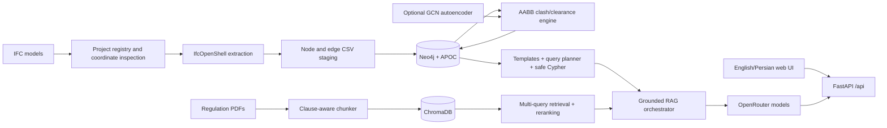

# BIM-Intellect v2 — Integrated Project Report

**Report date:** 2026-08-28

**Target branch:** `fix/rag-grounded-api`

**UI source integrated:** `origin/feature/ui-ux` at `0d4aff7` (`fix: hidden sidebars`)

**Verification:** 84 tests passed, 3 skipped; Python and JavaScript syntax checks passed; frontend smoke test passed; Docker Compose configuration validated.

## 1. Executive summary

BIM-Intellect v2 is a bilingual BIM analysis and grounded question-answering application. It combines four systems:

1. IFC parsing and filtered, multi-model federation with IfcOpenShell;
2. a provenance-aware Neo4j building graph;
3. deterministic AABB clash and clearance analysis, optionally enriched by an unsupervised graph anomaly model;
4. regulation RAG over a multilingual ChromaDB corpus, combined with schema-aware graph retrieval.

The latest `feature/ui-ux` work has been adopted into the current RAG/graph branch. The delivered interface is a responsive English/Persian workspace with overlay navigation and context drawers, chat, IFC pipeline, results, and document-corpus views. Existing graph query planning, grounded citation handling, multi-file uploads, text-direction support, project-scoped ingestion, and clash logic remain connected.

The deterministic clash engine is the authoritative issue detector. The graph anomaly model is a separate triage signal; it does not create, remove, or reclassify clashes.

## 2. System architecture



### Runtime components

| Component | Implementation | Responsibility |
|---|---|---|
| Web/API | FastAPI 0.111, Uvicorn | Serves the UI and `/api` routes |
| IFC | IfcOpenShell 0.8.5 | IFC parsing, hierarchy, world-coordinate geometry |
| Graph | Neo4j 5.20 + APOC | Elements, IFC relationships, project provenance, detected issues |
| Vector store | ChromaDB | Persistent multilingual regulation chunks |
| Embeddings/ranking | Sentence Transformers, scikit-learn | Dense embeddings, lexical/hybrid reranking |
| LLM access | OpenAI-compatible client through OpenRouter | Query understanding, novel Cypher, grounded answer generation |
| Data/ML | pandas, NumPy, PyTorch | CSV handling, clash data, graph anomaly training/inference |
| Frontend | HTML, CSS, vanilla JavaScript | Responsive bilingual single-page workspace |

## 3. Repository map

| Path | Purpose |
|---|---|
| `main.py` | FastAPI application, CORS, static/template serving, safe validation-error response |
| `api/routes.py` | IFC, graph, clash, RAG, chat, filter, and health API |
| `extract_graph.py` | IFC hierarchy/semantic extraction and AABB generation |
| `extract_sotreys_type.py` | Fast IFC storey/type scanning for UI filters (filename retains the historical typo) |
| `bim_graph/` | Neo4j loader/client, project registry, coordinate validation, clash pipeline, graph retrieval |
| `bim_graph/anomaly/` | Graph dataset, features, sparse GCN autoencoder, training and inference |
| `rag/` | PDF chunking, indexing, Chroma access, retrieval, reranking, memory, prompts, orchestration |
| `templates/index.html` | Integrated application shell and accessible controls |
| `static/style.css` | Responsive logical-property styling for LTR/RTL layouts |
| `static/i18n.js` | English/Persian translation and document direction controller |
| `static/app.js` | UI state, uploads, ingestion, chat, results, filters and drawers |
| `tests/` | RAG, graph planning, federation, clash/anomaly, and workflow regression tests |
| `docs/` | Detailed subsystem documents |
| `Dockerfile`, `docker-compose.client.yml` | Full application + Neo4j client deployment |
| `docker-compose.yml` | Neo4j-only development deployment |
| `artifacts/anomaly/` | Checked-in anomaly dataset/checkpoint/results artifacts |

## 4. Integrated UI/UX

The UI branch introduced a new workspace shell without changing backend contracts.

### Navigation and layout

- Overlay sidebar navigation for Chat, Pipeline, Results, and Documents.
- Secondary context drawer for chat retrieval details.
- Scrim, close buttons, `Escape` behavior, and responsive hidden sidebars.
- Logical CSS properties allow the complete layout to mirror under RTL.
- Desktop and mobile layouts use the same functional controls.

### Internationalization

- `static/i18n.js` supplies English and Persian strings.
- The chosen language is stored in browser local storage.
- `<html lang>` and `<html dir>` are updated together.
- Model answers, questions, IFC names, and project IDs get content-aware direction.
- Metrics, citations, code-like IDs, and logs stay LTR where mirroring would be misleading.

### Functional views

- **Chat:** hybrid vector/graph questions, example prompts, stronger-model option, cited sources, retrieval diagnostics, and conversation ID continuity.
- **Pipeline:** multi-IFC drag/drop, project ID, registered-model selection, storey/type multiselects, reset option, import/analyse action, and activity log.
- **Results:** All Issues, Clashes, and Clearances; storey/type filters; project-aware output; cross-file and anomaly fields.
- **Documents:** multi-PDF ingestion, optional document ID for a single file, indexed-document status, and collection clearing.

### Compatibility preserved during integration

- Empty multiselect and “all selected” both serialize as no filter.
- One file uses the legacy scalar multipart field; batches use repeated `files` fields.
- API validation errors are converted to a stable JSON-safe shape.
- Structured FastAPI/Pydantic errors are rendered into readable UI text.
- Current graph source/citation rendering and Persian/English chat direction were retained.

## 5. IFC project and graph ingestion

### Upload and registry

`POST /api/ifc/upload` accepts one or multiple `.ifc` files. Each file is processed independently, so one invalid sibling does not roll back valid files.

For every accepted file the system:

1. sanitizes the client filename and project ID;
2. streams to a temporary file under `dataset/ifc/projects/<project-id>/`;
3. computes SHA-256 and uses a digest-prefixed stored filename;
4. scans schema, storeys, and IFC type counts;
5. inspects units, world context, sites, georeference, map conversion, and project/site GUIDs;
6. writes a thread-safe JSON registry record with provenance and processing state.

The `file_id` is `<safe-stem>-<first-12-sha256>`. This makes duplicate content stable while preserving the original filename in metadata.

### Federation safety

Before multi-file ingestion or project-scoped analysis, `validate_federation` requires:

- equal length-unit scale;
- and either matching map conversion, or matching world context plus a shared project GUID, site GUID, or georeference.

A single file is automatically compatible. Missing metadata, unit mismatch, or unverified alignment returns HTTP 409. The system intentionally refuses cross-file analysis rather than mixing unverified coordinate frames.

### Extraction

`extract_graph.py` always includes spatial hierarchy nodes (`IfcProject`, `IfcSite`, `IfcBuilding`, `IfcBuildingStorey`) and `AGGREGATES` edges. Semantic elements are limited to a supported whitelist and can be filtered by storey and IFC type.

For selected elements, IfcOpenShell geometry uses `USE_WORLD_COORDS`. A multi-process iterator calculates axis-aligned min/max values. Opening subtraction and material resolution are disabled because only outer bounding envelopes are required. Elements without representable geometry remain graph nodes but are excluded from clash analysis because their bounding-box fields are null.

Additional relationships are:

- `CONTAINS`: storey to element;
- `BOUNDS`: space to boundary element when both were retained;
- `PORT_OF`: distribution port to related MEP element;
- `AGGREGATES`: spatial hierarchy.

Federated element identity is composite: `project_id::source_file_id::ifc_guid`. The original IFC GUID is retained separately as `ifcGuid`.

### Neo4j loading

The loader sends batches of 1,000 rows through the Bolt driver. Every IFC object is an `:Element` with an additional dynamic IFC-class label such as `:IfcWall`. APOC creates dynamic labels and typed relationships. A uniqueness constraint protects `Element.id`.

Project mode also creates:

```text
(:BIMProject)-[:HAS_MODEL]->(:IFCModel)-[:HAS_ELEMENT]->(:Element)
```

`reset_all=true` clears the complete graph. Otherwise, project ingestion replaces that project's elements and model nodes. The project pipeline is serialized by a process-local reentrant lock to avoid concurrent CSV/import corruption.

## 6. Clash detection — exact implemented behavior

This section describes the code in `bim_graph/clash_pipeline.py`, not an intended future design.

### 6.1 Input and scope

The engine reads `:Element` nodes back from Neo4j. It does not analyse the CSV directly. An element is eligible only when `minX` is present; extraction writes all six bounds together, so this represents elements with usable AABBs.

Optional scope is applied by:

- `projectId = $project_id` when a project is supplied;
- `sourceFileId IN $file_ids` when files are supplied.

Project analysis normally supplies only files that reached `ingested` state. Before detection, the API repeats federation validation. Storey name is fetched for reporting, but the current detector does **not** partition candidates by storey. All eligible selected elements share one world-coordinate sweep, allowing cross-storey issues when their actual AABBs overlap or approach each other.

### 6.2 Bounding-box mathematics

For each axis `x`, `y`, and `z`:

```text
gap_axis = max(a.min_axis, b.min_axis) - min(a.max_axis, b.max_axis)
```

- A negative gap is overlap depth on that axis.
- Zero means the envelopes touch on that axis.
- A positive gap is separation on that axis.

A pair is a `CLASH` only when all three gaps are strictly negative. Its metric is AABB intersection volume:

```text
metric = (-gap_x) * (-gap_y) * (-gap_z)
```

Otherwise the engine clamps negative gaps to zero and calculates Euclidean envelope separation:

```text
distance = sqrt(max(gap_x,0)^2 + max(gap_y,0)^2 + max(gap_z,0)^2)
```

If `distance < 0.25`, the result is `CLEARANCE_VIOLATION` and the metric is that distance. Exactly `0.25` is not reported. Face/edge/corner touching has distance zero: it is not a volumetric clash, but is reported as a clearance violation. Metrics are rounded to four decimal places before persistence.

### 6.3 Candidate generation and performance

The detector implements a one-axis sweep-and-prune broad phase:

1. sort all eligible records by `min_x`;
2. maintain an active list;
3. remove prior element `a` when `a.max_x + 0.25 < b.min_x`;
4. run the exact three-axis classification for every remaining active pair.

This avoids testing pairs that are clearly too far apart on X. Sorting is `O(n log n)`; the candidate pass depends on X-axis density and remains `O(n²)` in the worst case. The active list is a Python list and no spatial tree or exact solid/mesh intersection is used.

### 6.4 Duplicate and ignored pairs

The same IFC `GlobalId` exported in different source files is skipped when both records have that GUID and different source file IDs. This prevents duplicate discipline exports of one physical object from manufacturing a clash.

The following unordered IFC-type pairs are intentionally ignored:

| Type A | Type B |
|---|---|
| IfcWallStandardCase | IfcWallStandardCase |
| IfcSpace | IfcSpace |
| IfcRailing | IfcWallStandardCase |
| IfcRailing | IfcStair |
| IfcRailing | IfcSlab |
| IfcRailing | IfcRailing |
| IfcDoor | IfcWallStandardCase |
| IfcDoor | IfcSlab |
| IfcDoor | IfcDoor |
| IfcCovering | IfcWallStandardCase |
| IfcCovering | IfcCovering |
| IfcSlab | IfcWallStandardCase |
| IfcStair | IfcWallStandardCase |
| IfcSlab | IfcStair |

These exclusions encode expected host/contact relationships and reduce envelope false positives. They are exact runtime IFC type-name matches; similar subclasses are not automatically covered.

### 6.5 Multi-file provenance

Every result records:

- composite endpoint IDs and original IFC GUIDs;
- source IFC filename for each endpoint;
- endpoint disciplines in the in-memory result;
- project ID;
- `cross_file=true` only when both source file IDs are non-empty and different.

Because all models must pass coordinate verification and their geometry is extracted in world coordinates, intra-file and cross-file candidates use the same calculation.

### 6.6 Persistence

Detected issues are stored as a directed relationship:

```text
(a:Element)-[:CLASHES_WITH {
  issue,
  metric,
  projectId,
  sourceIfcFileA,
  sourceIfcFileB,
  ifcGuidA,
  ifcGuidB,
  crossFile
}]->(b:Element)
```

The direction is an implementation detail arising from sweep order, not engineering causality. `MERGE` prevents duplicate relationships for the same ordered endpoints.

For a project-scoped rerun, prior `CLASHES_WITH` relationships in that project are deleted within the selected file scope before new results are written. This also removes stale issues when the new run finds zero. The summary returns elements checked, issues detected, counts by issue type, selected files, and cross-file issue count.

Read APIs expose:

- `GET /api/clashes` → `issue=CLASH`;
- `GET /api/violations` → `issue=CLEARANCE_VIOLATION`;
- `GET /api/issues` → both;
- optional `storey`, comma-separated `types`, and `project_id` filters.

A storey/type result matches when either endpoint satisfies the filter. Rows include both endpoint IDs, GUIDs, names, types, source files, issue, metric, project, cross-file flag, and nullable anomaly scores.

### 6.7 Optional anomaly enrichment

When enabled, the engine first completes the deterministic rule pass, then scores the graph using `GraphAnomalyDetector`. Only `AGGREGATES`, `CONTAINS`, `BOUNDS`, and `PORT_OF` edges are model inputs; `CLASHES_WITH` is explicitly excluded to prevent target leakage.

Node properties written are:

- `anomalyScore`;
- `anomalyFeatureError`;
- `anomalyStructuralError`;
- `isAnomaly`.

Issue relationships receive `anomalyScoreA`, `anomalyScoreB`, and `combinedAnomalyScore`. Combination is `max` by default or `mean` when requested. The rule `issue` and `metric` are never altered. A missing/broken anomaly checkpoint emits a warning and the authoritative clash run continues.

### 6.8 Engineering limitations that must be understood

- AABB overlap is conservative; rotated, curved, hollow, and irregular shapes can have overlapping envelopes without solid intersection.
- The fixed clearance constant is `0.25`. Its source comment assumes feet (about three inches), but the engine does not convert the threshold from IFC unit metadata. The result UI correctly calls the metric “model units.” Production use should normalize geometry or convert a physical threshold explicitly.
- The ignore list is global, hard-coded, and does not consider system, material, discipline, tolerance class, or element-specific rules.
- There is no severity ranking beyond issue type, metric, cross-file flag, and optional anomaly score.
- The detector does not compute clash point, intersection solid, penetration direction, or visualization geometry.
- Project/file scope cleanup is precise only when analysis is invoked with project provenance; legacy unscoped use should be treated as development compatibility.
- The algorithm is synchronous inside the API request and can be CPU-intensive for dense models.

## 7. Graph anomaly detection

The optional ML subsystem is an unsupervised two-layer sparse GCN autoencoder. It reconstructs both node features and graph links.

Features include bounding-box presence, centers, extents, log volume, degrees, neighbor-degree mean, isolation, storey presence, relationship-specific in/out degrees, one-hot IFC type, and one-hot storey. Unknown categories have explicit buckets. Missing geometry becomes zero numerical geometry plus `has_bbox=0`.

Training loss is:

```text
loss = alpha * feature reconstruction MSE
     + beta  * positive/negative link BCE
```

Defaults are 100 epochs, hidden dimension 64, latent dimension 16, dropout 0.1, `alpha=0.7`, `beta=0.3`, seed 42, and a 99th-percentile training-score triage threshold. This threshold is not supervised accuracy. The checked-in documentation records a two-building, 12,311-node training artifact; no precision/recall claim is valid because the repository contains no anomaly ground-truth labels.

## 8. Regulation RAG and hybrid graph QA

### Document ingestion

PDFs are normalized and parsed page by page. The chunker detects Persian/English clause structure, canonicalizes Persian/Arabic digits, excludes table-of-contents fragments where possible, stores section links, and retains source, document, clause, page, section, content hash, and neighbor metadata. Indexing uses Chroma upsert semantics so rebuilding known IDs is idempotent.

### Retrieval

The current retrieval path provides:

1. contextual standalone-query rewriting and bounded conversation memory;
2. up to four query variants;
3. dense multilingual candidate retrieval;
4. hybrid/cross-encoder reranking;
5. one bounded lexical fallback when semantic relevance is weak;
6. neighboring-chunk expansion, or complete-section expansion for completeness requests;
7. deduplicated, size-bounded context assembly.

Conversation memory is in process, bounded by count and TTL, and is not a durable multi-worker session database.

### Graph retrieval

Graph questions are resolved in this order:

1. deterministic templates for known identifiers;
2. schema-aware plans for grouped issue counts, storey-scoped counts, anomaly-property counts, typed issue listings, and exact IFC-type counts;
3. LLM-generated Cypher for novel shapes.

Queries are safety-checked and validated with Neo4j `EXPLAIN`. Planned queries carry required output columns. If a non-empty result omits them, one bounded corrective query is allowed; a still-incomplete response fails closed. UI context is capped to 25 graph rows.

### Grounding and citations

The orchestrator routes a question to regulation evidence, graph evidence, both, or conversational handling. Explicit graph schema signals override accidental vector-only routing. Final regulatory claims must cite a retrieved clause/page pair. Persian digits are normalized during citation validation. Unsupported or malformed citations cause repair or a fail-closed insufficient-evidence response. Returned `sources` include only evidence actually used by the answer.

Standard and stronger model profiles are configured independently. The strong option changes query-understanding and final-answer models; it does not weaken grounding requirements.

## 9. API inventory

All application endpoints are mounted under `/api`; `/` serves the UI.

| Method | Endpoint | Purpose |
|---|---|---|
| POST | `/extract` | Legacy path-based IFC extraction to CSV |
| POST | `/load` | Load staged CSV into Neo4j |
| POST | `/ingest` | Legacy combined extract/load |
| POST | `/analyze` | Run rule clash analysis and optional anomaly scoring |
| POST | `/ifc/upload` | Upload and independently inspect one/many IFC files |
| GET | `/ifc/projects` | List registered projects/files and legacy disk files |
| POST | `/ifc/projects/{project_id}/ingest` | Federate, extract, load, and optionally analyse selected models |
| GET | `/filters/dataset` | Generate/read IFC storey/type filter metadata |
| GET | `/filters/storeys` | List storeys actually present in Neo4j |
| GET | `/filters/types` | List IFC types actually present in Neo4j |
| GET | `/clashes` | List volumetric AABB clashes |
| GET | `/violations` | List clearance violations |
| GET | `/issues` | List both issue types |
| POST | `/rag/upload` | Upload and index one/many PDFs |
| POST | `/rag/ingest` | Legacy server-path PDF ingestion |
| GET | `/rag/status` | Collection count and indexed-document inventory |
| DELETE | `/rag/clear` | Delete/recreate the regulation collection |
| POST | `/ask` | Routed, grounded vector + graph conversation |
| DELETE | `/rag/conversations/{conversation_id}` | Clear one in-memory conversation |
| POST | `/ask-vector` | Legacy vector-only answer path |
| POST | `/ask-graph` | Graph-only retrieval/debug path |
| GET | `/health` | Neo4j and Chroma readiness; 503 if a required check fails |

The OpenAPI schema documents both plural batch and legacy scalar multipart fields.

## 10. Configuration

Important environment variables include:

| Area | Variables |
|---|---|
| Neo4j | `NEO4J_URI`, `NEO4J_USER`, `NEO4J_PASSWORD` |
| IFC staging | `IFC_PATH`, `NODES_CSV`, `EDGES_CSV`, `BIM_PROJECT_STORAGE_DIR`, `BIM_PROJECT_REGISTRY` |
| OpenRouter | `OPENROUTER_API_KEY`, model/site/retry settings |
| Chroma | `CHROMA_PERSIST_DIR`, collection and embedding model settings |
| Retrieval | candidate/rerank counts, context limit, weights, reranker provider/device |
| Memory | recent-message limit, summary size, conversation cap and TTL |

`.env` is ignored by Git and excluded from Docker build context. Secrets are injected by Compose through `env_file`; they must never be copied into documentation or commits.

## 11. Deployment and operation

### Local development

```powershell
docker compose -f docker-compose.yml up -d
python -m pip install -r requirements.txt
python -m uvicorn main:app --reload
```

### Full client deployment

```powershell
docker compose -f docker-compose.client.yml build
docker compose -f docker-compose.client.yml up -d
docker compose -f docker-compose.client.yml ps
```

The client composition builds the FastAPI image, starts Neo4j with APOC, waits for Neo4j health, then starts the app on port 8000. Host `chroma_db`, `dataset`, and `artifacts` directories are mounted for persistence. Neo4j browser and Bolt are exposed on 7474/7687.

The conventional `.dockerignore` now excludes Git/IDE state, virtual environments, caches, runtime Chroma/artifacts, archives, and `.env` from the application image.

## 12. Verification performed on the integrated tree

| Check | Result |
|---|---|
| Fetch latest `origin/feature/ui-ux` | `0d4aff7` fetched and merged |
| Merge conflict audit | `.gitignore`, HTML, CSS, and JavaScript reconciled; no markers remain |
| Python compilation | Passed for API, graph, RAG, and entry modules |
| JavaScript syntax | `static/app.js` and `static/i18n.js` passed `node --check` |
| Test suite | **84 passed, 3 skipped**, 1 third-party deprecation warning |
| Frontend smoke test | `GET /` returned 200 and rendered the integrated page |
| OpenAPI generation | Passed; 24 paths including `/` were generated |
| Docker Compose config | `docker-compose.client.yml` validated |
| Health smoke test | Chroma reachable; Neo4j unavailable locally, so `/api/health` correctly returned 503 |

The normal pytest invocation on this workstation was initially intercepted by an incompatible globally installed Hydra/OmegaConf plugin. Running with `PYTEST_DISABLE_PLUGIN_AUTOLOAD=1` isolated project tests and produced the result above.

## 13. Operational and security considerations

These are current implementation constraints, not completed features:

- The API has no authentication or authorization. Destructive graph/vector operations and paid LLM calls must not be exposed publicly as-is.
- CORS is wildcard-based. Production should use an explicit trusted-origin list and an authentication scheme.
- Neo4j development credentials are defaults and APOC is unrestricted in Compose; replace credentials and restrict procedures for production.
- Legacy path-based IFC/PDF routes assume a trusted operator and should be disabled or sandboxed in a multi-user deployment.
- Extraction, graph load, clash detection, and PDF embedding run in request handlers. Large jobs need a queue, progress API, cancellation, and timeouts.
- Some list/filter handlers catch Neo4j failures and return empty lists with an error field, which clients must not interpret as proof that there are no issues.
- Each graph request creates a new Neo4j driver instead of sharing an application-level connection pool.
- Chroma, the project JSON registry, temporary CSVs, and conversation memory are local-process/local-filesystem state; multi-instance deployment requires shared durable services and concurrency design.
- Uploaded file size/count limits, quotas, malware scanning, rate limiting, and audit logging are not implemented.
- Checked-in model artifacts increase repository/image-mount size and need an explicit artifact/versioning policy.

## 14. Recommended next work

1. Normalize clash geometry/threshold to declared physical units and add per-discipline tolerance profiles.
2. Add exact geometry confirmation after AABB broad phase and return clash points/volumes for viewers.
3. Add authentication, role checks, restricted CORS/APOC, rate limits, and upload limits.
4. Move extraction, ingestion, embedding, and analysis to durable background jobs.
5. Add project-scoped authorization and database/vector tenancy.
6. Share the Neo4j driver and replace swallowed infrastructure errors with explicit service responses.
7. Add browser-level accessibility and responsive visual regression tests for both languages.
8. Add reviewed clash/anomaly labels before making any ML accuracy claim.

## 15. Related technical documents

- `docs/CLASH_DETECTION_AND_GRAPH_ANOMALY.md`
- `docs/MULTI_FILE_WORKFLOWS.md`
- `docs/RAG_ARCHITECTURE.md`
- `docs/GRAPH_RAG_QUERY_IMPROVEMENTS.md`
- `BIM-Intellect-Documentation.md`

This report is the integrated project-level overview. The subsystem documents contain deeper command examples, schemas, training details, and regression rationale.
