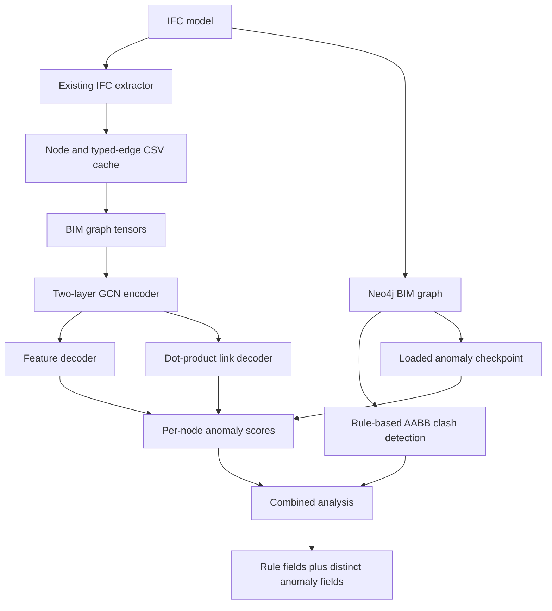

# Clash Detection and Graph Anomaly Detection

## 1. System overview

BIM-Intellect now has two complementary analysis paths:

- `bim_graph/clash_pipeline.py` is the authoritative deterministic rule path. It sweep-compares axis-aligned bounding boxes (AABBs) across the selected, coordinate-verified project models, reports true overlaps as `CLASH`, and reports separations below the configured clearance as `CLEARANCE_VIOLATION`. Existing ignored IFC-type pairs and the meaning of `metric` are unchanged. Multi-file federation is detailed in [MULTI_FILE_WORKFLOWS.md](MULTI_FILE_WORKFLOWS.md).
- `bim_graph/anomaly/` is an optional unsupervised graph path. It learns common combinations of IFC attributes, bounding-box geometry, storey membership, and local graph topology. Reconstruction error gives each graph node an anomaly score.

An anomaly is a review/risk signal. It is not evidence that two elements clash, that the model violates a regulation, or that the IFC is incorrect.

## 2. Architecture



Training code is not imported by the clash loop. `GraphAnomalyDetector` loads a checkpoint once and exposes inference over encoded graphs, CSVs, IFCs, or Neo4j records.

## 3. Dataset generation

### Sources and graph construction

The checked-in artifact was built from:

- `dataset/ifc/210_King_Merged.ifc`
- `dataset/ifc/AdvancedProject.ifc`

`bim_graph.anomaly.dataset` calls the existing `extract_graph.run_extraction` implementation. It therefore uses the same semantic/spatial nodes and the same relationship semantics as the Neo4j pipeline:

- nodes: `IfcProject`, `IfcSite`, `IfcBuilding`, `IfcBuildingStorey`, and supported semantic building/MEP types;
- identifiers: IFC `GlobalId`/GUID;
- relationships: `AGGREGATES`, `CONTAINS`, `BOUNDS`, and `PORT_OF`;
- node properties: IFC entity type, name, storey GUID/name, and world-coordinate AABB.

`CLASHES_WITH` is explicitly excluded from dataset construction and inference features. This prevents rule/clash output leakage into the unsupervised model.

Extraction results are cached under `artifacts/anomaly/extracted/`. Each cache has a source size/mtime fingerprint. A matching source reuses the cache; `--force-extract` reparses it.

### Node features

The numerical block contains:

- `has_bbox`;
- AABB center `x/y/z`;
- AABB extent `x/y/z`;
- `log1p` AABB volume;
- unique-neighbor degree, incoming degree, outgoing degree;
- mean neighbor degree and isolated-node flag;
- storey-presence flag;
- incoming and outgoing counts for every training relationship type.

The categorical block contains one-hot IFC entity type and storey name. Both vocabularies have `__UNKNOWN__` buckets for new buildings. Numerical features use training-set mean and standard deviation; near-zero standard deviations are replaced with one. Missing AABBs become zero geometry plus `has_bbox=0`, so spatial hierarchy nodes and unrepresentable elements remain valid.

The present artifact contains 2 disconnected building graphs, 12,311 nodes, 15,909 directed source relationships, and 99 input features. The GCN symmetrizes message-passing adjacency and adds self-loops, but link reconstruction retains the source edge list.

### Processed `.pt` schema

`artifacts/anomaly/bim_graph_dataset.pt` is a plain dictionary saved by PyTorch:

| Key | Contents |
|---|---|
| `schema_version` | Dataset compatibility version. |
| `graph.x` | Combined normalized `float32 [N,F]` node-feature tensor. |
| `graph.edge_index` | Combined `int64 [2,E]` edge tensor. |
| `graph.graph_ptr` | Start/end node offsets for each building. |
| `graph.node_ids`, `ifc_guids` | IFC GUID mappings. |
| `graph.entity_types`, `element_names`, `storeys`, `source_files` | Human/mapping metadata. |
| `graph.relationship_types` | Edge type in source-edge order. |
| `graphs` | Same encoded fields split per source building. |
| `feature_metadata` | Ordered feature names, vocabularies, normalization mean/std, input dimension. |
| `manifest` | IFC fingerprints, cache paths, node counts, and edge counts. |

## 4. Model

The selected model is deliberately small and dependency-light:

1. sparse normalized GCN layer: input → hidden, ReLU and dropout;
2. sparse normalized GCN layer: hidden → latent;
3. MLP feature decoder: latent → hidden → reconstructed input;
4. dot-product link decoder over positive and sampled negative edges.

Core PyTorch sparse tensors are used; PyTorch Geometric/DGL is not required. This is adequate for the current 12k-node corpus and keeps CPU inference practical.

Training minimizes:

```text
loss = alpha * mean_feature_reconstruction_MSE
     + beta  * mean_positive_and_negative_link_BCE
```

For node `i`:

```text
anomaly_score_i = alpha * feature_error_i
                + beta  * mean_incident_link_error_i
```

`feature_error_i` is the mean squared error across the normalized feature vector. `structural_error_i` is binary cross-entropy over observed and deterministically sampled absent links incident to the node. Isolated nodes are supported through self-loop message passing and sampled non-links.

## 5. Training

Install dependencies and build the processed dataset:

```powershell
pip install -r requirements.txt
python -m bim_graph.anomaly.dataset `
  --ifc-dir dataset\ifc `
  --output artifacts\anomaly\bim_graph_dataset.pt `
  --cache-dir artifacts\anomaly\extracted
```

Train the reproduced checkpoint:

```powershell
python -m bim_graph.anomaly.train `
  --dataset artifacts\anomaly\bim_graph_dataset.pt `
  --checkpoint artifacts\anomaly\graph_autoencoder.pt `
  --history artifacts\anomaly\training_history.json `
  --epochs 100 --learning-rate 0.001 `
  --hidden-dim 64 --latent-dim 16 `
  --alpha 0.7 --beta 0.3 `
  --seed 42 --device cpu
```

The delivered run used seed 42, 100 epochs, Adam at `1e-3`, weight decay `1e-5`, hidden dimension 64, latent dimension 16, dropout 0.1, one negative per positive edge, `alpha=0.7`, and `beta=0.3`. Loss decreased from 0.356157 to 0.191453. This is reconstruction loss, not supervised accuracy. The 99th percentile of training anomaly scores (0.790425 in the delivered run) is stored only as a triage threshold.

`--device auto` selects CUDA if available and CPU otherwise. An unavailable explicitly requested CUDA device produces a warning and falls back to CPU. CLI flags or `--config` JSON can change the training configuration.

The checkpoint stores model weights/configuration, training configuration, feature metadata and normalization parameters, complete loss history, calibration diagnostics, and source manifest. A separate JSON history is also saved.

## 6. Inference

Score a new or cached IFC model:

```powershell
python -m bim_graph.anomaly.inference `
  --checkpoint artifacts\anomaly\graph_autoencoder.pt `
  --ifc dataset\ifc\AdvancedProject.ifc `
  --cache-dir artifacts\anomaly\extracted `
  --device auto `
  --output artifacts\anomaly\anomaly_scores.csv
```

Score an existing extractor CSV pair:

```powershell
python -m bim_graph.anomaly.inference `
  --checkpoint artifacts\anomaly\graph_autoencoder.pt `
  --nodes-csv nodes.csv --edges-csv edges.csv `
  --output artifacts\anomaly\anomaly_scores.csv
```

Python callers can create `GraphAnomalyDetector(checkpoint_path)` once, then use `score_ifc`, `score_csv`, `score_records`, or `score_graph`. New IFC/storey categories map to the saved unknown buckets. Empty graphs return a warning and empty result. A missing checkpoint raises a targeted `FileNotFoundError`; the clash integration catches it and continues rule-only.

The full experiment is in `notebooks/graph_anomaly_training.ipynb`. Production implementations remain in Python modules.

## 7. Clash pipeline integration

Existing callers remain valid:

```python
summary = run_clash_detection()
```

This path does not load a model, issue anomaly queries, or add summary keys. Enable optional scoring with:

```python
summary = run_clash_detection(
    anomaly_model_enabled=True,
    anomaly_checkpoint="artifacts/anomaly/graph_autoencoder.pt",
    anomaly_combination="max",  # or "mean"
    anomaly_device="auto",
)
```

CLI equivalent:

```powershell
python -m bim_graph.clash_pipeline `
  --anomaly `
  --anomaly-checkpoint artifacts\anomaly\graph_autoencoder.pt `
  --anomaly-combination max
```

The existing `POST /api/analyze` endpoint accepts the same optional query parameters (`anomaly_model_enabled`, `anomaly_checkpoint`, `anomaly_combination`, and `anomaly_device`). Its default remains rule-only. The `/api/clashes`, `/api/violations`, and `/api/issues` responses expose GUIDs and nullable anomaly fields.

The model is loaded before opening the Neo4j analysis loop and reused for all elements. In anomaly mode, `clash_pipeline.py`:

1. runs the unchanged AABB rule detection;
2. fetches all `Element` nodes and only the four non-clash graph relationship types;
3. scores every graph node once;
4. writes node-level scores to Neo4j;
5. maps scores by IFC GUID and adds separate fields to each `CLASHES_WITH` relationship;
6. leaves `issue` and `metric` unchanged.

The default combined anomaly score is `max(anomaly_score_a, anomaly_score_b)`. `mean` is available. This is anomaly fusion only, not rule-severity fusion. If the checkpoint is missing or scoring fails, a useful warning is emitted and deterministic clashes still complete.

## 8. Output schema

The ranked CSV contains:

| Field | Meaning |
|---|---|
| `IFC_GUID` | Stable mapping back to the IFC/Neo4j element ID. |
| `Entity_Type` | IFC runtime entity type. |
| `Anomaly_Score` | Weighted feature plus structural error. |
| `Rank` | Descending rank within this scored building. |
| `Source_File` | IFC source filename. |
| `Feature_Error` | Per-node feature reconstruction MSE. |
| `Structural_Error` | Per-node incident-link reconstruction BCE. |
| `Storey` | Storey name when available. |
| `Element_Name` | IFC name when available. |
| `Is_Anomaly` | Whether score meets the saved training-percentile threshold. |

When enabled, Neo4j element nodes receive `anomalyScore`, `anomalyFeatureError`, `anomalyStructuralError`, and `isAnomaly`. Clash relationships receive `anomalyScoreA`, `anomalyScoreB`, and `combinedAnomalyScore`. `list_issues()` exposes snake-case forms alongside the existing IDs, names, types, `issue`, and `metric` fields.

## 9. Limitations

- Anomaly does not necessarily mean clash.
- Anomaly does not necessarily mean an engineering or regulatory violation.
- The model learns patterns only from available IFC data and the extractor's supported types.
- Performance and threshold usefulness depend on training-data diversity; two buildings are a small corpus.
- AABB features are envelopes and do not capture detailed meshes, orientations, materials, or exact solids.
- Storey names are project-specific categorical features; unseen values intentionally map to unknown.
- Link-negative sampling is an approximation, and scores can shift when graph context changes.
- Spatial hierarchy nodes can rank highly because their topology differs from ordinary elements.
- Neo4j anomaly properties persist until a later anomaly-enabled run overwrites them; a rule-only run does not delete prior ML diagnostics.
- The rule-based clash detector remains deterministic and authoritative.
- No accuracy, precision, recall, or F1 claim is made because the repository has no anomaly ground-truth labels.

Useful unsupervised diagnostics are training reconstruction curves, score distributions, score-component inspection, and manual review of top-k rows. Synthetic injected anomalies may be used in future sanity checks but must remain labeled synthetic.

## 10. Future improvements

- relational or edge-type-aware GNN message passing;
- contrastive/self-supervised graph objectives;
- more varied architectural, structural, and MEP training models;
- orientation, material, property-set, and richer geometry features;
- calibrated supervised clash-risk prediction if reviewed labels become available;
- human feedback on top-k anomaly triage;
- regulation/RAG evidence linked to anomalous elements;
- graph mini-batching or neighborhood sampling for much larger corpora.
