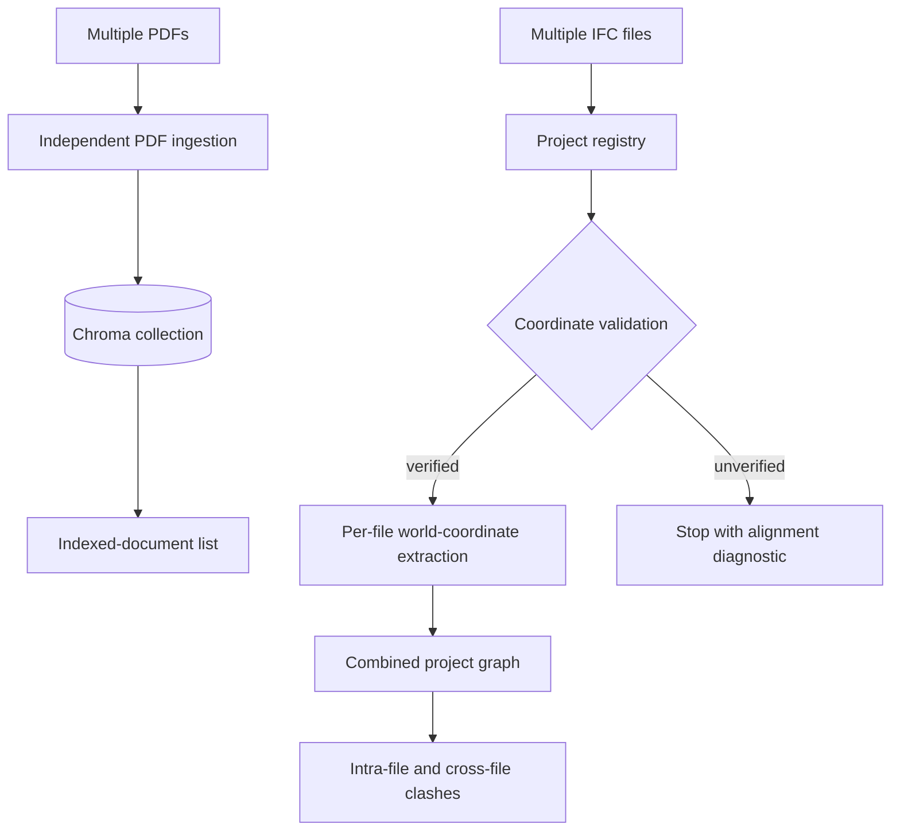

# Multi-File RAG and BIM Workflows

## Overview

The web application accepts batches of regulation PDFs and batches of IFC models. Each file has an independent result, so one bad document does not roll back successful siblings. The UI lists only completed RAG documents as indexed and only completed IFC models as available for analysis.

IFC models are grouped by a user-supplied `project_id`. A project is an analysis boundary, not an inferred building identity: unrelated models are never combined merely because they are present on disk. The user selects the models participating in each run.



## RAG Corpus Workflow

`POST /api/rag/upload` accepts either the backward-compatible `file` part or repeated `files` parts. Batch document IDs are derived from the content hash and normalized filename unless an explicit ID is supplied for a single file. Each PDF is chunked, embedded, and committed independently.

`GET /api/rag/status` now includes `documents`, grouped from actual Chroma metadata. A row is therefore shown under **Stored / Indexed Documents** only after chunks have been embedded and persisted. Each row includes the source filename, chunk count, page count, status, and ingestion time when recorded. Older indexed chunks remain visible but may not have an ingestion timestamp.

Example:

```powershell
curl.exe -X POST http://localhost:8000/api/rag/upload `
  -F "files=@dataset/sources/regulation-a.pdf" `
  -F "files=@dataset/sources/regulation-b.pdf"

curl.exe http://localhost:8000/api/rag/status
```

## BIM Project Registry

`dataset/ifc/project_registry.json` is the runtime registry and `dataset/ifc/projects/<project_id>/` stores uploaded files. The registry is written atomically and keeps:

- project ID and source filename;
- stable file ID and content hash;
- discipline (currently supplied by API clients, otherwise `unspecified`);
- upload, processing, and ingestion status/timestamps;
- schema, storeys, type counts, coordinate metadata, node count, and edge count.

Files are first `uploaded`. They become `ingested` only after extraction and Neo4j loading succeed. A failure is recorded per file and does not prevent compatible siblings from being extracted. Root-level IFC files that predate the registry are listed as `legacy_unregistered`; they are not presented as imported/available until uploaded into a project.

### APIs

| Endpoint | Purpose |
|---|---|
| `POST /api/ifc/upload` | Multipart upload; accepts legacy `file` or repeated `files`, plus `project_id` and optional `discipline`. |
| `GET /api/ifc/projects` | List projects, registered files, processing state, and legacy unregistered files. |
| `POST /api/ifc/projects/{project_id}/ingest` | Extract/load selected `file_ids`, optionally run project-scoped clash detection. |
| `POST /api/analyze?project_id=...&file_id=...` | Run analysis over one or repeated selected file IDs. |
| `GET /api/issues?project_id=...&file_id=...` | Read provenance-aware results for one or repeated selected file IDs. `/clashes` and `/violations` expose the same scope and fields. |

Example project ingestion request:

```json
{
  "file_ids": ["architecture-…", "structure-…", "mep-…"],
  "storeys": [],
  "types": [],
  "reset_all": false,
  "run_clash_detection": true
}
```

## Federation and Coordinate Safety

Files are never byte-concatenated or treated as if their local origins automatically match. Upload inspection records:

- IFC length-unit scale;
- project and site GlobalIds;
- site latitude/longitude/elevation when present;
- geometric representation world coordinate system and true north;
- `IfcMapConversion` values when present;
- an inspection fingerprint.

IfcOpenShell geometry is generated with `USE_WORLD_COORDS=True` and `CONVERT_BACK_UNITS=False`. Before a multi-file run, all models must use the same declared unit scale and expose a verifiable shared frame. After compatible world contexts, true north, and known spatial placements are checked, verification can use a shared project/site/building GUID, an identical explicit map conversion, or matching non-generic project and building identities. Georeference agreement is retained as supporting evidence, but common placeholder latitude/longitude alone is not sufficient. A single file requires no federation check.

This permits compatible discipline exports such as `model_0_arc.ifc` and `model_0_structure.ifc`, whose exporters regenerated project/site GUIDs but retained the same named project/building and aligned world geometry. Matching origins alone still fail closed for unrelated buildings.

Different units produce `unit_mismatch`. Missing metadata produces `missing_coordinate_metadata`. Files with matching units but no verifiable common reference produce `unverified_alignment`. In all three multi-file failure cases, extraction/clash analysis stops rather than returning spatially incorrect results. The system deliberately does not guess or apply an unproven translation/rotation; align/federate those files in the authoring tool and upload them again.

## Combined Graph and Provenance

Each selected IFC is parsed separately, then its extracted node/edge rows are assembled into one project graph. Federated graph IDs use:

```text
project_id::source_file_id::IFC_GlobalId
```

The original IFC identity remains in `ifcGuid`. This avoids Neo4j key collisions when separate files contain equal GUID strings while retaining traceability. Element nodes also store `sourceIfcFile`, `sourceFileId`, `discipline`, `projectId`, and `coordinateSystemId`. IFC model-node IDs are also project-scoped. Neo4j contains `(:BIMProject)-[:HAS_MODEL]->(:IFCModel)-[:HAS_ELEMENT]->(:Element)` provenance links.

## Cross-File Clash Detection

The detector fetches all bounding boxes for the selected project/files and performs one x-axis sweep-and-prune pass in their verified shared world frame. This considers both intra-file and cross-file pairs; it no longer partitions comparisons by storey-name strings. Existing AABB classification and ignored type-pair rules remain authoritative.

Each clash retains:

- graph ID, original GUID, type, and name for both elements;
- source IFC filename, file ID, and discipline for both elements;
- project ID;
- `cross_file` boolean;
- existing rule issue and metric fields;
- optional anomaly fields, kept separate from rule results.

The same GlobalId exported in two selected files is treated as the same object and is not reported as a clash with itself. Project-scoped reruns replace prior relationships for the selected model set, including when the new run finds no issues.

## UI Workflow

In **RAG Corpus**, select or drop multiple PDFs, upload once, and inspect the per-file outcome and indexed-document list.

In **Pipeline**:

1. enter a project/building ID;
2. select or drop multiple IFC models;
3. upload and inspect each file's status;
4. check one or more successfully ingested models for the analysis set;
5. run project ingestion and clash detection;
6. inspect the Results table, which shows both source filenames and marks cross-file findings.

The reset checkbox remains explicit because it clears the entire graph. It also marks every other registry file as no longer present in the graph and removes its generated scene entries. Normal project ingestion only replaces the selected project's graph and preserves unrelated projects.

## Validation

```powershell
$env:PYTEST_DISABLE_PLUGIN_AUTOLOAD='1'
python -m pytest -q tests/test_multifile_workflows.py
python -m pytest -q
node --check static/app.js
python -m compileall -q api bim_graph rag extract_graph.py extract_sotreys_type.py
```

## Limitations

- The JSON project registry is appropriate for this single-process deployment. Multi-host production should move the registry and locking to a transactional database/job queue.
- Geometry extraction and the shared CSV staging files are serialized in the API process; long jobs should eventually run in a background worker.
- Coordinate validation is intentionally conservative. It does not solve or auto-register models that lack trustworthy common-reference metadata.
- Extracted vertices/AABBs and generated scenes use the canonical metre geometry contract. Clearance distance is measured in metres at a physical threshold of 0.25 m; clash metric is AABB overlap volume in m³. Declared source-unit mismatch remains a federation rejection.
- IfcOpenShell geometry workers default to four to bound native memory on complex exports. Set `BIM_GEOMETRY_WORKERS` to tune this for the deployment.
- Discipline is persisted and accepted by the backend but the current UI assigns the batch default `unspecified`; automatic discipline inference is intentionally avoided.
- IFC files that cannot generate geometry are reported independently and are excluded from the successful combined graph.
