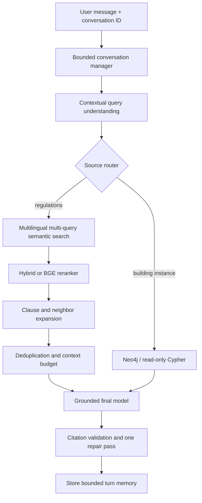

# Conversation-Aware Regulation and BIM RAG

## Purpose

BIM-Intellect answers two different classes of questions without conflating their evidence:

- the regulation corpus supplies general engineering requirements, safety instructions, standards, and maintenance guidance;
- Neo4j supplies facts about the currently ingested IFC building, including elements, properties, relationships, clashes, and clearances.

The rule is evidence-first: a language model interprets and writes, but retrieved PDFs and graph records remain the factual sources.

## Architecture



The standard model profile uses the configured default OpenRouter model for understanding and generation. Strong mode uses the configured Gemini model for routing, follow-up rewriting, query expansion, and free-form Cypher generation, then the configured Claude Sonnet model for the grounded answer. The frontend only selects standard or strong mode; it cannot provide arbitrary model IDs.

## Root causes in the previous pipeline

The old `/api/ask` endpoint constructed a new orchestrator for every request and did not use its separate `ChatSession`, so short follow-ups lost their topic. Vector search used one literal query and kept only five global nearest chunks. There was no reranking, clause/neighbor expansion, duplicate removal, context budget, completeness signal, or bounded second retrieval path. Chunk metadata contained only source, clause, and page. A failed citation check replaced the answer immediately with an English insufficient-evidence message, and ordinary social messages took the same evidence path.

In the validation PDF, clause `22-7-7` is split into three content chunks across PDF pages 67–68. The old top-five behavior could return the first chunk and omit the continuation.

## PDF ingestion and structured chunks

`rag.chunker` normalizes Persian/Arabic Unicode and digits, detects clause boundaries before splitting text, and prefers paragraph/list boundaries over fixed sliding windows. The default is 1,200 characters with no duplicate overlap. Oversized logical blocks alone are split further. Each stored chunk has:

| Field | Meaning |
|---|---|
| `chunk_id` | Stable document/page/chunk identifier |
| `document_id`, `document_title`, `source` | Document identity and actual PDF filename |
| `page_number` | PDF page number from extraction |
| `chapter`, `clause_id`, `section_id` | Extracted structural identifiers |
| `heading` | Best-effort first-line heading; never synthesized |
| `chunk_index`, `section_chunk_index` | Document and clause order |
| `previous_chunk_id`, `next_chunk_id` | Document neighbors |
| `previous_section_chunk_id`, `next_section_chunk_id` | Same-clause continuation links |
| `content_hash` | Exact normalized-text deduplication key |
| `is_toc` | Conservative front-matter/table-of-contents classification |

Missing headings or clause IDs remain empty/unknown instead of being invented. Unlabeled text stays searchable but cannot become a regulation citation. The manifest records extraction diagnostics. A known font mapping in the Mabhas 12 PDF extracts its visible root as `01`; ingestion records that fact and maps only the root to chapter `12`, which is authoritatively identified by the source filename.

## Semantic indexing

The default encoder is `sentence-transformers/paraphrase-multilingual-MiniLM-L12-v2`, a compact 384-dimensional multilingual semantic model suitable for CPU/offline use. Embedding input includes the document title, chapter, clause, extracted heading, and chunk body; the stored document remains the original normalized body. The embedding provider/model and index version are collection metadata. A mismatch fails clearly and requires reindexing instead of silently querying incompatible vectors.

For stronger retrieval experiments, configure `BAAI/bge-m3` as the embedding model. It supports multilingual dense retrieval and longer input, but is substantially heavier. Changing the embedding model always requires `--rebuild`.

## Retrieval stages

1. Contextual understanding rewrites the current turn as a standalone query using the bounded summary, recent messages, prior topic, and current message.
2. The router independently selects regulation vector search, BIM graph retrieval, both, or neither.
3. Regulation queries produce up to four semantic variants. Chroma retrieves 32 candidates per distinct query by default.
4. Duplicate candidates merge by chunk ID. Multi-query hits and reciprocal ranks are retained.
5. The default hybrid reranker combines dense similarity, Persian character n-gram TF-IDF relevance, and multi-query agreement. `RAG_RERANKER_PROVIDER=cross-encoder` enables the optional multilingual `BAAI/bge-reranker-v2-m3` second stage.
6. Normal questions expand a configurable same-section neighbor window. Completeness requests expand the highest-ranked logical clauses, capped per section.
7. Exact content hashes remove duplicate/overlapping text while preserving different continuation chunks.
8. Context assembly ranks whole sections and stays within `RAG_MAX_CONTEXT_CHARS`. A relevant clause is kept together ahead of unrelated fragments.
9. Weak semantic evidence triggers one bounded lexical fallback. There is no unbounded retry loop.

The final prompt explicitly preserves separate list items for “all/complete/more” intent. All output citations must match retrieved `(clause_id, page_number)` pairs. Invalid citations trigger one repair call; an invalid repaired answer is withheld. If the model provider is unavailable, a bounded extractive response is returned from retrieved evidence rather than an API 500 or a fabricated answer.

## Conversation memory and follow-ups

The browser creates a UUID in `sessionStorage` and sends it as `conversation_id`. `ConversationStore` isolates IDs, retains a bounded recent-message window, compacts older messages into a bounded rolling summary, tracks the durable topic and used chunk IDs, applies TTL/LRU eviction, and is shared across orchestrator instances in the API process.

For example, after the topic “بازدید عینی از تاسیسات برقی”, the messages “همین؟”, “بازم بگو”, and “کاملش کن” are rewritten into standalone searches for additional or complete material on that topic. The semantic understanding model—not the retriever—sets `is_follow_up` and `completeness_requested`. Greetings and acknowledgements route to ordinary conversation with no forced evidence lookup.

This memory is intentionally in-process. A multi-worker or multi-host deployment must replace the `ConversationStore` backend with Redis/database storage while retaining the same conversation-ID boundary.

## API and UI

Existing requests remain valid:

```json
{"question": "بازدید عینی از تاسیسات برقی شامل چه چیزهایی است؟"}
```

The extended request is:

```json
{
  "question": "کاملش کن",
  "conversation_id": "7bb2b4cd-...",
  "use_strong_models": true,
  "selected_element_id": null
}
```

`POST /api/ask` returns the ID, mode, actual backend model IDs, rewritten query, source flags, citations, and safe retrieval diagnostics. `DELETE /api/rag/conversations/{conversation_id}` clears one session. The Chat tab’s **Use Stronger Models** switch defaults off and affects subsequent requests without a reload.

## Configuration

Copy `.env.example` to `.env`. Important values are:

```dotenv
RAG_ROUTER_MODEL=openai/gpt-4o-mini
RAG_FINAL_MODEL=openai/gpt-4o-mini
RAG_STRONG_ROUTER_MODEL=google/gemini-2.5-flash
RAG_STRONG_FINAL_MODEL=anthropic/claude-sonnet-4.5
RAG_EMBEDDING_PROVIDER=local
RAG_EMBEDDING_MODEL=sentence-transformers/paraphrase-multilingual-MiniLM-L12-v2
RAG_RERANKER_PROVIDER=hybrid
```

OpenRouter is reused through the one client in `rag.openrouter_client`. Strong mode requires the configured account/key to have access to both selected models.

## Reindexing and operation

Install and build the entire corpus:

```powershell
python -m pip install -r requirements.txt
python -m rag.indexer --source-dir dataset/sources --rebuild
python -m rag.indexer --status
```

`--rebuild` deletes only the configured versioned Chroma collection. It does not delete PDFs or other collections. Identical PDFs are skipped by SHA-256. The generated `dataset/sources/rag_index_manifest.json` reports source hashes, pages, chunks, skipped duplicates, extraction errors, embedding settings, and final collection count.

The existing `/api/rag/upload` and `/api/rag/ingest` endpoints remain available for one-document updates. They now remove stale chunks with the same `document_id` before storing the replacement and report `stale_chunks_replaced`.

Run the application and tests:

```powershell
docker compose up -d
uvicorn main:app --reload
$env:PYTEST_DISABLE_PLUGIN_AUTOLOAD='1'
pytest -q rag/test_routing.py tests/test_rag_v2.py
```

The environment-specific pytest variable avoids loading unrelated globally installed plugins; it is not required in a clean virtual environment.

## Electrical-inspection validation

The indexed source `22 - v1-1392 - مراقبت و نگهداری.pdf` contains 15 distinct lettered requirements (`الف` through `س`) in clause `22-7-7`, on PDF pages 67–68. They are stored in three linked non-TOC chunks. Complete retrieval was run for all three semantic formulations:

- `بازدید عینی از تاسیسات برقی`
- `بازرسی چشمی برق ساختمان`
- `در بازرسی ظاهری تاسیسات الکتریکی چه چیزهایی باید بررسی شود؟`

Each assembled final-answer context contained all 15 markers and all three clause chunks. The observed context sizes were 6,013, 5,170, and 8,296 characters respectively; all remained below the configured budget. The requested four-turn same-conversation sequence was also run: every turn retained `vector=true`, `graph=false`, each follow-up inherited the electrical-inspection topic, and every answer-stage context contained all 15 items. Live LLM wording could not be validated because OpenRouter returned HTTP 403 in the development environment; the new provider-failure path returned all 15 cited source items extractively instead of failing the API.

## Limitations and future work

- PDF text extraction remains sensitive to unusual fonts, scan-only pages, reading order, and tables; OCR is not yet included.
- A lightweight MiniLM encoder trades some domain recall for CPU practicality. BGE-M3 and the BGE reranker should be evaluated on a curated Persian engineering relevance set.
- Retrieval completeness means all material in the detected logical clause reaches generation; it cannot prove a different distant clause is also semantically relevant.
- Conversation memory is process-local and not durable across restarts.
- An answer can only be as reliable as corpus diversity and IFC/Neo4j ingestion quality.
- Regulation retrieval does not prove a model violation, and graph retrieval does not create a regulation requirement.

Future improvements include OCR/layout extraction, learned Persian engineering reranking, hierarchical parent documents, Redis memory, retrieval evaluations with human judgments, relational graph retrieval, regulation-to-BIM entity linking, and human feedback on missed clauses.
