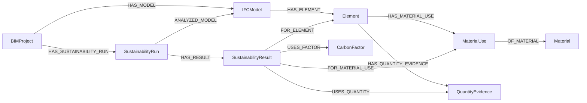

# Sustainability + LEED Implementation Plan

**Status:** Phases 1–3 implemented; reviewed LEED evaluator rules and production-scale report jobs remain future work  
**Prepared:** 2026-09-04  
**Applies to:** the current BIM-Intellect v2 repository and its existing multi-IFC, Neo4j, clash/anomaly, regulation-RAG, hybrid-QA, and bilingual workspace behavior

## 1. Purpose and boundaries

### Phase 1 implementation status (2026-09-04)

The deterministic BIM sustainability foundation described here is now implemented in `sustainability/`, `api/sustainability_routes.py`, and the versioned Neo4j sustainability subgraph. It supports project/file-scoped extraction, calculation, persistence, aggregation, and read APIs. The checked-in carbon-factor CSV is intentionally header-only because this repository does not contain an approved authoritative dataset.

Phase 1 uses existing graph AABBs as an optional, low-quality fallback (`allow_geometry_derived=true`); the safe API default is false. The stored bounds come from `extract_graph.py` with IfcOpenShell `CONVERT_BACK_UNITS=False` and are treated as metres. IFC-authored quantities and material-layer thicknesses are independently normalized from their IFC units. A generous envelope plausibility check excludes gross project/local unit inconsistencies without rewriting the raw IFC evidence.

At the Phase 1 checkpoint, the Sustainability dashboard, LEED document metadata/retrieval, chat routing, assessment rules, and report exports remained future work. Phases 2 and 3 have since implemented the document metadata/retrieval, chat routing, conservative assessment-state handling, dashboard, and exports. Reviewed deterministic LEED evaluator rules remain future work.

Phase 1 verification completed with 18 focused sustainability tests passing and the full repository suite at 102 passed / 3 skipped. Python compilation, JavaScript syntax, JSON schema loading, OpenAPI generation (five sustainability routes), UI smoke serving, and the full client Compose configuration also passed. Live Neo4j was unavailable on the verification workstation, so Bolt persistence was validated through repository/query-contract tests rather than a live database run.

### Phase 2 implementation status (2026-09-05)

Phase 2 adds backward-compatible `document_domain`, `standard_name`, and `standard_version` metadata to the existing RAG collection; domain isolation across dense retrieval, lexical fallback, reranking, and expansion; named-section document citations; a separate deterministic sustainability retriever; semantic three-source routing; conservative LEED-oriented assessment states; and post-generation numeric sustainability grounding. Chat requests and the existing frontend now carry active project/file scope.

The implementation kept the existing collection rather than forcing an immediate `regulations_v3` cutover. Legacy chunks missing `document_domain` are interpreted as `regulation`; newly classified LEED/sustainability searches use explicit Chroma metadata filters. A future rebuild may still move to a new collection version when a corpus-wide metadata migration is operationally scheduled.

No general LEED rule evaluator, credit scoring, or certification inference was added. With both project and document evidence but no reviewed evaluator, the assessment is `not_automatically_evaluable`.

### Phase 3 implementation status (2026-09-05)

Phase 3 adds the fifth Sustainability workspace view, exact project/selected-file versus all-ingested-file scope, summary KPIs, four carbon breakdowns, top element/material contributors, explicit data-quality panels, conversation-scoped grounded LEED findings, classified document upload controls, and downloadable JSON/CSV/HTML reports. Frontend response tokens and returned-scope validation prevent a response from another project or older selection from being rendered.

The canonical report schema is `sustainability-report-v1`. Reports assemble persisted deterministic results without recalculating them and include factor lineage, coverage, exclusions, session LEED findings/citations, and limitations. LEED findings remain bounded in-process conversation snapshots rather than certification records.

Phase 3 verification passed 36 focused sustainability tests and the final repository suite at 122 passed / 1 skipped in 50.60 seconds. JavaScript syntax, Python compilation, the factor-schema JSON, and Docker Compose configuration also passed. A live local Neo4j run exercised one registered IFC model through persistence and the summary/elements/report APIs. Because the checked-in factor CSV is intentionally header-only, the live run correctly produced no calculated carbon rather than inventing factors or reporting a meaningful zero. No classified LEED document existed in the local Chroma corpus, so live LEED claims were not fabricated; retrieval and hybrid behavior were validated with controlled fixtures.

This plan adds an incremental sustainability analysis path without redesigning the existing graph, clash engine, anomaly subsystem, regulation retrieval, or the pre-existing workspace views. The implemented phases:

- extract IFC material assignments and quantity evidence for already-ingested project/model elements;
- normalize material names while retaining the authored values;
- deterministically calculate embodied carbon from a controlled, versioned factor dataset;
- preserve factor, quantity, model, and calculation provenance;
- aggregate results at material, IFC type, element, source model, discipline, and project levels;
- ingest LEED and sustainability documents through the existing clause-aware multilingual RAG pipeline;
- answer sustainability-only and BIM + sustainability-document questions from deterministic evidence;
- add project/file-scoped APIs, a separate Sustainability workspace view, and auditable exports.

This phase will **not** implement whole-building energy simulation, operational carbon, life-cycle stages beyond those explicitly represented by the selected factor dataset, cost analysis, a general rules engine, or LEED certification/scoring. The product language must be “LEED-oriented assessment,” “potentially satisfied,” “not satisfied from available evidence,” “insufficient BIM/project evidence,” or “not automatically evaluable.” It must not report a certification level.

## 2. Current architecture relevant to sustainability

### 2.1 IFC and project path

The current project path is:

```text
IFC upload
  -> content-derived sourceFileId and project registry record
  -> schema/storey/type/unit/coordinate inspection
  -> federation validation
  -> extract_graph.py
  -> nodes.csv + edges.csv
  -> batched Neo4j load
  -> optional deterministic clash and anomaly analysis
```

The baseline `extract_graph.py` selects a fixed semantic IFC whitelist plus the spatial hierarchy. For each retained element it extracts:

- `Element.id`, using `project_id::source_file_id::ifc_guid` for registered projects;
- `ifcGuid`, IFC runtime type, name, storey ID/name;
- world-coordinate AABB bounds when geometry is representable;
- `projectId`, `sourceFileId`, `sourceIfcFile`, `discipline`, and `coordinateSystemId`.

It emits only `AGGREGATES`, `CONTAINS`, `BOUNDS`, and `PORT_OF` source relationships. Material application is explicitly disabled in the geometry settings because it is unnecessary for clash envelopes. Phase 1 intentionally leaves that staging schema unchanged: the new sustainability extractor reopens registered IFC files after ingestion, resolves the graph-retained GUID population, and writes separate sustainability evidence/results to Neo4j.

`bim_graph/load_to_neo4j.py` uses batched Bolt `UNWIND`, `MERGE (e:Element {id: ...})`, and APOC dynamic IFC labels. It creates:

```text
(:BIMProject)-[:HAS_MODEL]->(:IFCModel)-[:HAS_ELEMENT]->(:Element)
```

The current project replacement path deletes a project's `Element`, `IFCModel`, and `BIMProject` nodes before reloading it. Sustainability-owned dependent records will therefore need an explicit cleanup/invalidation step to avoid orphans.

The project registry is a thread-safe JSON manifest. It already contains the stored IFC path, SHA-256-derived file identity, discipline, status, coordinate metadata, and timestamps. These records are the authoritative way to reopen the original selected IFC files.

### 2.2 Deterministic analysis conventions

`bim_graph/clash_pipeline.py` establishes useful conventions for sustainability:

- analysis runs after graph import;
- project and repeated source-file IDs define the scope;
- selected files must be ingested and federation-compatible;
- deterministic Python computes engineering values;
- Neo4j persists results with project/file/IFC provenance;
- APIs return both aggregate summaries and detailed records.

The sustainability engine should follow these conventions, but it should use run/result records instead of mutable values directly on `Element`. Carbon results depend on factor-dataset and methodology versions; retaining that versioned lineage is materially different from the current clash relationship.

### 2.3 Regulation RAG and chat path

The current document path is:

```text
PDF
  -> Persian/English normalization and page extraction
  -> clause/section-aware chunks with neighbor links
  -> multilingual embeddings
  -> Chroma regulations_v2
  -> multi-query retrieval
  -> reranking and section/neighbor expansion
  -> grounded answer and citation validation
```

Chunk metadata already includes document identity, source filename, page, clause, chapter, section, heading, chunk order, neighbor IDs, content hash, table-of-contents status, and ingestion time. Retrieval currently searches the entire collection; `query_similar()` and the lexical fallback do not accept a document-category filter. Citation validation currently supports numeric hyphenated clause IDs plus page numbers, which is insufficient for identifiers such as `MRc1` or `EA Prerequisite 2`.

The orchestrator currently uses two source booleans, `needs_vector` and `needs_graph`. Graph retrieval has deterministic templates/plans for high-risk query shapes, then a bounded safe free-form Cypher fallback. Final answers may explain retrieved values, but the present prompt does not yet distinguish a deterministic carbon result from a value the language model might try to derive.

### 2.4 API and frontend conventions

All routes are mounted below `/api`. Current project workflows use snake-case request fields and project/file IDs. The five views are Chat, Pipeline, Results, Documents, and Sustainability; the frontend is framework-free HTML/CSS/JavaScript with English/Persian strings in `static/i18n.js`. Navigation lazy-loads view data and retains the project ID and selected source-file IDs in browser state.

Sustainability is a fifth sibling view. It is not inserted into Results and does not replace any existing sub-tab.

## 3. Current IFC data availability and missing capabilities

### 3.1 Repository sample inspection

A read-only inspection was performed with the installed IfcOpenShell utilities against the two checked-in source IFCs. Counts are diagnostic, subtype-inclusive where `by_type()` is subtype-inclusive, and are not a promised production baseline.

| Observation | `AdvancedProject.ifc` | `210_King_Merged.ifc` |
|---|---:|---:|
| Schema | IFC2X3 | IFC2X3 |
| Supported semantic elements, unique by IFC instance | 1,276 | 10,957 |
| Project length scale to metre | 0.001 (millimetre project) | 0.3048 (foot project) |
| `IfcMaterial` | 97 | 113 |
| `IfcMaterialLayer` / `IfcMaterialLayerSet` | 27 / 16 | 110 / 55 |
| `IfcRelAssociatesMaterial` | 1,345 | 2,860 |
| Supported semantic occurrences directly named by a material relationship | 1,094 | 4,248 |
| `IfcElementQuantity` | 1,354 | 261 |
| Supported semantic occurrences with a direct element-quantity relationship | 849 | 261 |
| `IfcQuantityVolume` / `Area` / `Length` / `Weight` | 1,000 / 1,858 / 3,356 / 0 | 0 / 261 / 0 / 0 |

Material relationship forms in the samples include `IfcMaterial`, `IfcMaterialLayerSet`, `IfcMaterialLayerSetUsage`, and—importantly—`IfcMaterialList`. Although `IfcMaterialList` was not in the requested investigation list, the implementation must support it for IFC2X3 compatibility. Neither sample contains IFC4 `IfcMaterialProfile` or `IfcMaterialConstituent`, so those paths require synthetic IFC4 fixtures.

The first model contains useful quantity names such as `NetVolume`, `GrossVolume`, `NetSideArea`, `GrossFootprintArea`, `Length`, `Width`, `Height`, and `Depth`. The second model has no `IfcQuantityVolume`; its observed explicit quantities are 261 `GSA BIM Area` values. This demonstrates why the system cannot assume that an IFC contains a carbon-ready volume or mass, even when it contains extensive material assignments.

Both samples contain many `IfcPropertySet` records. Examples include `BaseQuantities`, `Pset_QuantityTakeOff`, `Materials and Finishes`, `Dimensions`, and `Pset_WallCommon`. A property-set name alone does not make a value an authoritative physical quantity: direct `IfcElementQuantity`/`IfcPhysicalQuantity` traversal is required to retain value type, unit, and relationship provenance.

### 3.2 Capability gap

Before Phase 1, the system lacked:

- material association traversal, including occurrence-versus-type inheritance;
- representation of layers, profiles, constituents, lists, or allocation shares;
- direct extraction of IFC physical quantities and their unit overrides;
- material-name normalization and deterministic factor matching;
- a controlled factor dataset and provenance validation;
- dimensional checking and carbon calculation;
- versioned sustainability runs/results and coverage/error states;
- sustainability aggregations, APIs, UI, exports, chat routing, and LEED-specific RAG metadata.

## 4. Proposed modules and files

The implementation should be isolated in a new package and connected through narrow integration points.

```text
sustainability/
  __init__.py
  config.py                 # paths, supported units, method version, fallback policy
  models.py                 # dataclasses/enums for extraction, factors, results, scope
  normalization.py          # Unicode/name normalization and deterministic aliases
  units.py                  # IFC/project-unit to SI conversion and dimensional checks
  ifc_extractor.py          # material, quantity, property, and geometry evidence
  factors.py                # CSV loader, schema validation, lookup, ambiguity reporting
  calculator.py             # deterministic per-use carbon calculations
  repository.py             # Neo4j constraints, upsert, cleanup, current-run queries
  service.py                # project/file scope validation and analysis orchestration
  retriever.py              # bounded read-only sustainability evidence for chat
  assessment.py             # evidence-availability and explicitly supported rule registry
  reporting.py              # JSON/CSV/HTML report/export assembly

api/
  sustainability_routes.py  # sustainability-specific Pydantic contracts and endpoints

dataset/sustainability/
  carbon_factors.csv        # approved data only; no invented default factors
  carbon_factors.schema.json
  README.md                 # source/licence/update instructions

templates/
  index.html                # adds the sibling Sustainability view

static/
  app.js                    # view state, calls, rendering, download actions
  sustainability.js         # project-safe dashboard state and presentation
  style.css                 # cards/charts/tables using existing design tokens
  i18n.js                   # complete English/Persian labels and status language

tests/
  fixtures/sustainability/  # minimal IFC2X3/IFC4 and factor fixtures
  test_sustainability_ifc.py
  test_sustainability_units.py
  test_carbon_factors.py
  test_carbon_calculator.py
  test_sustainability_repository.py
  test_sustainability_api.py
  test_sustainability_routing.py
  test_sustainability_frontend.py
```

Existing files changed at integration points will be `api/routes.py`, `extract_graph.py` only if a shared element-selection helper is factored out, `bim_graph/load_to_neo4j.py` for scoped sustainability cleanup/invalidation, `rag/config.py`, `rag/chunker.py`, `rag/embedder.py`, `rag/indexer.py`, `rag/retrieval.py`, `rag/orchestrator.py`, `rag/prompts.py`, `.env.example`, `README.md`, `REPORT.md`, and `BIM-Intellect-Documentation.md`. No existing endpoint or response field will be removed.

Because the current `.gitignore` allows only an explicit set of test files, the implementation phase must deliberately add the new test paths to its allow-list; otherwise the tests could appear locally while remaining untracked.

## 5. IFC material and quantity extraction strategy

### 5.1 Scope and execution point

The first implementation should run sustainability analysis as an explicit, synchronous project/file-scoped operation after graph ingestion, parallel to `POST /api/analyze` rather than inside the existing clash loop.

For each request, `SustainabilityService` will:

1. sanitize and resolve `project_id` and selected `file_ids` through the project registry;
2. require every selected file to have `status=ingested`;
3. reuse `validate_federation()` and snapshot its result and unit metadata;
4. fetch the selected graph's supported semantic (non-spatial) `Element.id`/`ifcGuid` set, making the graph—not the unfiltered IFC—the analysis population;
5. reopen each registered IFC path and extract sustainability evidence only for those retained GUIDs;
6. load and validate the requested factor-dataset version;
7. calculate in deterministic Python and persist one completed run atomically;
8. update separate registry fields such as `sustainability_status`, `sustainability_run_id`, and `sustainability_analyzed_at` without replacing current ingestion/clash status.

This avoids changing `nodes.csv`/`edges.csv`, avoids making clash detection depend on sustainability, and respects storey/type filtering already applied during ingestion. The existing process-local pipeline lock should guard graph replacement and sustainability analysis until a durable job/locking design exists.

### 5.2 Material association traversal

Extraction must inspect `IfcRelAssociatesMaterial` at occurrence and inherited type level. Direct occurrence assignment takes precedence where IFC semantics indicate an override; inherited and direct assignments must not be counted twice. `ifcopenshell.util.element.get_material()`/`get_materials()` may assist resolution, but a structured traversal is still required to retain how the assignment was authored.

Supported association forms:

| IFC form | Extraction behavior |
|---|---|
| `IfcMaterial` | One material use with the raw IFC material name. |
| `IfcMaterialLayer` | Preserve material, layer name, position, thickness, vent flag/category where present. |
| `IfcMaterialLayerSet` and `IfcMaterialLayerSetUsage` | Flatten ordered layers, retain set/usage identity, direction, offset, and total thickness. |
| `IfcMaterialProfile` and profile set/usage wrappers | Preserve material, profile name/category, profile reference, ordering, and calculable cross-section data where available. |
| `IfcMaterialConstituent` and constituent set | Preserve material, constituent name/category, and authored fraction where the schema/data provides one. |
| `IfcMaterialList` | Preserve the ordered list for IFC2X3; do not assume equal proportions. |

Each extracted material-use record will include a deterministic ID based on `Element.id`, association STEP/entity ID, component kind/index, material identity, and extractor schema version, plus all six required identity fields: `projectId`, `sourceFileId`, `sourceIfcFile`, `discipline`, `ifcGuid`, and `elementId` (`Element.id`). Including the extractor version prevents a later extraction-method change from silently rewriting evidence referenced by an older run. File-local IFC entity/STEP IDs may be recorded only when namespaced by `sourceFileId`.

Raw names are immutable evidence. Normalization produces separate `normalizedName`, `category`, `normalizationRule`, and `normalizationVersion` fields. It must normalize Unicode, case, whitespace, separators, common unit noise, and configured exact aliases. It must not use an LLM or an unreviewed fuzzy match. Fuzzy similarity may be shown as a non-binding curation suggestion, never as an automatically selected factor.

### 5.3 Explicit IFC quantities

Traverse `IfcRelDefinesByProperties` to `IfcElementQuantity`, recursively handling supported `IfcPhysicalSimpleQuantity` and `IfcPhysicalComplexQuantity` members. At minimum support:

- `IfcQuantityVolume.VolumeValue`;
- `IfcQuantityArea.AreaValue`;
- `IfcQuantityLength.LengthValue`;
- `IfcQuantityWeight.WeightValue`.

Retain quantity-set name/description/method, quantity name/description/formula, IFC quantity class, raw numeric value, local `Unit` override if present, project-unit fallback, normalized value/unit, and file-local entity provenance. Values that are negative, non-finite, dimensionally invalid, or use an unsupported unit remain evidence records with an error status but are not calculable.

Selection must be policy-driven and factor-basis-specific. For example, `NetVolume` may be preferred to `GrossVolume`, but `GSA BIM Area`, `NetSideArea`, `NetFloorArea`, and `GrossFootprintArea` have different meanings and must not be treated as interchangeable merely because all are square units. `config.py` should contain an explicit ordered mapping of accepted quantity names per material/product category and factor basis. Ambiguous equally ranked quantities produce `ambiguous_quantity`, not a silent choice.

### 5.4 `IfcPropertySet` usage

Property sets are supplemental evidence, not a blanket fallback. The first release should whitelist only reviewed properties such as:

- material/finish strings used to improve an otherwise missing raw material label;
- `Pset_MaterialCommon.MassDensity` or an explicitly configured equivalent;
- manufacturer/EPD/product identifiers used for exact factor selection;
- explicitly reviewed declared mass/area/volume properties.

Every property-derived value is labeled `property_set`, with property-set name, property name, unit, and inheritance level. It is never relabeled as an `explicit_ifc_quantity`, because it did not originate from `IfcElementQuantity`.

### 5.5 Derived geometry and quantity classification

Every selected quantity must use one of these top-level statuses:

```text
explicit_ifc_quantity
derived_geometric_estimate
unknown_quantity
```

Additional lineage fields describe `quantityOrigin`, `derivationMethod`, `allocationMethod`, `methodVersion`, and quality flags. A layer share derived from an explicit whole-element volume is still an estimate at material-use level; its lineage may say `baseOrigin=explicit_ifc_quantity`, but its top-level status is not explicit.

Fallback order:

1. Use a compatible, unambiguous explicit IFC quantity.
2. If enabled and geometry is representable, calculate a mesh-derived quantity from the selected element's triangulated geometry. Use `ifcopenshell.util.shape.get_volume()` only for closed/valid volume geometry and `get_area()`/appropriate documented area routine only for an area basis whose semantic meaning matches the factor. Store the IfcOpenShell version, geometry settings, algorithm version, and normalized geometry unit.
3. Use density conversion only when both source volume and reviewed density evidence exist. `mass = volume * density` is `derived_geometric_estimate` or another derived estimate, never explicit mass.
4. Otherwise report `unknown_quantity`.

The current graph retains only AABB min/max values. They can deterministically produce envelope length, area, or volume, but those values overstate rotated, curved, hollow, L-shaped, and many ordinary building elements. Therefore:

- AABB quantities are not part of the default project total;
- an opt-in `allow_aabb_estimates` policy may permit them only for an explicit element-type/method whitelist;
- results must say `derivationMethod=aabb_envelope`, `quality=low`, and `includedInDefaultTotal=false` unless policy explicitly changes that behavior;
- the UI/export must display AABB estimates separately.

IfcOpenShell geometry has an explicit unit contract for Phase 1. The existing extractor uses `convert-back-units=False`; its tessellated vertices and stored AABBs are treated as metres. IFC quantities and layer thicknesses are normalized independently from their local/project IFC units. Tests and a real-file smoke check pin this behavior before an AABB-derived value is used.

### 5.6 Multi-material allocation

Whole-element quantity cannot automatically become each material's quantity.

- Single resolved material: a compatible whole-element quantity may be assigned to that use.
- Layered construction: volume may be allocated by normalized layer thickness only when the assembly is reasonably uniform and the configured policy permits it. The material-use quantity is an estimate and records the thickness ratio.
- Constituents: use an authored valid fraction where present; missing fractions remain unallocated.
- Profiles: use reviewed cross-sectional-area ratios only where calculable; otherwise remain unallocated.
- `IfcMaterialList`: never assume equal shares.
- Mass must not be split by thickness unless reviewed densities are used in a documented deterministic allocation.
- Area-based product/assembly factors must declare whether they apply to an entire assembly or a material layer; the engine must prevent applying an assembly factor once per layer.

## 6. Proposed graph/data model

Dedicated nodes are preferred over adding arrays or current carbon values directly to `Element`. Neo4j properties cannot represent the needed nested material/quantity lineage cleanly, and direct element properties would overwrite prior factor/method versions.



### 6.1 Nodes

`Material` is a normalized catalog identity:

```text
id, normalizedName, category, normalizationVersion
```

`MaterialUse` is an authored occurrence/component record:

```text
id, rawName, associationClass, associationLevel,
componentKind, componentIndex, layerThicknessM, authoredFraction,
projectId, sourceFileId, sourceIfcFile, discipline, ifcGuid, elementId,
extractorVersion
```

`QuantityEvidence` retains every candidate, not only the selected one:

```text
id, quantityStatus, origin, quantitySetName, quantityName, quantityIfcType,
rawValue, rawUnit, normalizedValue, normalizedUnit, dimension,
derivationMethod, methodVersion, quality, validationStatus,
projectId, sourceFileId, ifcGuid, elementId
```

`CarbonFactor` is an immutable imported factor version:

```text
id, materialId, materialName, category, value, unit, quantityBasis,
applicability, region, source, sourceUrl, sourceVersion, year,
datasetVersion, lifeCycleStages, scopeBoundary, indicator, notes, datasetHash
```

`SustainabilityRun` records scope and reproducibility:

```text
id, scopeKey, projectId, selectedFileIds, status, isCurrent,
startedAt, completedAt, methodologyVersion, extractorVersion,
factorDatasetVersion, factorDatasetHash, allowDerivedGeometry,
allowAabbEstimates, elementCount, calculatedCount, unknownCount,
explicitCarbonKgCO2e, derivedCarbonKgCO2e, totalCarbonKgCO2e
```

`SustainabilityResult` is one material-use result (or one synthetic missing-material result) within a run:

```text
id, projectId, sourceFileId, sourceIfcFile, discipline, ifcGuid, elementId,
status, verificationClass, normalizedQuantity, quantityUnit, quantityStatus,
factorValue, factorUnit, carbonKgCO2e, includedInDefaultTotal,
uncertaintyFlags, calculationVersion
```

The factor value/unit/source snapshot is intentionally denormalized on the result as well as linked to `CarbonFactor`, so exports remain auditable even if a factor catalog is later archived.

### 6.2 Constraints and identity

Add unique constraints for `Material.id`, `MaterialUse.id`, `QuantityEvidence.id`, `CarbonFactor.id`, `SustainabilityRun.id`, and `SustainabilityResult.id`, while retaining the existing `Element.id` constraint. IDs must be deterministic except `SustainabilityRun.id`, which may combine a timestamp/UUID with the deterministic `scopeKey`.

All project-owned nodes repeat the scope properties needed for safe cleanup and bounded queries. `Material` and `CarbonFactor` are global/versioned catalog nodes. `SustainabilityRun-[:ANALYZED_MODEL]->IFCModel` is authoritative for selected files; the `selectedFileIds` property is a convenient immutable snapshot.

### 6.3 Run and aggregation semantics

Persist a new run as `status=running` without changing the current run. In one final transaction, write results, set `status=completed`, and make it the only `isCurrent=true` run for the same exact `scopeKey`. A failed run remains non-current with an error summary and must not replace the last completed run.

APIs aggregate the selected/current result nodes rather than persisting many mutable summary nodes. Carbon may be summed across results because every successful result is normalized to `kgCO2e`. Physical quantities must be grouped by compatible unit/basis and must never be summed across kg, m3, and m2.

Element-level summaries group by `Element.id`; model summaries by `projectId + sourceFileId`; project summaries by run. Material, IFC-type, source-file, and discipline summaries are deterministic query/service projections over the same run.

## 7. Carbon-factor dataset

`dataset/sustainability/carbon_factors.csv` will be configuration data, not application constants. The repository must initially contain either approved/licensed records with documented origin or only a schema/example clearly marked non-production. No random or model-invented factors may ship.

Required schema:

| Field | Purpose |
|---|---|
| `factor_id` | Immutable unique ID; includes source/dataset version semantics. |
| `material_id` | Stable normalized material ID. |
| `material_name` | Human-readable canonical name. |
| `aliases` | Reviewed exact aliases, using a documented delimiter/escaping rule. |
| `category` | Controlled material/product category. |
| `factor_value` | Positive decimal value. |
| `factor_unit` | Canonical allow-listed unit: initially `kgCO2e/kg`, `kgCO2e/m3`, or `kgCO2e/m2`. |
| `quantity_basis` | `mass`, `volume`, or a specific area semantic. |
| `basis_description` | Declared-unit/product boundary, e.g. what one m2 represents. |
| `applicability` | `material`, `layer`, `product`, or `assembly`, preventing duplicate application. |
| `region` | Geographic applicability. |
| `source` / `source_url` | Publisher/dataset and durable reference. |
| `source_version` | Source publication/version. |
| `year` | Reference year. |
| `dataset_version` | Version of this imported catalog. |
| `life_cycle_stages` | Declared modules/boundary represented by the factor, such as an explicitly sourced A-stage set. |
| `scope_boundary` | Human-readable system boundary and exclusions. |
| `indicator` | Controlled indicator, initially the configured GWP/CO2e indicator only. |
| `valid_from` / `valid_to` | Optional selection window. |
| `notes` | Boundary, exclusions, licence, or interpretation notes. |

The dataset loader calculates a SHA-256 hash, validates headers/types/units, rejects duplicate factor IDs, rejects alias collisions within the same selection scope, and rejects missing provenance. A deterministic selection policy filters by exact material/alias, quantity basis, applicability, configured region, requested dataset version, validity/year, indicator, and life-cycle boundary. Zero or multiple equally valid factors produce `unmatched_material` or `ambiguous_factor`; category-only fallback is disabled by default. Suggestions may be returned for administrator review but never used in calculations. Factors with incompatible life-cycle boundaries must not be silently summed into one project total; the run either selects one declared boundary or reports separate boundary groups.

If mass must be derived, reviewed density must have equally explicit provenance. Prefer a separate future `material_properties.csv` over hiding density inside carbon factors. In phase one, valid IFC/property-set density may be used when configured; otherwise mass-based factors require an explicit mass quantity.

## 8. Deterministic calculation methodology

### 8.1 Dimensional contract

The unit registry recognizes only supported dimensions and converts to canonical SI:

```text
mass   -> kg
volume -> m3
area   -> m2
length -> m
carbon -> kgCO2e
```

Use an IFC quantity's local unit when present; otherwise use the applicable project unit (`MASSUNIT`, `VOLUMEUNIT`, `AREAUNIT`, or `LENGTHUNIT`). Do not derive area and volume scales by blindly squaring/cubing the length scale when the IFC explicitly declares separate units; validate declared units independently. Geometry-derived units follow the tested geometry contract, not the display/model unit assumption.

### 8.2 Calculation

For a factor whose denominator exactly matches the selected canonical quantity:

```text
carbon_kgCO2e = normalized_quantity * factor_value
```

Examples of permitted dimensional pairs are kg with kgCO2e/kg, m3 with kgCO2e/m3, and the exact configured m2 semantic with kgCO2e/m2. A kg quantity multiplied by a volume factor is an error, not an implicit density conversion. Use Python `Decimal` for factor parsing/multiplication and define serialization/rounding in one versioned policy; retain unrounded internal values.

### 8.3 Status and uncertainty

Results use explicit machine-readable statuses, including:

```text
calculated_explicit
calculated_derived
missing_material
unmatched_material
ambiguous_factor
missing_quantity
ambiguous_quantity
incompatible_unit
unsupported_allocation
invalid_quantity
invalid_geometry
```

`verificationClass` is one of `verified_from_bim`, `estimated`, or `missing`. Factor provenance is not “verified BIM”; it is external dataset evidence. An optional factor uncertainty interval may be propagated only if the dataset explicitly supplies it and the formula is documented. Otherwise display qualitative flags rather than inventing a percentage.

Unknown/unmatched results contribute no numeric zero. Summary responses always return:

- `calculated_carbon_kgco2e` for included calculated results within the named indicator/life-cycle boundary;
- an explicit/derived split;
- excluded low-quality estimate totals, if any, separately;
- calculated element/material-use counts and denominator counts;
- missing/unmatched/ambiguous counts and carbon coverage;
- a statement that the reported total is partial when coverage is below 100%.

The LLM never receives raw inputs with an instruction to multiply them. It receives a preformatted deterministic sustainability context containing stored result values, statuses, scope, method version, and factor citations.

## 9. LEED and sustainability-document integration

### 9.1 Collection decision

Phase 2 chose **A: the existing RAG architecture and collection with document-domain metadata**, rather than a separate sustainability collection. It did not force a collection-version cutover because the added metadata is scalar and legacy chunks can be safely interpreted as ordinary regulations.

Reasons:

- chunking, multilingual embedding, reranking, section expansion, document inventory, memory, and citation validation remain one maintained pipeline;
- hybrid questions can retrieve ordinary regulations and sustainability/LEED material together when appropriate;
- Chroma metadata filters provide retrieval isolation without a second client/configuration/index lifecycle;
- Documents remains the single corpus-management view.

The implemented scalar metadata fields are:

```text
document_domain = regulation | sustainability | leed | standard
standard_name
standard_version
```

Existing and newly ingested documents with omitted metadata default to `regulation`. `query_similar()`, lexical fallback, section expansion, and document listing all apply the same domain filter. Explicit LEED questions search `leed`, `sustainability`, and `standard`; ordinary code questions default to `regulation`; clearly hybrid document questions may search an explicit union. Retrieval diagnostics expose the applied domains.

An operationally scheduled future rebuild may introduce a new collection version and enrich all legacy metadata. The current backward-compatible implementation does not claim that old chunks contain classification fields: it explicitly treats missing `document_domain` as `regulation`, while sustainability/LEED searches require newly classified metadata.

### 9.2 Chunking and citations

The current page/section/neighbor chunk architecture and Persian numeric clause behavior are retained. Numeric sections keep their clause identifiers; other text receives a deterministic page section identifier. More specialized credit/prerequisite heading detection remains a future retrieval-quality enhancement. Operators explicitly provide authoritative standard name/version metadata because filename or LLM inference is not trusted.

Current citation regexes accept only numeric hyphenated clauses. Add a second backward-compatible verified citation form for non-numeric document sections:

```text
[Document <document_id>, Section <section_id>, Page <page_number>]
```

Legacy regulation citations remain:

```text
[Clause <clause_id>, Page <page_number>]
```

Both validators must compare generated identifiers to the current retrieved metadata exactly. A LEED claim without a supported document/section/page citation fails closed just as a regulation claim does today.

Only documents supplied and authorized by the operator are indexed. The system must retain document edition/version/authority and avoid presenting an out-of-date or unofficial source as current. Licensing and redistribution rights are deployment responsibilities and must be recorded in the corpus manifest.

### 9.3 LEED-oriented assessment

Separate four evidence classes in every response/report:

1. **Document requirement:** verbatim-derived or paraphrased meaning supported by retrieved document citation.
2. **Verified from BIM:** authored material/quantity/property evidence with IFC provenance.
3. **Inferred/estimated:** geometry, density, or material-allocation derivation with method flags.
4. **Missing/project assessment:** deterministic statement about evidence availability and an appropriately conservative assessment status.

`assessment.py` will contain a small versioned registry of explicitly implemented evaluators. An evaluator declares required fields, allowable estimate classes, aggregation method, and output statuses. If no evaluator exists for a retrieved criterion, return `not_automatically_evaluable`. If fields are absent, return `insufficient_bim_project_evidence`. A rule may return `potentially_satisfied` or `not_satisfied_from_available_evidence` only when its complete deterministic prerequisites and authoritative criterion version are present.

The first release should focus on evidence availability and embodied-carbon/material summaries. It will not sum credits, infer prerequisites, assign points, or output Certified/Silver/Gold/Platinum.

## 10. API design

All endpoints are project-scoped and use repeated `file_id` query parameters or `file_ids` in JSON consistently with current workflows. Omitting file IDs means all currently ingested files for the specified project; responses echo the resolved exact scope. Supplying unknown or non-ingested files returns 404/409 rather than broadening scope.

### 10.1 Analysis

`POST /api/sustainability/analyze`

```json
{
  "project_id": "project-a",
  "file_ids": ["architecture-abc", "structure-def"],
  "factor_dataset_version": "2026.1",
  "region": "configured-region",
  "allow_derived_geometry": true,
  "allow_aabb_estimates": false
}
```

Response includes `run_id`, resolved scope, status, method/factor dataset versions and hash, element/material-use counts, explicit/derived/unknown coverage, carbon totals, warnings, and per-file outcomes. It does not implicitly run clash analysis and clash analysis does not implicitly run sustainability.

### 10.2 Read APIs

`GET /api/sustainability/summary?project_id=...&file_id=...&run_id=...`

- current completed run for the exact scope unless `run_id` is supplied;
- total calculated carbon, explicit/derived split, excluded estimates, coverage/status counts;
- carbon by material, IFC type, source IFC file, and discipline in bounded top-level arrays;
- no result returns 404 with a stable `analysis_not_found` code.

`GET /api/sustainability/materials?project_id=...&file_id=...&status=...&limit=...&offset=...`

- normalized and raw material names, category, material-use/element counts;
- quantity/carbon grouped only across compatible bases;
- factor ID/value/unit/source/version/region/year;
- unmatched and ambiguous records remain visible.

`GET /api/sustainability/elements?project_id=...&file_id=...&ifc_type=...&status=...&sort=carbon_desc&limit=...&offset=...`

- `Element.id`, `ifcGuid`, name/type/storey and all project/file/discipline provenance;
- material uses, selected quantity classification, factor provenance, calculated carbon, flags;
- pagination metadata and stable sorting.

`GET /api/sustainability/factors?dataset_version=...&material_id=...&region=...`

- factor-catalog status/hash and validated factor records;
- read-only; adding/replacing datasets remains an operator-controlled file/deployment action in phase one.

### 10.3 Assessment findings and exports

LEED-oriented assessment is performed through the existing grounded chat endpoint. A validated answer may add a session-only finding to conversation memory. The dashboard reads only findings with an exact conversation/project/file scope match:

`GET /api/sustainability/assessment-findings?project_id=...&file_id=...&conversation_id=...`

The assessment vocabulary is constrained to the conservative statuses above. Findings preserve cited document metadata and missing-project-data categories; they are not certification records.

`GET /api/sustainability/report?project_id=...&file_id=...&run_id=...&conversation_id=...&format=json|csv|html`

- JSON is the canonical machine-readable report;
- CSV is a flat audit export whose row types cover the summary, breakdowns, elements, quality exceptions, factors, and LEED-oriented findings;
- HTML is generated by `sustainability/reporting.py` as a printable standalone report;
- each export contains run/scope IDs, generation time, methodology version, dataset version/hash, factor citations, quantity statuses, exclusions, and limitations.

All numeric response fields use explicit units in field names or adjacent `unit` fields. Do not return a bare `total` or combine incompatible physical quantities.

## 11. Frontend design

Add a fifth navigation item and `tab-sustainability`. Existing Chat, Pipeline, Results, and Documents markup, IDs, routes, and behavior remain unchanged.

The view uses the project ID and selected ingested IFC file IDs already managed in Pipeline. If none are selected, it shows a clear scope selector rather than analyzing all projects. Opening the view loads the current exact-scope summary; “Run sustainability analysis” calls the analysis endpoint with visible fallback controls.

Minimum layout:

- scope/run banner: project, selected source files, analysis time, methodology and factor dataset;
- KPI cards: calculated embodied carbon (`kgCO2e`), explicit/derived split, element coverage, unmatched/missing counts;
- carbon by material;
- carbon by IFC type;
- carbon by source IFC file and discipline;
- top contributing elements with `Element.id`, `ifcGuid`, source file, and quantity/factor status;
- unknown/unmatched materials;
- elements missing quantities and incompatible/ambiguous records;
- LEED/sustainability evidence assessments, with separate requirement/evidence/status sections;
- JSON/CSV/printable HTML export actions.

Use accessible HTML tables and CSS-native bars for the first implementation; no charting dependency is necessary. Carbon bars use computed carbon only. Missing values appear in a coverage panel, not as zero-length contributors. Derived values have a persistent “Estimated” badge; explicit IFC quantities have “IFC quantity”; unknowns never display `0 kgCO2e`.

Every dynamic string and status receives English/Persian entries. Machine IDs, units, numeric values, factor versions, and citations remain LTR. The view lazy-loads on navigation and refreshes after a completed analysis. A failed run preserves and labels the last successful run rather than clearing it.

Documents remains the corpus manager. Extend it with document-category/version/authority fields and category badges rather than creating a second upload screen. Existing uploads default to `regulation`, preserving current clients.

## 12. Routing and chat integration

Extend query understanding to a third deterministic source flag:

```json
{
  "needs_vector": true,
  "needs_graph": false,
  "needs_sustainability": true
}
```

Conceptual execution:

```text
question + conversation + explicit project/file scope
  -> understanding/routing policy
  -> regulation retrieval (optionally category-filtered)
  -> graph retrieval (existing facts, when required)
  -> sustainability retriever (fixed parameterized queries only)
  -> grounded answer over labeled evidence blocks
```

Routing policy adds deterministic English/Persian signals for embodied carbon, carbon factor, sustainability, material contribution, missing quantity/material, LEED, and common Persian equivalents. Examples:

| Question | Sources |
|---|---|
| What sustainability information exists for this project? | Sustainability |
| Which materials contribute most? | Sustainability |
| What is the total estimated embodied carbon? | Sustainability |
| Which elements have missing material or quantity data? | Sustainability |
| What does this LEED criterion require? | Sustainability/LEED document categories |
| Does the BIM provide enough evidence for this requirement? | Sustainability + filtered document RAG; graph only when non-sustainability element facts are needed |

Add optional `project_id` and `file_ids` to `QuestionRequest` and send the active frontend scope. They are backward-compatible. A model-specific sustainability question without a resolvable scope fails closed with a scope-needed response; it must not combine different projects.

`sustainability/retriever.py` uses an allow-listed intent planner and parameterized repository methods for total, contributors, coverage, missing data, element details, factor provenance, and assessment evidence. It returns structured records plus a bounded text context. It never generates a formula or accepts model-generated arithmetic. Novel sustainability questions may return available summary evidence, but they may not fall through to free-form Cypher that recomputes carbon.

`RetrievalResult` gains `sustainability_context`, `sustainability_sources`, and diagnostics. `has_any_context`, source deduplication, UI metadata, and response fields gain `used_sustainability` without changing existing `used_vector`/`used_graph` semantics.

Final prompts label the contexts separately and state:

- carbon values must be copied only from deterministic sustainability results;
- no multiplication, conversion, factor selection, or missing-value substitution is allowed;
- document requirements require validated citations;
- BIM facts, estimates, missing data, document requirements, and assessment outcomes must remain visibly distinct;
- no certification or rating-level claim is permitted.

## 13. Test plan

### 13.1 IFC extraction

- minimal IFC2X3 fixtures for direct material, material list, layer set/usage, occurrence and inherited type assignments;
- minimal IFC4 fixtures for material profiles and constituents;
- direct occurrence override does not double count inherited type material;
- ordered layers, thickness, profile, constituent fraction, raw name, and association provenance survive extraction;
- `IfcElementQuantity` volume/area/length/weight values, local-unit overrides, project units, formulas, nested complex quantities, and names survive extraction;
- reviewed `IfcPropertySet` fallback is labeled as property evidence, never explicit quantity;
- every record preserves `projectId`, `sourceFileId`, `sourceIfcFile`, `discipline`, `ifcGuid`, and `Element.id`.

### 13.2 Fallback and units

- missing explicit quantity selects valid mesh fallback only when enabled;
- non-closed/invalid geometry becomes unknown, not zero;
- millimetre, metre, foot, square-foot, cubic-foot, gram/kilogram, and local quantity-unit overrides normalize correctly;
- geometry output units are verified against known mm- and foot-based solids;
- AABB fallback is opt-in, low quality, and excluded from default total;
- explicit, derived, and unknown statuses remain distinct through API serialization;
- length/area/volume/mass scale mistakes and invalid unit multiplication are rejected.

### 13.3 Factors and calculation

- exact normalized name, exact alias, material ID, region/version/year, basis, and applicability matching;
- alias collisions, duplicate IDs, unsupported units, invalid/missing source, and dataset hash/version behavior;
- unmatched and ambiguous materials never calculate;
- category/fuzzy suggestions never auto-match;
- mass/volume/area calculations and deterministic decimal rounding;
- single-material assignment, permitted layer allocation, missing list fractions, and assembly-factor no-double-count behavior;
- explicit/derived totals, excluded estimate totals, unknown counts, and coverage denominators.

### 13.4 Persistence and provenance

- constraints and idempotent catalog import;
- exact-scope current-run selection;
- failed run does not replace the prior completed run;
- two projects and two files with equal IFC GUIDs remain isolated by `Element.id`;
- project replacement/reset removes or invalidates dependent sustainability data without deleting reusable factor/catalog nodes accidentally;
- aggregations by element, material, IFC type, model, discipline, and project reconcile to result rows.

### 13.5 API, routing, RAG, and frontend

- analysis rejects unknown/non-ingested files and incompatible scopes;
- omitted file IDs resolve only to currently ingested files in the named project;
- stable response/error contracts, pagination, filters, units, and export manifests;
- document upload defaults to `regulation`; LEED metadata is stored and returned;
- semantic, lexical, and section-expansion retrieval all honor category filters;
- old numeric clause and new document-section citations validate; fabricated citations fail;
- sustainability-only, LEED-only, and sustainability + LEED hybrid routing in English/Persian;
- no-scope model sustainability request fails closed;
- mocked final LLM cannot introduce a carbon number absent from deterministic context;
- unsupported LEED criteria return `not_automatically_evaluable`; missing evidence is distinct from failure;
- HTML contains a sibling Sustainability nav/view and retains all four prior views;
- JavaScript sends project/file scope, renders status badges/unknowns, and exposes export contracts;
- i18n key parity and RTL/LTR behavior;
- existing clash, anomaly, multi-file, graph-query, RAG, OpenAPI, and upload regression suites remain green.

Use unit tests with programmatically generated/minimal IFC fixtures and fake Neo4j/Chroma clients for speed. Add a smaller marked integration suite against disposable Neo4j and Chroma, plus one end-to-end sample analysis with totals reconciled independently from its expected fixture values. Do not make tests depend on the large checked-in IFCs or an external LLM.

## 14. Limitations and risks

| Risk/limitation | Required treatment |
|---|---|
| IFC material names are inconsistent, multilingual, abbreviated, or product-specific. | Preserve raw names; exact reviewed aliases only; report unmatched records. |
| Material assignment may be inherited, layered, incomplete, or proportionless. | Preserve association form/level; deterministic precedence; no equal-share guess. |
| Explicit IFC quantities may be absent or semantically unsuitable. | Quantity-name policy, mesh fallback with labels, otherwise unknown. |
| AABB is an envelope rather than material volume. | Opt-in low-quality estimate, separate/excluded by default. |
| Mesh volume may fail for open/non-manifold geometry. | Validate and return `invalid_geometry`/unknown; never coerce to zero. |
| IFC/project/geometry units can differ. | Local-unit-first normalization, explicit geometry contract, dimensional tests. |
| kgCO2e/kg factors need mass; density may be absent. | Require mass or reviewed density-derived mass with provenance. |
| kgCO2e/m2 factors can describe different functional units. | Store basis/applicability; match exact semantic basis only. |
| Carbon-factor sources have region, year, life-cycle boundary, licensing, and revision constraints. | Immutable factor records, dataset hash/version, operator-approved source and notes. |
| Factors from different GWP indicators or life-cycle boundaries are not additive. | Select one declared run boundary or report separate groups; never silently combine them. |
| A partial total can look complete. | Always display coverage, exclusions, missing counts, and explicit/derived split. |
| Sustainability analysis reopens large IFC files synchronously. | First release follows current synchronous model with lock; profile it, then add a job queue/caching without changing results. |
| Project re-ingestion can orphan result nodes. | Add scoped cleanup/invalidation before persistence rollout. |
| One Chroma collection could mix document domains. | Mandatory category metadata and identical filters across vector, lexical, and expansion paths; versioned rebuild. |
| LEED identifiers are not numeric clauses. | Add document/section/page citations while retaining legacy validation. |
| BIM alone cannot establish many LEED requirements. | Evidence-availability statuses and an explicit evaluator registry; no general certification inference. |
| Current security is trusted-operator oriented. | Do not add factor upload/mutation APIs in phase one; keep file/path and paid-LLM risks documented. |

The embodied-carbon result is an estimate constrained by model scope, factor boundaries, data coverage, and allocation assumptions. It is not an EPD, full LCA, design certification, or professional determination.

## 15. Migration and backward compatibility

- Do not change existing `Element.id`, `ifcGuid`, provenance property names, IFC dynamic labels, or source relationship semantics.
- Add Neo4j labels/relationships/constraints idempotently. Existing graph queries ignore them unless explicitly routed to sustainability.
- Before project replacement, delete/invalidate only dependent `MaterialUse`, `QuantityEvidence`, `SustainabilityResult`, and `SustainabilityRun` records for that project/scope. Preserve global `Material` and immutable `CarbonFactor` nodes still referenced elsewhere. Full reset retains its existing “delete everything” meaning.
- Existing project-registry JSON schema remains readable because new sustainability keys are optional. Increment `schema_version` only with a migration/defaulting function; never require users to re-upload solely for absent sustainability status keys.
- Existing `/api/analyze`, `/api/issues`, `/api/clashes`, `/api/violations`, `/api/ask`, and RAG upload fields remain valid. New chat request fields are optional; new document metadata defaults to `regulation`.
- Build `regulations_v3` alongside `regulations_v2`, compare document/chunk counts and retrieval fixtures, then switch `RAG_COLLECTION_NAME`. Rollback is an environment change. Do not silently query v2 as if it had category metadata.
- Do not rewrite existing nodes/edges CSV formats unless the shared selector refactor proves necessary. Sustainability extraction owns its own typed records.
- API responses add fields rather than renaming existing fields. The UI feature-detects `used_sustainability` and continues rendering older responses.
- Exports carry schema versions so future consumers can reject incompatible changes.

## 16. Exact phased implementation order

Each phase has a testable exit condition and depends on the preceding phases.

1. **[Implemented] Contract and fixture baseline.** The enums, identity rules, additive graph schema, API contracts, factor CSV schema, methodology version, and source policy are fixed. Programmatic IFC-shaped fixtures and synthetic factor fixtures cover the Phase 1 regression baseline; the checked-in factor file contains no unproven value.
2. **[Implemented] Factor and normalization foundation.** `models.py`, `config.py`, `normalization.py`, `units.py`, and `factors.py` validate and hash the dataset, normalize SI units, and perform exact name/alias selection with unmatched and ambiguous failure states.
3. **[Implemented] IFC sustainability extraction.** Material associations and supported `IfcElementQuantity` values are extracted with occurrence/type and explicit/derived/unavailable provenance. IFC property sets are inspected only to locate actual `IfcElementQuantity` definitions; ordinary property values are not promoted to quantities. The optional fallback uses existing SI graph AABBs and is disabled by default. Mesh takeoff remains a future accuracy improvement rather than a Phase 1 dependency.
4. **[Implemented] Deterministic calculator.** Dimension compatibility, conservative layer/constituent allocation, Decimal multiplication, statuses, exclusions, aggregation, and direct quantity/factor lineage are implemented. Density-derived mass is intentionally not inferred.
5. **[Implemented] Neo4j persistence and lifecycle.** Additive constraints, catalogs, evidence, versioned runs/results, current-run switching, exact-scope reads, and project reload cleanup are implemented without changing existing element/clash/anomaly schemas. Factor node identity combines the dataset content hash with the logical factor ID, preventing a later CSV revision from rewriting historical factor provenance.
6. **[Implemented] Service and sustainability APIs.** Scope validation/orchestration and `/analyze`, `/summary`, `/materials`, `/elements`, and `/factors` are implemented. Registry sustainability fields are optional additions. API/OpenAPI tests cover success, scope forwarding, missing analysis, and controlled errors.
7. **[Implemented] Sustainability dashboard.** The fifth bilingual view provides exact project/file scope, run/refresh controls, KPIs, all four groupings, top element/material contributions, missing/unmatched/estimated panels, and loading/success/partial/empty/error states without changing the four existing views.
8. **[Implemented without forced collection migration] LEED/RAG metadata.** Chunk/document metadata, domain filters across every retrieval branch, named-section citation validation, upload/indexer inputs, and document status metadata are implemented. Legacy missing-domain chunks remain `regulation`; classified LEED retrieval is isolated without requiring an immediate `regulations_v3` rebuild.
9. **[Implemented] Chat sustainability source.** Request scope, `needs_sustainability`, deterministic sustainability intents/retriever, evidence labels, diagnostics, prompts, and numeric-grounding validation are implemented. Sustainability-only and hybrid tests prove that unsupported carbon numbers are rejected.
10. **[Assessment state implemented; evaluator registry remains future] LEED-oriented evidence assessment.** The four conservative states and evidence-availability logic are implemented. No general evaluator or assessment UI is shipped; both evidence sources without a reviewed evaluator produce `not_automatically_evaluable`, and no certification vocabulary is permitted.
11. **[Implemented] Reports and exports.** Canonical JSON, flat audit CSV, and printable HTML downloads contain factors, quantities, coverage, assessment evidence, citations, versions, and limitations. Report totals are copied from the persisted run and factor snapshots remain reproducible.
12. **[Implemented for the current single-process deployment] Regression and documentation release gate.** Focused sustainability tests, the complete repository suite, frontend syntax, Python compilation, OpenAPI/UI smoke checks, Compose validation, and a live local Neo4j/IFC run are recorded. Clean-database migration rehearsal and asynchronous large-report generation remain production-deployment work.

This order intentionally establishes provenance and dimensional safety before persistence or UI presentation, and establishes category-isolated document retrieval before hybrid LEED assessment.
